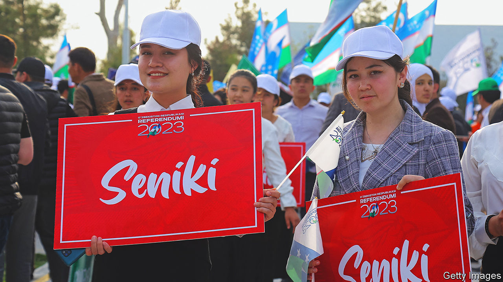

###### People power or power grab?

# Uzbekistan’s president clings to power while passing liberal reforms 

##### A new constitution would recognise individual rights and allow Shavkat Mirziyoyev to prolong his rule 

 

> Apr 20th 2023 

“THE CONSTITUTION is yours!” proclaim red banners emblazoned on billboards and on buses zipping around Tashkent, Uzbekistan’s capital. As Uzbeks prepare to cast ballots in a referendum on constitutional reform on April 30th, the government is whipping up such a fervour for a yes vote that even children have been dragooned in support. In a video that sparked mockery on social media, a nursery teacher led a group of tots in chanting pro-constitutional reform slogans.

Shavkat Mirziyoyev, president of the Central Asian country of 35m, presents the proposed overhaul as the latest item in a reform agenda he has pursued since coming to power in 2016, after the death of his tyrannical predecessor, Islam Karimov. Mr Mirziyoyev has freed political prisoners, relaxed media controls, promoted market reforms and ended forced labour in Uzbekistan’s vast cotton fields.

The new constitution, which would rewrite 65% of the existing one, would foster “a modern democratic state that prioritises every person’s individual rights”, said Jakhongir Shirinov, chairman of the parliamentary committee overseeing the reforms. “Where once the state came first, now the citizen comes first.”

The draft constitution includes guarantees on gender equality. Signalling a big change in patriarchal Uzbekistan, these would follow the recent adoption of a law criminalising domestic violence. The draft also recognises the rights of prisoners and defendants in a country that previously jailed and tortured dissidents on an industrial scale. Arresting officers would be obliged to read detainees their rights. Officials also highlight the draft’s stipulations on the inviolability of private property. The new constitution signals the “irreversibility of reforms” in Uzbekistan, says Eldor Tulyakov, director of the Development Strategy Centre, a pro-government think-tank charged with publicising them.

Uzbekistan, which saw economic growth of almost 6% in 2022, partly thanks to Mr Mirziyoyev’s reforms, is on the up. Yet there is a catch. The new constitution, which is almost certain to be voted through in the absence of a no campaign, could allow him to stay in power for a quarter of a century. Both the existing constitution and the new draft restrict presidents to two terms in office, and his second term ends in 2026. But the new constitution would “reset” Mr Mirziyoyev’s terms to zero, permitting him to stand for two more. With the duration of presidential terms also set to be extended from five years to seven, Mr Mirziyoyev could retain power until at least 2040. He would merely need to keep winning re-election, which is eminently doable in a country with no political opposition. The new constitution would even entitle him to turn his current five-year term into a seven-year one and thus rule until 2042.

This is just the sort of constitutional trickery used by Mr Mirziyoyev’s predecessor to rule for 25 years. A recent media crackdown also recalls Mr Karimov’s time. Social-media users have been under pressure to delete posts critical of the new constitution. Mr Mirziyoyev said recently that he was committed to the “spirit of freedom” for the media, but that promises to be somewhat short of the real thing. “The press cannot raise the issues it wants to,” 40 free-press advocates said in a statement last month, which also complained of media “pressure and intimidation”. “We’ll see after the referendum whether there will be no censorship and whether people who pressure journalists will be punished,” said Anora Sodiqova, a reporter who was one of the signatories. She recently announced her departure from a pioneering independent media outlet that she had co-founded, citing “pressure and blackmail” from unidentified figures.

Many voters have not got to grips with the contents of the draft constitution, even if they plan to vote for it. The reforms will “change things for the better for us”, enthuses a retired teacher in Tashkent, though he could not explain how.

In Karakalpakstan, in the country’s north-west, voters seem more sceptical. The constitutional reform sparked turmoil in the autonomous region last year, after Karakalpaks took to the streets to protest over a clause in a first draft of the rewrite that would have stripped them of their right to secede. Mr Mirziyoyev scrapped the clause after 21 people were killed during an intervention by security forces to quell the protests.

Anger still simmers over the killings and its aftermath—including the conviction of 61 prominent lawyers, journalists and other civilians of fomenting the turbulence as part of a separatist plot. No law-enforcement officers have been held responsible for the deaths. In Nukus, Karakalpakstan’s capital, many plan to stay away from polling stations. “I’m not voting after they killed all those people!” exclaimed one market trader, a typical response in Karakalpakstan. ■

