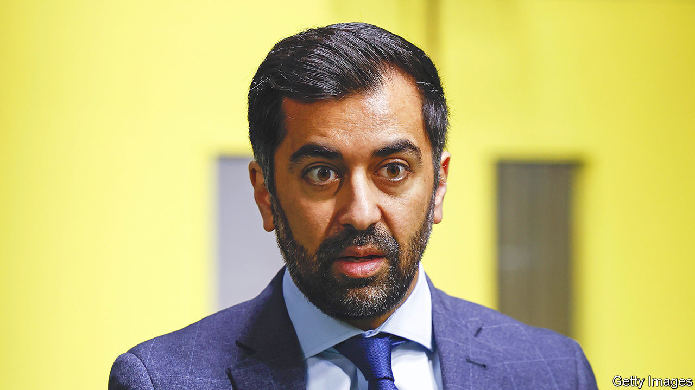

###### Thistle hurt

# A deepening crisis in Scotland’s ruling party 

##### Humza Yousaf is struggling to master the chaos in the Scottish National Party 

 

> Apr 20th 2023 

When Nicola Sturgeon suddenly announced her resignation as leader of the Scottish National Party (SNP) and first minister of Scotland on February 15th, she declared she wanted a more private life. If anything, the glare of attention has intensified. 

On April 5th police arrested and released without charge Peter Murrell, Ms Sturgeon’s husband, who also served as the SNP’s former chief executive. Cops are investigating claims that £667,000 ($829,000) raised to support a second referendum on Scottish independence was improperly spent on other things. They confiscated a swanky motorhome from the driveway of Mr Murrell’s elderly mother. On April 18th police arrested and released without charge Colin Beattie, the party’s treasurer (who stepped back from the role the following day). The men are two of three “registered officers” on the party’s accounts. The third is Ms Sturgeon; Holyrood is rife with speculation that she will be questioned, too. 

Humza Yousaf, elected by SNP members to replace Ms Sturgeon on March 27th, appears powerless to contain the chaos. Unlike his imperious predecessor, Mr Yousaf cuts a rather passive figure. So far he has acted more like a bemused narrator of the mess rather than the new broom who will clean it all up. “I’ll have to speak to Colin Beattie. My understanding is he’s still in the police station being questioned,” he declared, when first asked whether Mr Beattie could continue to sit on a party committee. “Yes, of course I’m surprised when one of my colleagues has been arrested,” he added, in a quote for the ages. 

Mr Yousaf was the source of the revelation that the SNP had been without auditors for six months, after the previous firm’s resignation in October. He was unaware of that until he became leader, he said. His closest rival for the leadership, Kate Forbes, declares it all “mindblowing”. “We need decisive and quick action or we will be in trouble,” she said, in what sounded like a job application. 

News of Mr Beattie’s arrest broke hours before Mr Yousaf delivered the first major policy address of his term, optimistically titled: “New Leadership, A Fresh Start for Scotland”. Mr Yousaf did indeed ditch chunks of Ms Sturgeon’s agenda. But that was not so much born of political conviction—he campaigned as her political apprentice—but because it wasn’t working. A faltering bottle-deposit scheme will be delayed and plans to restrict alcohol advertising reconsidered. Of the second referendum Ms Sturgeon hankered for, there was not a word. 


