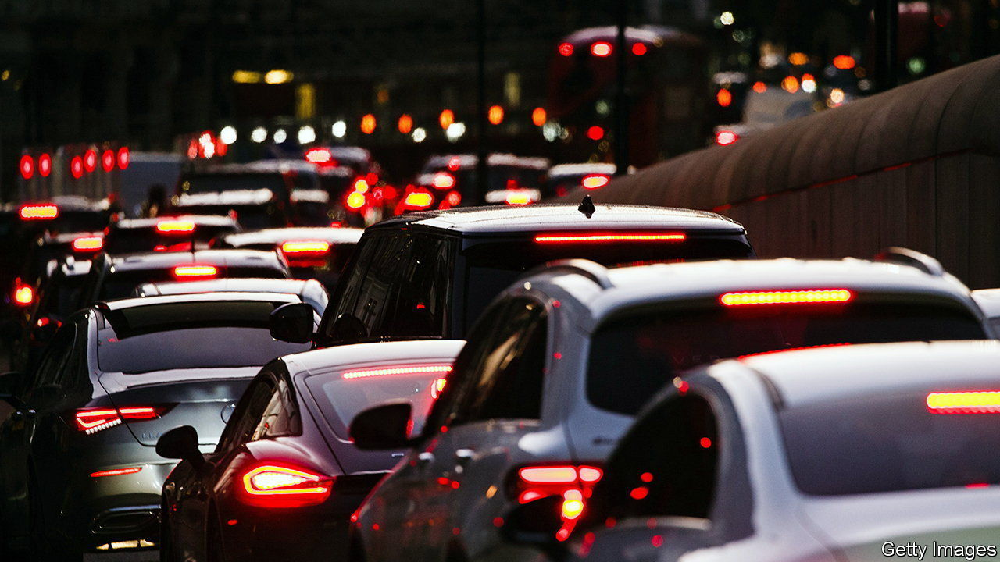
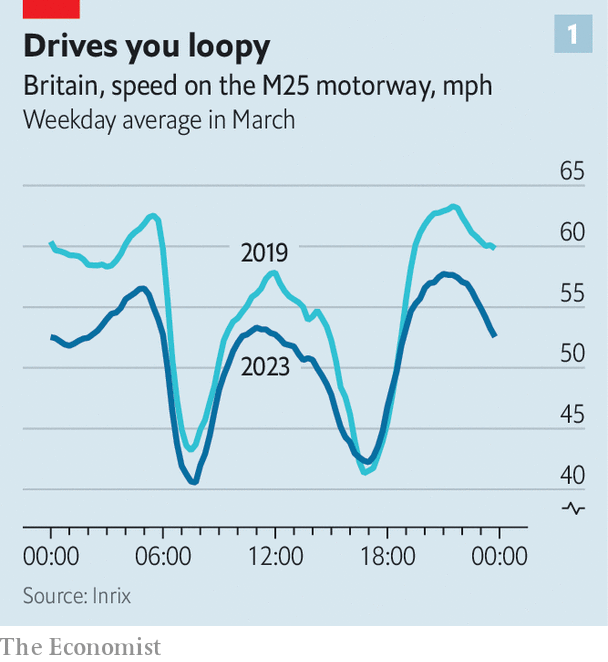
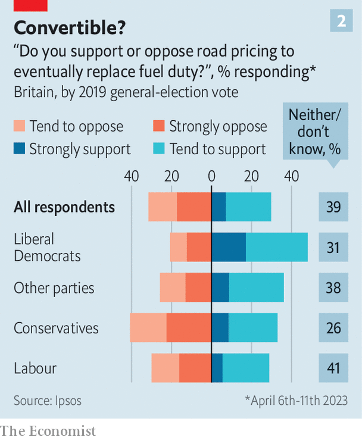

###### Less jam tomorrow

# Britain needs to embrace road pricing 

##### The government will have to find a replacement for vehicle-fuel duty 

 

> Apr 20th 2023 

BRITAIN’S ROADS are some of the most jammed in the world, with roughly 41m vehicles crawling along 250,000 miles of tarmac. Congestion is estimated to cost about £10bn ($12.5bn) a year in lost time. Plans to build new “smart motorways”, which would add capacity by getting rid of hard shoulders, have just been dropped. Average speeds are slowing (see chart 1). 

 


Motoring creates other problems beyond congestion. Vehicles cause 27,000 serious injuries or deaths each year, and are responsible for 10% of the country’s air pollution and one-fifth of its greenhouse-gas emissions. The Treasury levies fuel duty of 53p per litre on the price of petrol and diesel as a way of reflecting these externalities. The tax has long failed to keep pace with inflation but it will still haul in £30bn this year, 2.9% of all tax receipts.

Fuel duty is running out of road, however. As part of its journey toward net-zero carbon emissions by 2050, the government will ban the sale of new internal-combustion engine (ICE) vehicles from 2030. As more motorists switch to electric vehicles (EVs), fuel-duty receipts will fall to zero over the next 25 years. The pace of EV sales has already surpassed forecasts by the Office for Budget Responsibility, a watchdog, which had expected fuel duty to drop by about a third as a percentage of GDP by 2030. Although just one in 70 of the vehicles on British roads is purely electric, they accounted for 15% of new cars sold in 2022. 

To fill the budgetary hole the Treasury could tax something other than motoring. Raising income tax by five percentage points would do the trick. But even if that were politically palatable, leaving motoring untaxed would result in more of it. Until the grid is decarbonised, carbon is still being emitted when EVs are being charged. So the government also needs to encourage a reduction in motoring miles to help meet its climate targets. 

That means the Treasury still needs to devise a tax that discourages excessive motoring. It could levy a duty on electricity, EVs’ “fuel”. But there is currently no way to differentiate between charging a Tesla at home and powering a hairdryer. A report published last year by a cross-party parliamentary committee received evidence from economists, engineers and transport planners. It concluded that only one credible solution exists: road pricing.

Road pricing means charging motorists for driving on public roads. Singapore is the flag-carrier for this approach: the city-state has had it since 1975. Road pricing already exists in limited form in Britain, from tolls on motorways and bridges to the congestion zone in central London. A national version would probably mean charging people based on the distance they drive. But the politics of road pricing is tricky; operational questions loom, too.

The British government first explored the idea back in 1964. It estimated then that reduced congestion would provide £150m per year in benefits (equivalent to 0.4% of GDP at the time). The idea was revived 40 years later, after the Department for Transport published a 180-page feasibility study concluding that road pricing could save £10bn a year (0.6% of GDP) by reducing congestion. The Labour government committed to introducing it, but after 1.8m people signed a petition against it in 2007—the fourth-highest total in the history of online parliamentary petitions—the plans were ditched by the Conservative-led government in 2010.

 


Views seem to have softened a bit since then. asked Ipsos, a pollster, to survey Britons about their attitudes towards replacing fuel duty (see chart 2). Some 30% of the 2,000 people polled said they supported road pricing; 32% opposed it; nearly two-fifths were indifferent. But Conservative voters, the elderly and the poorest households were most hostile. Many worried that it would increase their motoring costs. Jeremy Hunt, the chancellor, responded to the parliamentary committee by saying the government has no plans to consider road pricing.

In its report the committee urged the government to look at “telematic” technology—black boxes that transmit information about a vehicle’s location and speed to receivers. A system of dynamic pricing would have the benefit of encouraging people to drive during quieter times of the day, reducing air pollution (for so long as ICE vehicles remain on the roads) and alleviating congestion. 

Dynamic pricing may sound desirable to economists, but it comes with a hefty risk of failure. Trying to optimise the behaviour of some 35m motorists would be no simple task. Although prices could be set by an arms-length regulator such as the Office of Rail and Road, a system of Uber-like surge pricing would be bound to attract criticism. It would also interfere with various local-level schemes that aim to reduce traffic and emissions. Steve Gooding of the RAC Foundation, a transport think-tank, likens dynamic road pricing to “NHS computerisation and the Trident nuclear-deterrent programme” rolled into one. 

A flat-rate system would be simpler and clearer. This approach, whereby the tax is based on overall mileage and assessed by checking the odometer during a vehicle’s annual check-up, was the most favoured among respondents to our survey. According to the Department for Transport, a total of 300bn miles were driven by vehicles on Britain’s roads in 2021. Assuming that a replacement scheme for fuel duty would aim to be revenue-neutral, the average motorist would end up being charged around ten pence for every mile. 

Britain is not alone in finding road pricing easier to recommend than implement. The Netherlands has had a commitment to road pricing for 20 years, but it has been caught up in political traffic; it hopes to introduce a simple form of the scheme by 2030. Given the political pitfalls, the Treasury is unlikely to do anything before the next general election. Eventually, though, it will have to hit the accelerator.■


