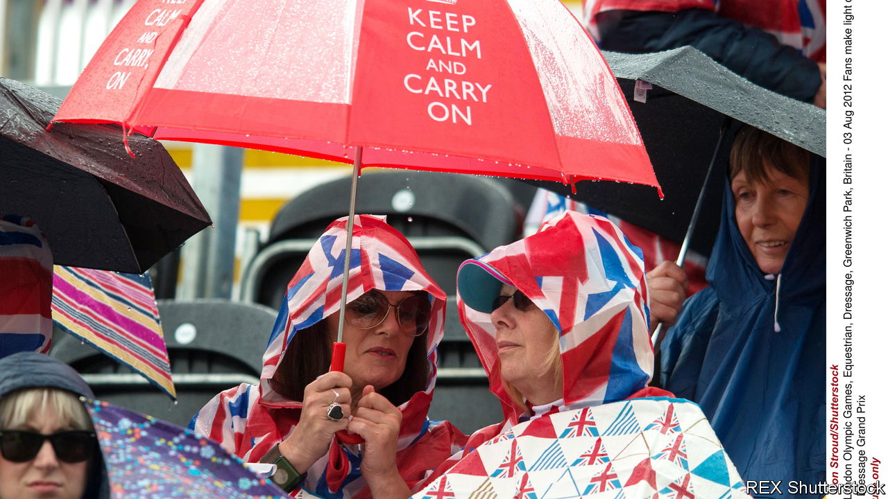

###### Beep prepared

# Britain’s emergency text alert is a signal of something bigger 

##### Attitudes towards resilience are changing 

 

> Apr 20th 2023 

The British can talk for hours about mundanities, from the best car-journey routes to the weather. Lately pubs and coffee shops have quivered in anticipation of a text. At 3pm on April 23rd mobile phones across Britain will beep and buzz for up to ten seconds, in a test of the government’s new emergency-alerts system. In a real crisis the alerts will warn citizens of imminent threats to life in their area, such as wildfires or floods, and offer practical instructions (like “Prepare for evacuation” or “Don’t open the window”). 

In countries like America and South Korea, where alerts can go off daily, the idea of a government text message is not that exciting. In Britain the test has become a national event, scheduled carefully between the London marathon and a semi-final of the FA Cup, a football tournament. It is also a sign that the country is re-learning the value of preparedness.

The focus on contingency planning has ebbed and flowed over the decades. In a new book, “Attack Warning Red! How Britain Prepared for Nuclear War”, Julie McDowall writes of how in the 1950s the Women’s Voluntary Services trained housewives to withstand attack. They whipped up concoctions of borax and ammonium sulphate to douse a thatched-cottage roof during a fire, and encouraged a population still subject to rationing to stockpile veal and sausages. Preparations for raising the alarm were often farcical. One pub landlord’s plan to alert his fellow villagers was to pedal through the streets on his bicycle, yelling “The Russians are coming!”

Nerves calmed with the end of the cold war, until the September 11th terrorist attacks brought a renewed focus on risk assessment and contingency planning. But after the London Olympics “we maybe got a bit complacent”, suggests Susan Scholefield, a former head of the Civil Contingencies Secretariat, the emergency-planning arm of the Cabinet Office. The pandemic provided a huge jolt: a public inquiry is currently considering the shortcomings of Britain’s preparedness for covid-19. Climate change, the threat of a no-deal Brexit and the return of war to Europe have also pushed resilience back up the agenda.

A special “resilience framework” was published in December. A new resilience directorate in the Cabinet Office now oversees the management of risk. National planning exercises have become more rigorous, following criticisms that pre-covid simulations of pandemic risk were not taken seriously enough. When officials were unhappy with the results of “Operation Mighty Oak”, a recent test of what would happen to key institutions in the event of a power cut, they re-ran it. 

The National Security Risk Assessment (NSRA), a classified assessment of the greatest risks facing the country, has been overhauled. Now it can draw upon information from a whizzy new Situation Centre, a secret room in Whitehall which co-ordinates data on the most serious threats. The NSRA will also start measuring some risks over five-year time frames rather than two (though that is still not long enough to consider threats like the failure of the Thames Barrier, which just about stops floodwater surging into London).

Central government cannot prepare for everything: financial constraints alone prohibit that. The December framework commits to beefing up local resilience forums, teams of local-government officials and emergency responders which plan their work based on the national risk register, an unclassified version of the NSRA. It also stresses the importance of involving firms, voluntary bodies and the public.

And crises are not always the result of sudden events like a solar storm, a terrorist attack or a flood. Most of the really big emergencies are “slow-burn” crises, which smoulder for years without the government really noticing, says Sir David Omand, a former head of GCHQ, Britain’s signals-intelligence agency, and author of a forthcoming book called “How to Survive a Crisis”. As an example he points to socioeconomic strains caused by rising inequality or simmering disgruntlement about pay on the part of health-service workers. An emergency alert cannot help tackle these kinds of problems. ■


