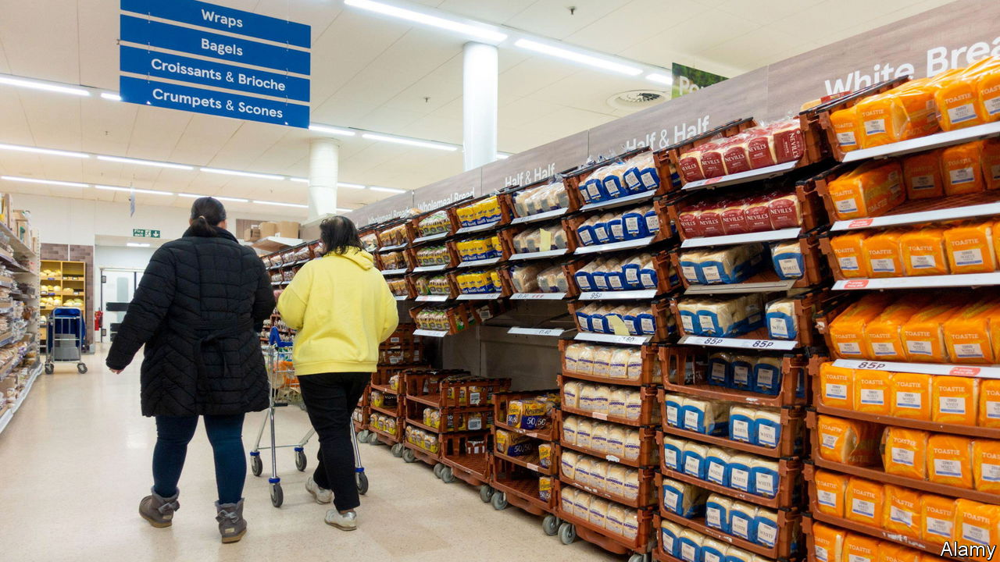
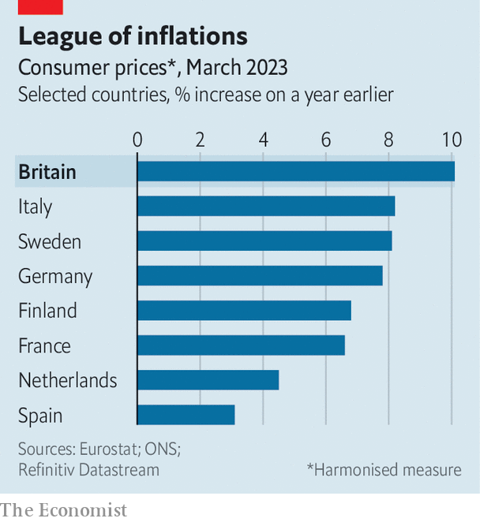

###### Bread and circuses

# Britain’s inflation rate is not falling fast enough 

##### It remained stuck in double digits in March. Why? 

 

> Apr 19th 2023 

Bread and circuses offered a path to social peace, according to Juvenal, a Roman satirist. Britain’s latest inflation data, published on April 19th and covering the year up to the end of March, would have given him cause for concern. Surging costs for food and recreation have kept the annual rate of price growth in double figures. 

Food first. Higher energy prices following Russia’s invasion of Ukraine have raised the cost of fertiliser; heatwaves last year curtailed the growing season of Britain’s trade partners. Prices of olive oil, mainly imported from Spain, were up by 49% as unseasonably warm weather hurt production. Many staple foods, which account for a big share of poorer households’ spending, have been badly hit. The inflation rate for bread and cereals, at 19.4%, is the highest since the Office for National Statistics began tracking it in 1989. 

The source of the surge in the price of “recreation and culture”, as that statistical category is known, is harder to pin down: the composition of video-game bestseller charts can have an outsize effect on the month-to-month rate. But rises there, alongside those in food, were enough to offset most of the fall in the price of petrol. That left inflation virtually unchanged at 10.1%, down only slightly from the 10.4% posted in February. 

 


Britain’s post-pandemic inflation rate is staying stubbornly higher than that of many of its peers (see chart). Economists had expected it to fall to 9.8% in March. Figures for the euro zone, released on the same day, showed that the rate of inflation in the bloc fell to 6.9%, despite many of the same pressures on food and energy prices after Russia’s invasion of Ukraine. 

This difference is partly a matter of timing. Britons are not yet enjoying the effects of lower wholesale gas prices. The  between the energy price cap (EPC), limiting the amount that suppliers can charge customers, and the energy-price guarantee, which fixes the unit rate that households pay, means that there is not as tight a link between consumer and wholesale gas prices as in the rest of Europe. In Spain, where consumer prices track the wholesale price more closely, year-on-year inflation in March was just 3.1%.

Headline inflation will fall sharply next month in Britain, however, owing to “base effects” rather than to any positive economic news. The first upward revision of the price cap after Russia’s invasion of Ukraine was in April 2022, which means it will fall out of the year-on-year figures next month. Consumer gas prices in April 2023 will therefore be 27% higher than a year earlier, rather than 96% as in March. That will reduce the headline inflation rate next month by around 1.7 percentage points, according to economists at Investec, a bank. 

Good news may also soon show up in the form of lower food prices. An index of international commodity prices from the UN’s Food and Agriculture Organisation found that food costs in March were 20% lower than a year earlier, when prices spiked after Russia invaded. 

Once food and energy are excluded, Britain’s inflation experience seems more typically European. So-called core inflation, which strips out these two categories, remained stable at 6.2% in Britain in March; in the euro zone it increased slightly to 5.7%, from 5.6% in February. Spain may be enjoying a much lower headline rate of inflation but the “core” rate is 7.5%, higher than in Britain. 

Investors have nonetheless increased their bets that the Bank of England will lift interest rates, to 4.5% from 4.25%, at its next meeting on May 11th. Market pricing now implies that the main policy rate will peak at closer to 5% in November, rather than 4.75%. That may also be because of labour-market figures, published on April 18th, showing that the rate of wage growth was slowing but still remained high (at 6.6% during the three months to February). Bread and circuses may be in short supply, but jobs are not. And that combination is not good for inflation. ■


