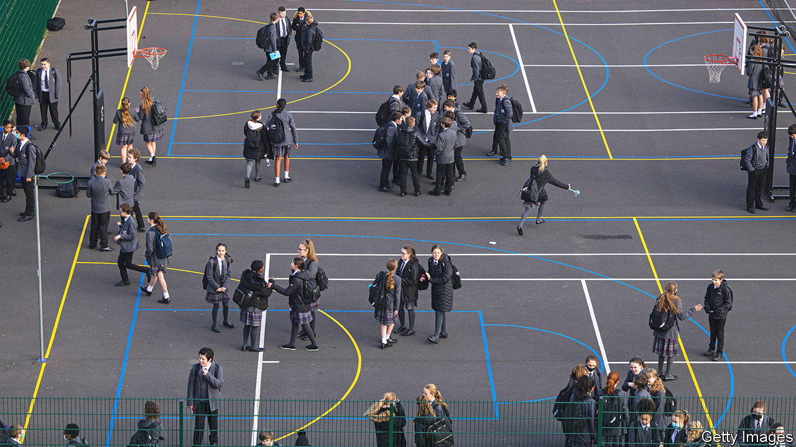
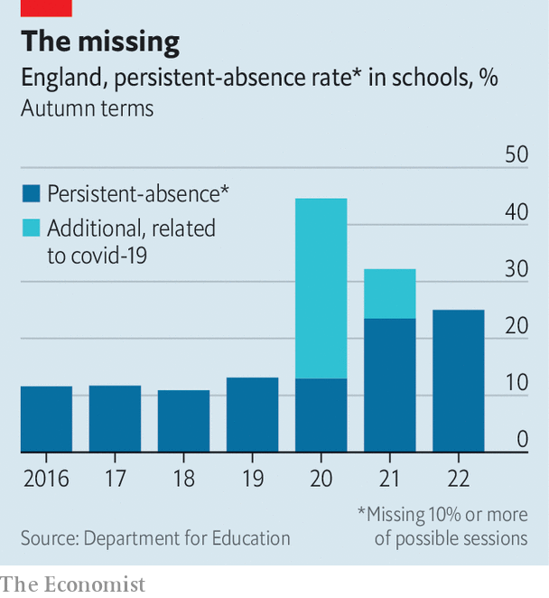

###### Empty chairs

# English schoolchildren are still missing months of classes 

##### The pandemic is over. Persistent absence is the new epidemic 

 

> Apr 20th 2023 

Before the covid-19 pandemic, Liz Marsh’s daughter seemed to be coping better with debilitating anxieties. Diagnosed as autistic when she was six, she appeared to have found a school that worked reasonably well for her. Over the past two years, however, her problems have resurged. These days the ten-year-old rarely travels to her school in Leeds willingly; some days she simply lies down in their driveway. The problem is not that she doesn’t want to go to school, says her worried mother: “She just can’t.”

Though covid is no longer closing schools or requiring pupils to self-isolate, many children are still missing from their desks. So far this school year more than one-fifth of pupils in England have been “persistently” absent, a label that applies when a youngster misses at least 10% of their classes. (Other parts of Britain do not track attendance in the same way.) 

 


That is almost twice the rate that was normal before covid. Some teachers had hoped this was a “blip” that would vanish as the pandemic faded, says Rob Williams of the National Association of Head Teachers, a union. But it looks as if lofty absence rates are sticking (see chart).

This would be a problem even if the pandemic had not already hit children’s learning. Pupils who miss even 15% of their lessons are half as likely as others to get five passes in the GCSE exams they take at age 16. Youngsters with very poor attendance rates are also vastly more likely to wind up in trouble with the police; perhaps 140,000 children are enrolled in school but actually in class less than half the time.

Pupils miss school for a whole gamut of reasons. The easy assumption, of truanting children unchecked by lax parents, is only part of it. Youngsters with special educational needs have long missed more lessons than others; they comprise only 16% of pupils in England but make up one-quarter of persistent absentees. Bullying and chaotic home lives make it less likely that children will go to school. 

So does poverty. In the 2021-22 school year, almost 40% of the poorest children were absent more than 10% of the time, roughly twice the absence rate among richer peers. Even in good times poorer pupils miss school days because they lack uniforms or bus money, notes Beth Prescott of the Centre for Social Justice, a think-tank—and these are not good times.

The pandemic has amplified these problems (though British schools were at least quicker to reopen to pupils than their counterparts in America) and created new ones. Children who were already feeling unhappy at school may now feel they have even less chance of making the grade because of the lost learning. The sports activities and extra-curricular clubs that many pupils liked best are still sometimes squeezed by schemes aiming to accelerate academic “catch-up”. 

Mental health has worsened, among children and parents alike. A survey carried out by the National Health Service (NHS) last year concluded that one in six children aged 7-16 had a “probable mental disorder”, up from one in nine in 2017. Steve Bladon, a former primary-school head whose own daughter has developed anxieties that prevent her from attending school, says it is not realistic to think that youngsters can all simply “crack on as they used to”. He says living through the pandemic has “changed” many children.

Attitudes to schooling have shifted, too. Before the pandemic children generally accepted that school-going was inevitable, even when it was causing considerable stress. Long bouts of remote learning, on adults’ orders, have shaken that assumption. Some autistic children found they were much better suited to studying at home than in school, reckons Ms Marsh; for those pupils in particular, going back to the old ways has been a wrench. Parents are more inclined than before to keep children at home if they sneeze or sniffle. A lot of parents now spend time working from home, notes Timo Hannay of SchoolDash, a data provider. That has reduced the inconvenience of a child not being in class.

Improving information about the problem is a government priority. Before the pandemic national absence rates were usually reported only once a term, and with a big lag. Now officials from the Department of Education are pulling data in real time from many schools’ own databases; they have started to show teachers how their absence rates compare with those elsewhere. Boosters hope it will also become easier for schools to detect patterns of absence that suggest a child is struggling with more than the odd bug.

Deciding what to do with such information is tricky, in part because persistent absences have such a wide array of causes. Officials are encouraging schools which have very good attendance records to share tips with worse performers. The government has also begun paying “attendance advisers”, some of them former head teachers, to spread best practice. That includes obvious but vital things such as setting high expectations for attendance and making school as engaging as possible.

More compelling is a plan to hire and train “attendance mentors”, people who work one-to-one with pupils who are frequently absent, in the hope of tackling problems that are keeping them out of class. This idea is sound but present ambitions are weedy, reckons Ms Prescott. The government’s pilot programme, launched this year in Middlesbrough, will benefit only about 1,600 children over three years. Ms Prescott’s organisation would like to see the government hire around 2,000 mentors nationally at a cost of £80m ($100m).

Making a real dent in the problem means fixing other overloaded systems. Long NHS waiting lists stymie access to children’s mental-health services. Getting authorities to recognise a child’s special educational needs—which unlocks funds and other help—often requires multiple appeals. While these problems linger, old-fashioned approaches, such as fining parents of absent youngsters, are unlikely to work. The pandemic’s woeful impact on children has not run its course. ■


