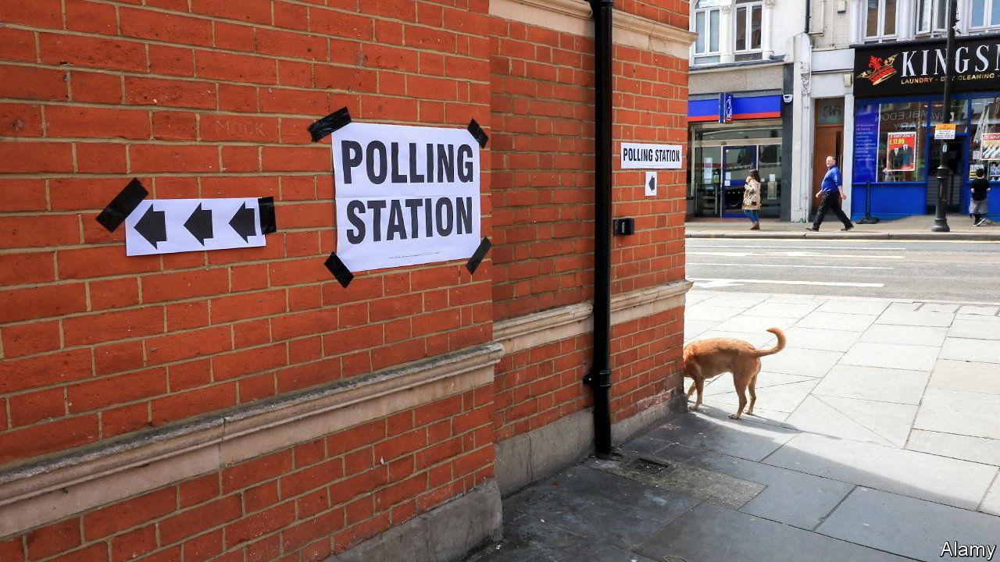

###### Picture perfect?

# The first big test of Britain’s voter-ID requirements is imminent 

##### Election officials fear that chaos may be the consequence 

 

> Apr 17th 2023 

“You can be 60 and have a free bus pass here, but you can’t use it,” exclaims Janette Williamson, the Labour leader of Wirral Council on Merseyside. Ms Williamson is talking not about public transport but about voting. New rules obliging eligible voters to show a form of photo ID at the ballot box face their first big test in local elections on May 4th. 

Passports and driving licences are acceptable everywhere, but requirements for other forms of ID vary. An over-60 travel pass is fine in London, Wales and Northern Ireland (where photo ID has been required since 2003). Elsewhere, only an over-66 travel pass granted at the state retirement age is OK. “It doesn’t seem to make much sense to us here,” says Ms Williamson. 

The changes, pushed through by the government last year, are ostensibly an attempt to allay fears about election security. Proponents point to high-profile, if isolated, examples of fraud. The most egregious, a 2014 mayoral election in the London borough of Tower Hamlets, was voided. 

Opponents argue that the new rules will suppress turnout among certain segments of the electorate. None of the photo-adorned bus passes, student cards and railcards carried by younger voters, who are less likely to vote Conservative, are acceptable. People with severe disabilities, the unemployed and those who have never voted are less likely to have photo ID. 

Whether the new rules will have a long-term impact, on either electoral integrity or voter suppression, is open to question. Pretending to be someone else at polling stations, the problem which voter ID is designed to fix, : in the eight years to 2021, there were only three convictions for this offence. In other places that require identification, such as Canada, Switzerland and certain American states, research has not shown a causal relationship between voter ID laws and depressed turnout. (Indeed, a new study in America suggests that communities which feel they are being deliberately targeted may turn out in greater numbers.) 

That still leaves open the possibility of immediate chaos. Details of the new voting requirements weren’t finalised until December 2022, leaving only a few months before the local elections for officials to get the message out. At the time the Conservative-led Local Government Association, a cross-party body representing more than 300 local authorities, called for the rules to be delayed because of potential pressure on election staff. 

“It’s the biggest change in polling stations in a generation,” says Peter Stanyon, CEO of the Association of Electoral Administrators, the body representing election officials. “It’s very disappointing that these things have been introduced so late.” Local officials are the ones who have to turn away people without the right form of ID. “There are concerns about the security of staff, because if you do get an irate elector, the staff are effectively quite vulnerable.”

There may be a lot of frustrated people. As of February, according to research by the Electoral Commission, an independent body that oversees ballots in Britain, 37% of voters believed that ID was not needed. A government study found that 4% of voters, or about 2m people, did not have a suitable photo ID. Such voters can apply for a free “voter authority certificate”. So far just 60,000 have done so; the deadline to apply is April 25th. “It’s a massive hill to climb,” says Craig Westwood, who runs communications for the commission.

Given the fine margins of local democracy, the loss of a few voters can make a big difference (experience suggests that people who are turned away from polling stations do not all return, even if they have a valid ID at home). In last year’s local elections, for instance, two seats on Wirral council were decided by fewer than 100 votes; two seats also happened to be the size of the Labour victory. 

If voters are turned away in droves, or seats swing because a handful of voters are carrying the wrong pass, that might dent faith in the system. “Confidence is always going to be central to our role and is a key indicator around elections,” says Mr Westwood. “It’s incredibly hard to build it up. And it’s very easy for it to be lost.” ■


