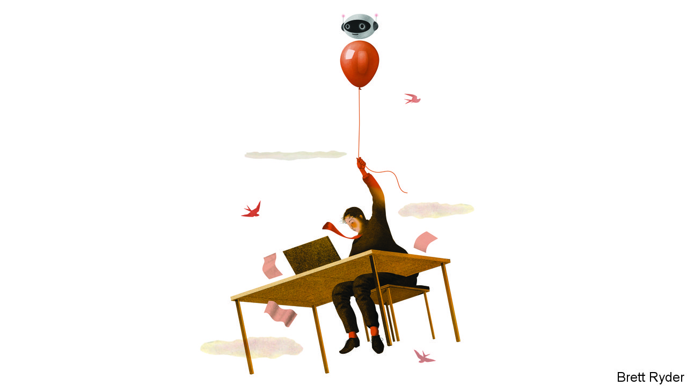

###### Schumpeter

# How businesses are experimenting with ChatGPT-like services 

##### In time, the approach may yield dividends 

 

> Apr 19th 2023 

Each earnings season comes with new buzzwords. As companies ready their scripts for the most recent quarter, one phrase in particular is sure to end up on many bosses’ lips—generative  (ai). Ever since Chatgpt, an artificially intelligent conversationalist, began dazzling the world, bosses have been salivating over the potential for generative ai to turbocharge productivity. Zurich, an insurer, is now using a customised version of  to simplify lengthy claims documents. Mattel, a toymaker, is designing new playthings using dall-e, another tool that conjures images based on text prompts. Absci, a biotech company, is using the new wonder to assist with the development of therapeutic antibodies. Plenty of other firms are dipping their toes in this unfamiliar water.

The toolmakers of the knowledge economy have more fully embraced the innovation frenzy. Microsoft has announced a string of product updates that will allow desk jockeys to offload tasks from drafting emails and summarising documents to writing computer code. “Like working in dog years”, is how Eric Boyd, head of ai for the tech giant’s cloud-computing division, describes the company’s hectic release schedule. Google, a rival, is likewise souping up its suite of tools, as are Adobe, Salesforce and Bloomberg, makers of software for creative types, salesmen and financial whizzes, respectively. Startups like Harvey, a Chatgpt-like legal assistant, and Jasper, a writing aid, are emerging thick and fast.

Despite all the experimentation, companies remain uncertain about how to make use of ai’s newfound powers. Most, according to Mr Boyd, either underestimate or overestimate the technology’s capabilities. Efforts are being made to determine which jobs are the strongest candidates for reinvention. A study published last month by Openai, the outfit behind Chatgpt and dall-e, looked at the share of tasks within an occupation that could be speeded up by at least half using the new technology. Topping the list were occupations involving copious amounts of routine writing, number crunching or computer programming—think paralegals, financial analysts and web designers.

It is unlikely that firms will soon dispense with such jobs entirely. Generative ai may do a good job of producing first drafts but relies on humans to give instructions and appraise results. Microsoft, tellingly, has labelled its new suite of tools “co-pilots”. In “Impromptu”, a recent book by Reid Hoffman, co-founder of LinkedIn, a social network for professionals, the author counsels users to treat Chatgpt and others “like an undergraduate research assistant”. (The book was written with the assistance of a bot.)

What’s more, as coders, salesmen and other white-collar types become more productive, there is little evidence yet that companies will want fewer of them, argues Michael Chui of McKinsey, a consultancy. Software may eventually eat the world, as one venture capitalist predicted, but so far it has only nibbled at the edges. And most companies will surely choose more sales over fewer salesmen. Yet various hurdles lie ahead for businesses looking to make use of generative ai. For a start, many firms will need to rethink the role of junior staff as apprentices to be trained, rather than workhorses to be whipped. Getting the best out of generative ai may also prove tough for firms with clunky old it systems and scattered datasets. On the plus side, large language models like the ones powering Chatgpt are better at working with unstructured datasets than earlier types of ai, says Roy Singh of Bain, a consultancy that has inked a partnership with Openai.

Other reservations could still slow adoption. Companies have a much higher bar than consumers when it comes to embracing new technology, notes Will Grannis, chief technologist for Google’s cloud-computing division. One concern is shielding confidential or sensitive data, a worry that has led companies from JPMorgan Chase, a bank, to Northrop Grumman, a defence contractor, to ban staff from using Chatgpt at work. Zurich does not allow customers’ personal information to be fed into its tool. 

A bigger concern is reliability. Chatgpt-like tools can spit out plausible but incorrect information, a process euphemistically dubbed “hallucination”. That may not be a problem when dreaming up promotional material, but it is a fatal flaw elsewhere. “You can’t approximate the design of an aeroplane wing,” notes Mike Haley, head of research for Autodesk, a maker of engineering software. Humans err, too. The difference is that generative-ai tools, for now, neither explain their thinking nor confess their level of confidence. That makes them hard to trust if the stakes are high.

Productivity to the people

Bosses could also find their appetite for generative ai spoiled by  over the risks the technology poses to society, particularly as it gets cleverer. Some fret about a barrage of ai-generated scams, misinformation and computer viruses. Such concerns are spurring governments to action. America’s Commerce Department is seeking comments from the public on how it should approach the technology. The European Union is amending a planned bill on ai to encompass recent advances. Italy has, for now, banned Chatgpt.

A final fear is that rolling out clever ai could undermine the morale of staff, if they worry for their futures. Yet so far employees appear to be among the new technology’s most enthusiastic supporters. Of 12,000 workers surveyed in January by Fishbowl, a workplace-network app, 43% had used tools like Chatgpt for work-related tasks—a large majority without their bosses knowing. Such enthusiasm suggests few tears shed for the loss of menial tasks to ai. “No one goes to law school to spend time trawling through documents,” says Winston Weinberg, Harvey’s co-founder. That may be enough to encourage firms to continue experimenting. With productivity growth in rich countries languishing for two decades, that would be no bad thing. ■


