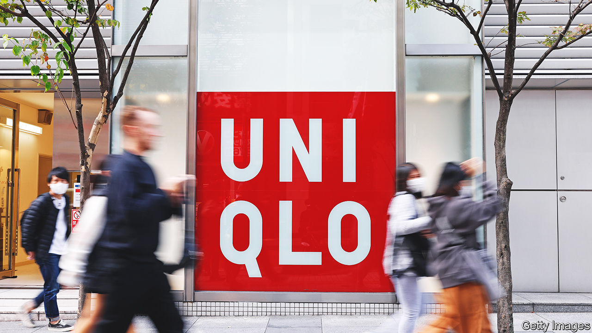

###### Faster, please

# Uniqlo’s success mirrors the growth of Japan’s industrial giants 

##### Automation and expansion go hand in hand 

 

> Apr 20th 2023 

Drive through any city in South-East Asia and Japan’s commercial presence is visible everywhere: vehicles made by Toyota, Honda and Nissan clog the roads, the result of decades of market dominance in the region. If Fast Retailing, the parent company behind Uniqlo, a clothing retailer, has its way, the drivers of those vehicles will soon be wearing Japanese clothes, too.

The company’s latest results were a boon for shareholders, with operating profits of ¥103bn ($760m) in the three months to the end of February, up by 48% compared with the same period last year. They already had good reason for cheer: the company’s shares have risen by 53% in the past 12 months, making it one of the best-performing large listed companies in Japan. Its shares are now just 10% shy of their all-time highs in February 2021, and, with a market capitalisation of $76bn, it is the country’s sixth-largest listed firm.

At first glance, Uniqlo is an unusual story of a Japanese retailer succeeding overseas. Fast Retailing’s main international competitors—Hennes &amp; Mauritz ab, the parent company of h&amp;m, and Inditex, the parent of Zara—are based in Sweden and Spain respectively. But the firm’s growth abroad follows as much in the footsteps of Japan’s industrial and manufacturing firms as its European peers.

Japanese industrial firms, carmakers in particular, made South-East Asia a second home from the 1960s onwards. Fast Retailing is also expanding particularly rapidly in Asia, where sales (excluding its home market and greater China) are up by 71% in the six months to the end of February, compared with the same period a year ago. The region now accounts for 16% of sales, up from 11% a year ago, and it is closing in on mainland China, Hong Kong and Taiwan, which dropped from 25% to 22% over the same period. In the 1960s the focus of Japanese firms was on exploration for oil, the supply of natural resources and producing industrial goods in countries with import-substitution policies. Now the region represents a promising market for Uniqlo rather than somewhere to put factories.

The comparison extends beyond geography. Exposed to demographic constraints in fast-ageing Japan, Fast Retailing has used technology and automation to replace workers, further mimicking the country’s large manufacturers. Keyence, a largely unheralded giant of industrial automation, is Japan’s second-largest listed firm, worth $111bn. Since 2017 Uniqlo has embedded all its garments with tiny identification tags, which enable automatic scanning at checkouts.

The reliance on automation goes deep into the company’s business operations and supply chain, too. In 2019 it joined up with Japan’s Mujin and France’s Exotec Solutions, both small robotics companies, with the aim of automating the jobs in its warehouses. It had already joined forces in 2018 with Daifuku, a larger automation firm, which helped reduce the workforce at a warehouse in Tokyo by 90%.

The savings are no longer just a bonus for the firm’s bottom line. Uniqlo raised salaries for some employees by up to 40% in March, in an effort to make corporate wages comparable to similar firms internationally, in order to compete for talent, and will set pay based on global standards in future. Savings from automation will be a necessity if the company wants to avoid eating into its profit margins to bump up salaries for its staff. ■


