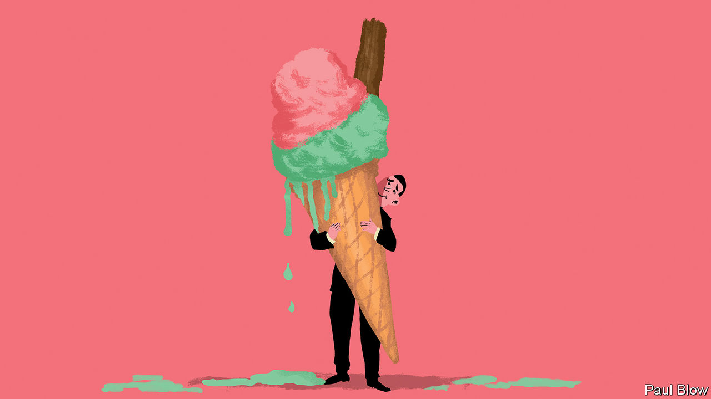

###### Bartleby

# What makes a good office perk? 

##### After the perkcession ends, a perkcovery will surely follow 

 

> Apr 20th 2023 

When companies tighten their belts, they look first to discretionary spending. Meta got rid of free laundry for its workers last year. In January Google announced a round of lay-offs that included 27 in-house massage therapists. Salesforce, another tech firm, has axed its contract with a Californian “wellness retreat”, where employees would have done God-knows-what with each other. The chopping of such benefits has been christened the “perkcession”. But just as perks get cut in bad times, so they return in the good. Eventually you can expect to read articles about a “perkcovery”. What makes a good perk? 

Dispensability is part of the point. This is not like a salary or a health-care plan; if it cannot be cut, it is not a perk. Views on what counts as a discretionary benefit can shift over time. Before the pandemic being allowed to work from home every so often was seen as a perk. Anyone who still describes it that way has failed to grasp how much the world has changed for white-collar workers. By the same token many of the perks that are now being cut were designed for a pre-pandemic world of long weeks in full offices. Last month Google warned that services at snack bars and cafeterias were being reviewed because attendance patterns had changed. 

Working out which perks are valuable to workers is hard. Asking employees may not always yield good answers. A poll conducted last year for Trusaic, a software firm, asked American workers what perks they would like to see introduced: the top answer was hangover leave. Perks that sound great in theory may not work out that well in practice. Several firms, Goldman Sachs and Netflix among them, tout the fact that they offer members of staff unlimited holidays. But other companies have abandoned the policy because the absence of clear rules leaves employees unsure how much time they can really take off; some take less than they did under a fixed allocation of vacation days.

Perks should reinforce a culture, not be undermined by it. Firms should not be offering employees access to advice on financial well-being if they pay worse than everyone else. They should not be touting mindfulness courses if they expect employees to work until they drop from exhaustion. And perks should be motivating to the widest possible group. Snack cupboards filled with calorific goodies are some people’s version of a sugary paradise, and others’ idea of obesogenic hell. If your perk is a source of controversy, it’s probably not right. 

The framing of a perk matters, too. Mental accounting is a concept that was coined by Richard Thaler, a behavioural economist, to describe how people put different values on money depending on context. A discount on a small purchase feels more significant than the same amount off a big-ticket item, for example. Helping people with things they resent paying for can also be more effective than doling out treats. 

In “Mixed Signals”, an enjoyable new book on incentives, Uri Gneezy describes an experiment he conducted with three academics in Singapore, in which taxi drivers there were rewarded if they did a certain amount of exercise. Some drivers were given $100 in cash and others were given a credit equal to the value of a much-disliked rental fee they had to pay to the firm that owned the taxi. The rental credit proved much more motivating to drivers. Employers who offer help with pet insurance or student-loan debt repayments may be onto something.

Perks also work best if they are noticed. Employees can quickly become habituated to something that is unvaryingly available. Ben and Jerry’s offers its staff three pints of ice cream and frozen yogurt a day; that risks being a benefit which fades into the background, even if its employees are less likely to. Time-limited seasonal benefits are a good answer to this: some firms let their people knock off early on Friday afternoons during the summer, for example. By the time the days lengthen and the weather warms, that perk might help to keep good employees in their posts. 

No employer should mistake perks for the things that really matter to their staff. Research into what workers value most reveals the same priorities: stimulating work, being recognised by their managers, good wages. When it comes to office environments, too, basics like natural light count for more than a massage. But perks can help at the margins. If you are going to dole them out, the trick is to find something that is both discretionary and meaningful. ■


