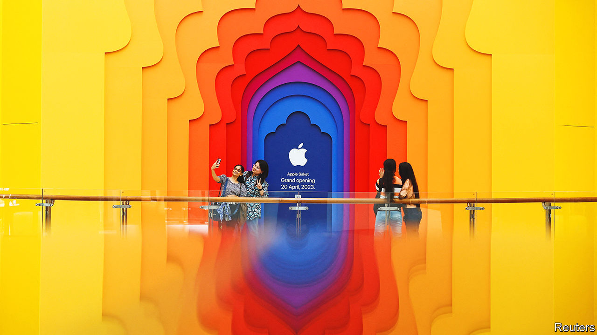

###### Branching out

# Why Apple is betting big on India 

##### The country is a growing consumer—and producer—of Apple’s gadgets 

 

> Apr 20th 2023 

The intricate timber roof-tiles were assembled in Delhi, the bright stone walls sourced from Rajasthan. But the man who opened the door of Apple’s gleaming new Mumbai outlet on April 18th had been flown in from California. Tim Cook, Apple’s boss, dispensed high-fives and  as he opened that shop and, two days later, an equally ritzy outlet in Delhi, the first Apple stores in India.

Soon to become the world’s most populous country, India has a new strategic importance for the world’s most valuable firm. As the crowds at Apple’s stores demonstrated, India is a growing consumer of pricey tech gadgetry. And as the humming factories outside Chennai show, the country is also increasingly a maker of them. With political and logistical difficulties mounting in China, Apple is putting down roots in a new Asian market.

Take consumers first. India will shortly have more of them than any country, as its population of 1.4bn edges past that of China this year. Apple products are beyond the means of most Indians. Whereas Apple accounts for more than half the phones sold in America, its market share in India last year was 4.5%, according to Counterpoint, a research firm. But as they get richer, Indians are upgrading their handsets. In the year to March, Apple’s revenues in India were almost $6bn, an increase of nearly 50% on a year earlier, according to Bloomberg. Dan Ives of Wedbush Securities, an investment firm, forecasts that its Indian revenues could reach $20bn in 2025. “India is a hugely exciting market for us,” Mr Cook told investors in February. “We are, in essence, taking what we learned in China years ago…and bringing that to bear.”

That applies to manufacturing processes, too. In the first two decades of the century Apple shifted most of its manufacturing to China. But China is becoming a riskier place for American firms to do business. One danger is political, as the two countries vie for tech supremacy. America’s threat to ban TikTok, a popular Chinese-owned social-media app, could be met by equivalent sanctions on American firms. Another risk is logistical. China’s zero-covid policy has interrupted manufacturing supply chains, most recently in November and December, when a series of hiccups hampered production of the iPhone 14 Pro. 

Given these risks, the company is scrambling to avoid having all its apples in one basket. India, where Apple began manufacturing with the domestic market in mind, is now seen as a future export base. Government subsidies help. In September Apple announced that it was making the iPhone 14 in India, the first time it had assembled a latest-generation phone in the country. By 2025 a quarter of iPhones will be made outside China, mainly in India, forecasts JPMorgan Chase, a bank. Vietnam, where Apple is reckoned to make almost half its AirPod earphones, has been another winner. Apple is now in talks to make its MacBook laptops in Thailand, reported earlier this month.

Apple plays down the idea that it is deserting China; even in a worst-case scenario it would keep manufacturing there for China’s vast domestic market (worth more than $70bn to Apple last year) and for some export, insiders say. Last month Mr Cook visited Beijing, where he hailed the “symbiotic” relationship between Apple and China and was applauded as he toured the company’s flagship store in the capital.

He has little choice but to maintain friendly relations. Even as Apple shifts some final assembly of its products to other countries, it relies on its long Chinese supply chains for components. Making tech gadgetry is a capital-intensive business. No country will have a manufacturing ecosystem like China’s any time soon, says Anshul Gupta of Gartner, a research firm: “There will always be some interdependence across these markets. You cannot just be completely decoupled.”

Nonetheless, India and others are eager to take whatever slice they can of Apple’s manufacturing pie. On April 19th Mr Cook was entertained in Delhi by Narendra Modi, India’s prime minister. A noted selfie-enthusiast, Mr Modi has been spotted wielding a gold iPhone. Judging by the crowds at Apple’s new stores, he soon won’t be the only one.■


