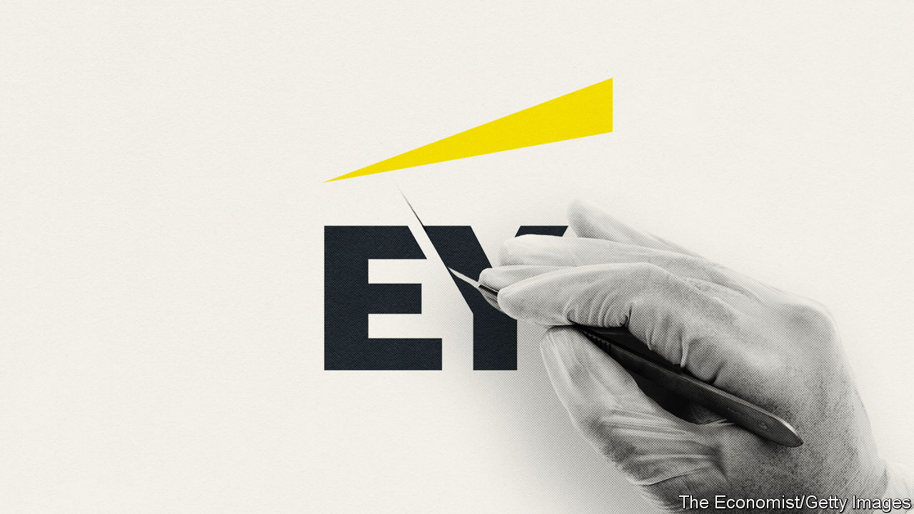
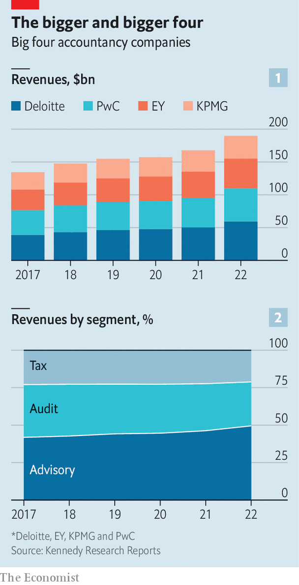

###### The too-big four

# Why EY and its rivals may eventually break up, after all 

##### The commercial logic for splitting up the big four is only getting stronger 

 

> Apr 16th 2023 

“WHOEVER SAID don’t question things? We say question everything.” So began the television commercial that EY aired in 2021 during the Super Bowl, a sports extravaganza known as much for its pricey ads as for the American football they interrupt. On April 11th, under a little too much questioning from its American branch, the professional-services giant decided to delay indefinitely plans for a separation of its audit and advisory businesses. A big sticking-point was the division of the tax practice, coveted by both auditors and advisers. Plans to publicly list the advisory business and load it with debt to pay off audit partners also looked cleverer when the deal was conceived in 2021, amid low interest rates and frothy share prices.

This suspension is a huge blow to EY’s global bosses, who underestimated just what an uphill climb “Project Everest”, the unfortunately codenamed break-up project, would prove. To EY’s split-averse professional-services rivals in the so-called “big four”, Deloitte, KPMG and PwC, it looks like vindication. Joe Ucuzoglu, Deloitte’s global chief, insists the “multidisciplinary model” is the “foundation” of his firm’s success. Bill Thomas, his opposite number at KPMG, says his firm’s decision in the early 2000s to list its advisory arm (since regrown) was “not the right thing”. Bob Moritz, who leads PwC, insists keeping the businesses together is central to his firm’s ability to recruit and retain talent. 

Yet the case against turning the big four into a biggish eight is far from open and shut. That is because the commercial logic of the split is getting more compelling. At stake is the future of one of the business world’s most critical oligopolies.

 


The big four are the heavyweight champions of professional services. They dominate the market for audits—checking the books for 493 of the companies in America’s S&amp;P 500 index and a big proportion of European blue chips. They also offer clients a one-stop shop for advice on issues from dealmaking to digitisation. Together, as of last year, they employed 1.4m people and generated $190bn in fees, up from $134bn in 2017 (see chart 1). KPMG, the smallest of the big four, generates three times the revenue of McKinsey, the .

The driving force behind the big four’s growth in recent years has been the rapid expansion of their advisory businesses, which now account for half their combined revenues (see chart 2). In the early 2000s EY, KPMG and PwC all spun off or sold their consulting arms in response to new conflict-of-interest regulations, which barred them from selling advice to audit clients. (Deloitte planned but then abandoned a spin-off.) With little room to expand in audits, however, the giants were soon lured back into the fast-growing business of advice.

The rebundling has in many ways paid off. The opportunity to dabble in different service lines has helped the big four entice the bright-eyed young things their businesses rely on. A career in bean-counting looks more appealing when it comes with the opportunity to work on big acquisitions or advise governments on important matters, observes Laura Empson of Bayes Business School in London and formerly of the board of KPMG’s British branch.

The big four’s breadth has helped them win over clients, too. Expertise in areas such as tax and valuations has helped KPMG and the others solidify their position as auditors-of-choice for large companies, says Mr Thomas. Widely recognised audit brands, meanwhile, have boosted the reputation of the firms’ advisory arms.

Mr Moritz argues that the multidisciplinary model has also helped PwC and the other professional-services giants adapt to the digital era. Software and data now underpin nearly all the services the firms offer. The auditors benefit from the technological know-how of the advisers, while the advisers benefit from the steady demand for audit work, which can fund investments even during downturns.

All that explains why some have balked at the idea of a separation. Firms operate franchise-like structures, with independent partnerships in each country, which also makes big shifts like a break up tough to pull off—as EY discovered in America.

Yet the case for staying conjoined is weakening as the big four’s businesses shift towards consulting. Auditor-independence rules have turned from an inconvenience into a drag; a bugbear of EY’s is its inability to team up with the software firms it audits, such as Salesforce, to help them roll out their technology to clients. Newish requirements in Europe and elsewhere for firms to rotate their auditors, typically every ten years, have increased clashes between audit and advisory partners over who will serve big customers. 

Meanwhile, auditing has been steadily losing its internal clout, says Ms Empson. Sarah Rapson, deputy head of the FRC, Britain’s audit overseer, worries that the firms no long foster the “culture of scepticism and challenge” that auditing relies on. The problems are on display in a string of much publicised audit snafus. On March 31st APAS, Germany’s accounting watchdog,  from taking on new publicly listed audit clients for two years over its failure to spot mischief at Wirecard, a fintech darling turned . Last year KPMG was fined £14m ($18m) by the FRC for feeding misleading information into a review of two of the firm’s audits. In 2020 Deloitte was fined £15m ($19m) by the FRC for audit failings, too.

Those audit flubs have tarnished the consultants by association. They could also lead to greater pressure from regulators to invest more in auditing, particularly around fraud detection. At the same time, the advisers are getting increasingly capital-hungry—they want to expand into managed services, running functions such as compliance, payroll and cybersecurity on behalf of clients, and they need new technology to do it. An advisory spin-off would leave the auditors flush with cash while freeing the consultants to pump themselves up with fresh equity from outside their partnerships. 

Staying together may no longer be good for attracting talent, either. The increasingly specialist skills offered by the big four leaves fewer opportunities for junior staff to dabble in different tasks. Few bosses want to receive cybersecurity advice from a fresh-faced accountant.

Mr Ucuzoglu of Deloitte warns that auditor-adviser break-ups have “never once played out as intended”. The consulting business KPMG listed two decades ago, under the name BearingPoint, went bankrupt in 2009. And the sale of EY’s and PwC’s old advisory businesses to, respectively, Capgemini and IBM, two IT-focused consultancies, resulted in messy culture clashes.

As EY reels from its graceless tumble down Everest, it and its three rivals will think twice before embarking on a similar expedition. Still, the break-up logic is unlikely to go away. , a consulting giant, emerged from the rubble of Arthur Andersen, the collapse of which in the early 2000s turned the “big five” into the big four. It has thrived since, now raking in $62bn a year in sales, more than any of the big four. Since listing in 2001 its market value has risen 20-fold, to $185bn. Such a prize may be too tantalising to resist. ■


