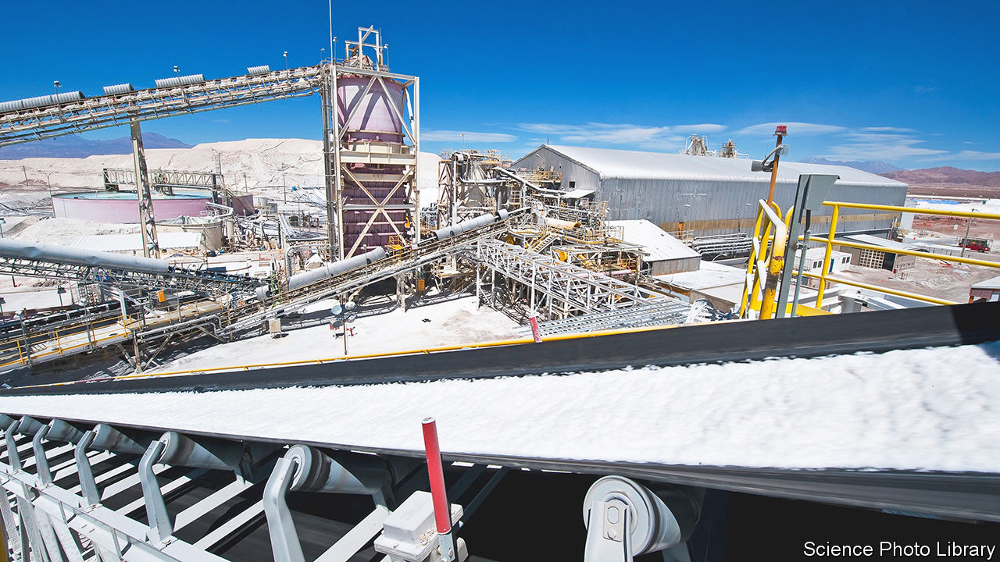
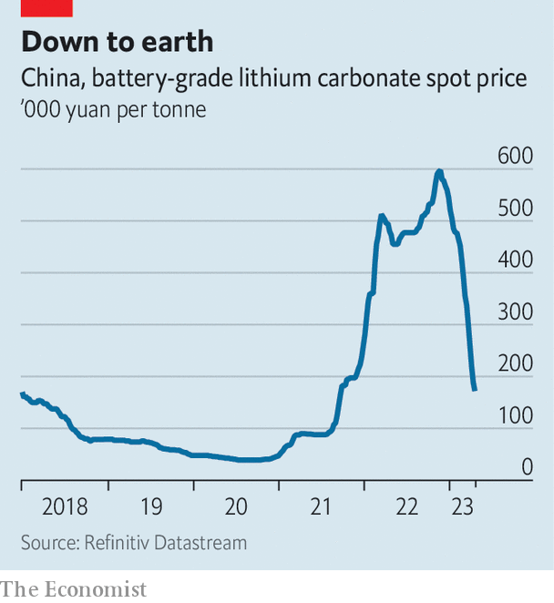

###### Ahead of the pack

# Why crashing lithium prices will not make electric cars cheaper 

##### The race to secure enough of the battery metal is just getting started 

 

> Apr 20th 2023 

Among the commodities that are key to decarbonisation, lithium is in the driving seat. Dubbed “white gold”, the metal is needed to produce nearly all types of batteries powering electric vehicles (evs). A single pack typically includes ten kilograms of the stuff. In the past two years turbocharged ev sales worldwide helped boost prices twelve-fold, prodding miners to invest, carmakers to sign supply deals and governments to label it a strategic material. Most commodity prices stalled this winter, but lithium continued to ride high. 

 


The rally has since gone into reverse. Prices for Chinese lithium carbonate, one of the two main forms of refined lithium, have more than halved this year (see chart). One reason is slowing demand for evs in China, the biggest market for them. Another is that carmakers such as Ford and Volkswagen, eager to enter a race dominated by Tesla and Chinese rivals, signed battery-supply deals at high prices last year. They are now reviewing the terms, further dampening appetite.

Global supply of mined lithium is rising fast, meanwhile. After growing by 1% in 2022, to 575,000 tonnes, it could jump by nearly a fifth this year as big mines come online in Australia and Chile, says Tom Price of Liberum, an investment bank. The sudden price slide has hit the valuations of sqm and Albemarle, the world’s largest miners of the metal. But the big miners are unlikely to suffer too much. Lithium is still expensive. Benchmark Minerals, a consultancy, estimates that carbonate prices are four times what they were, on average, between 2016 and 2021, when many big projects were commissioned (mines take about five years to build). 

Prices have yet to reach a floor but they are unlikely to fall far enough to bury big miners’ profits. Prices below $22,000 a tonne, far lower than today’s levels, would cause many of China’s domestic mines to shut down, lowering supply. And even as the refined product has become cheaper, the price of spodumene, a feedstock used to transform lithium ores, remains high, squeezing processors’ margins. They too may be forced to slash production, supporting prices of the refined stuff. 

And there are signs demand will revive. In April the chief of the China Passenger Car Association said he expected sales of evs in the country to rise by 30% this year. JPMorgan Chase, a bank, reckons a rebound will tip the lithium market into a deficit in 2023 and 2024. ev sales elsewhere remain healthy. The price of lithium hydroxide, a refined form of lithium used in more expensive, longer-range batteries, which are preferred outside China, has held up better than that of carbonate. It will help that hydroxide cannot be stored for ever. In the longer run rising demand for lithium for energy storage, supported by green policies in America, Europe and China, could make the market even tighter. 

This explains why big miners are still moving forward with new projects, such as Albemarle’s $1.3bn lithium hydroxide plant in South Carolina. A slump in the share price of rivals could allow them to grow bigger. In March Albemarle offered to buy Liontown Resources, an Australian producer, for $3.7bn. Insiders expect more deal activity. Carmakers, for their part, are anxious to secure more lithium. In April General Motors said it would invest in a startup that proposes to extract metal from previously ignored deposits, the latest in a series of recent bets on lithium ventures. 

A recovery in prices would disappoint carmakers. Lithium-ion battery prices have plummeted over the past decade or so, yet last year soaring metal prices helped to push up battery costs by 7%. The recent fall in lithium prices should again mean cheaper batteries, but it typically takes months for lower prices to translate into cheaper cars, by which point prices may be rising again. After a multi-year tear, white gold is taking a pause. Enjoy the pit stop while it lasts. ■


