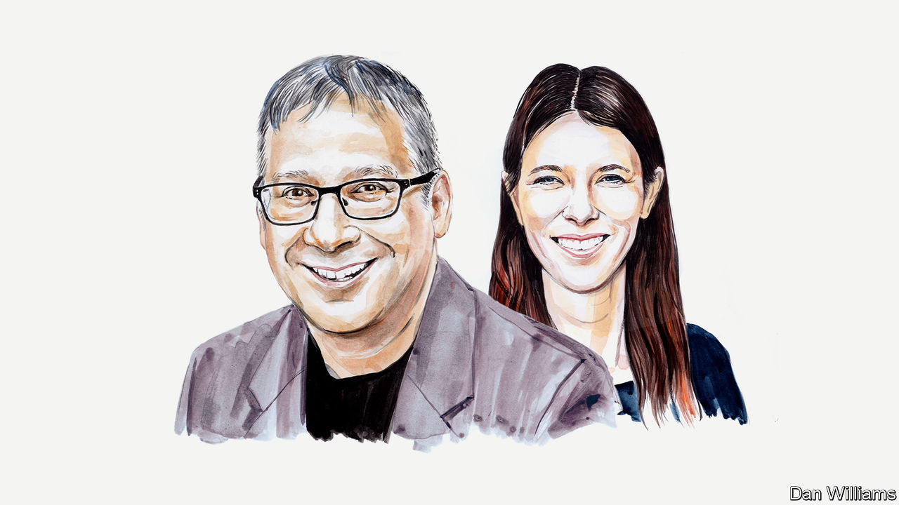

###### Artificial intelligence

# The world needs an international agency for artificial intelligence, say two AI experts 

##### Gary Marcus and Anka Reuel argue that global governance must be prioritised to address the risks of bias, misinformation or worse 

 

> Apr 18th 2023 

NEW GENERATIVE-AI tools like OpenAI’s ChatGPT, the fastest-growing consumer internet application of all time, have taken the world by storm. They have uses in everything from education to medicine and are astonishingly fun to play with. Although current AI systems are capable of spectacular feats they also carry risks. Europol has warned that they might greatly increase cybercrime. Many AI experts are deeply worried about their potential to create a tsunami of misinformation, posing an imminent threat to the American presidential election in 2024, and ultimately to democracy itself, by creating an atmosphere of total distrust. Scientists have warned that these new tools could be used to design novel, deadly toxins. Others speculate that in the long term there could be a genuine . 

One of the key issues with current AI systems is that they are primarily black boxes, often unreliable and hard to interpret, and at risk of getting out of control. For example, the core technology underlying systems like ChatGPT, large language models (LLMs), is known to “hallucinate”, making up false statements. ChatGPT, for example, falsely accused a law professor of being involved in sexual harassment, apparently confused by statistical but irrelevant connections between bits of text that didn’t actually belong together. After an op-ed tried to clarify what had gone wrong, Bing Chat made a similar error, and attributed it to information in  that the chatbot got completely backwards. 

These systems can also be used for deliberate abuse, from disrupting elections (for example by manipulating what candidates appear to say or write) to spreading medical misinformation. In a recent analysis of GPT-4, OpenAI’s most advanced LLM, the company acknowledged 12 serious concerns—without providing firm solutions to any of them. 

In the past year alone 37 regulations mentioning AI were passed around the globe; Italy went so far as to ban ChatGPT. But there is little global co-ordination. Even within some countries there is a hodge-podge, such as different state laws in America, or Britain’s proposal to eschew a central regulator, leaving oversight split among several agencies. An uneven, loophole-ridden patchwork is to no one’s benefit and safety. Nor should companies want to build a different AI model for each jurisdiction and face their own de novo struggle to navigate legal, cultural and social contexts. 


Still, there is plenty of agreement about basic responsible AI principles, such as safety and reliability, transparency, explainability, interpretability, privacy, accountability and fairness. And almost everyone agrees that something must be done—a  by the Centre for the Governance of AI found that 91% of a representative sample of 13,000 people across 11 countries agreed that AI needs to be carefully managed. 

It is in this context that we call for the immediate development of a global, neutral, non-profit International Agency for AI (IAAI), with guidance and buy-in from governments, large technology companies, non-profits, academia and society at large, aimed at collaboratively finding governance and technical solutions to promote safe, secure and peaceful AI technologies. 

The time for such an agency has come, as Google CEO Sundar Pichai himself said on April 16th. What might that look like? Each domain and each industry will be different, with its own set of guidelines, but many will involve both global governance and technological innovation. For example, people have long agreed that making employment decisions based on gender should be avoided, and have even come up with some measures in earlier, more interpretable AI, such as the interpretability requirements of the AI Bill of Rights proposed by the Biden administration. But in black-box systems like ChatGPT there is a wide variety of use cases with no current remedy. People might, for example, feed in a job candidate’s entire file and ask ChatGPT for a judgment, but we currently have no way to ensure that ChatGPT would avoid bias in its output. The kind of entity we envision would collaboratively address what to do about such “off-label” uses of chatbots and other policy questions, and at the same time develop technical tools for effective auditing. 

The IAAI could likewise convene experts and develop tools to tackle the spread of misinformation. On the policy side, it could ask, for instance, how wide-scale spreading of misinformation might be penalised. On the technical side, the initial focus should be on developing automated or semi-automated tools for answering fundamental questions, such as “How much misinformation is out there?”, “How rapidly is its volume growing?” and “How much is AI contributing to such problems?” Existing technologies are better at generating misinformation than detecting it. Considerable technical innovation will be required, and of great public benefit, but may or may not be of sufficiently direct commercial interest – hence the need for independent support by an entity like the IAAI. 

To take a third, very recent example, systems with names like AutoGPT and BabyAGI have been devised that allow amateurs to build complex and difficult-to-debug (or even fathom) assemblies of unreliable AI systems controlling other unreliable AI systems to achieve arbitrary goals—a practice that may or may not prove to be safe. As Marek Rosa, CEO of GOOD.Ai, put it, we need new technical ideas on “how to increase security (proactive defence) in a world where there are billions of AI agents…running in apps and servers, and we don’t know what they are talking about”, perhaps necessitating a kind of “antivirus [software] against AI agents”. A global alliance with top experts and researchers on call would be able to give swift and thoughtful guidance on such new developments. 

Designing the kind of global collaboration we envision is an enormous job. Many stakeholders need to be involved. Both short-term and long-term risks must be considered. No solution is going to succeed unless both governments and companies are on board, and it’s not just them: the world’s publics need a seat at the table. 

Fortunately, there is precedent for such global co-operation. At the end of the second world war, for example, nuclear weapons sparked deep fears and uncertainties about how the new technology would be used. As a response, 81 countries unanimously approved the International Atomic Energy Agency’s statute to “promote safe, secure and peaceful nuclear technologies”, with inspection rights. A different, softer kind of model, with less focus on enforcement, is the International Civil Aviation Organisation, in which member countries make their own laws but take counsel from a global agency. Getting to the right model, and making the right choices, will take time, wisdom and collaboration. 

The challenges and risks of AI are, of course, very different and, to a disconcerting degree, still unknown. We know in hindsight that the internet might have been designed in better ways with more forethought. Earlier decisions about how to handle privacy and anonymity, for instance, might have ensured that there was less of a culture of trolling. We also know that early choices get locked in. Our decisions now are likely to have lasting consequences and must be made thoughtfully.

Given how fast things are moving, there is not a lot of time to waste. A global, neutral non-profit with support from governments, big business and society is an important start. ■


