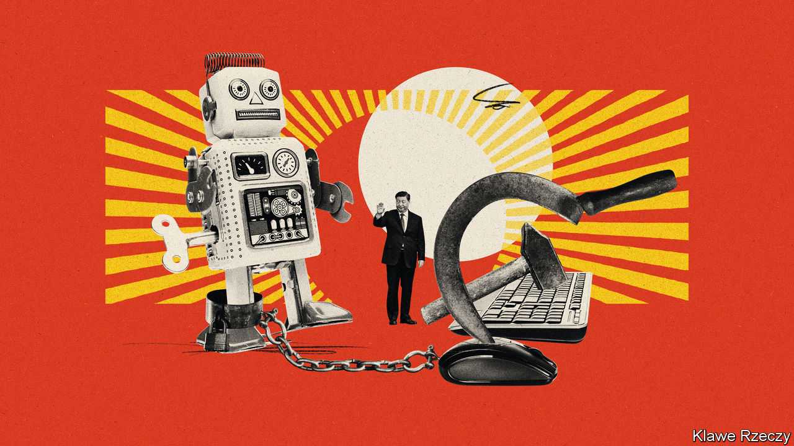

###### Welcome to ChatCCP

# Can Xi Jinping control AI without crushing it? 

##### Artificial intelligence will test the Chinese Communist Party’s ability to shape innovation to suit its purposes 

 

> Apr 18th 2023 

IN THE PAST month or so, China’s tech giants have been showing off. , , Huawei and SenseTime have all flaunted their artificial-intelligence (AI) models, which can power products and applications such as image generators, voice assistants and search engines. Some have introduced AI-powered chatbots similar to , the human-like conversationalist developed in America that has dazzled users. The new offerings have names such as Ernie Bot (Baidu), SenseChat (SenseTime) and Tongyi Qianwen (Alibaba). The latter roughly translates as “truth from a thousand questions”. But in China the Communist Party .

AI poses a challenge for China’s rulers. The “generative” sort, which processes inputs of text, image, audio or video to create new outputs of the same, holds great promise. Chinese tech firms, hit hard in recent years by  and sluggish sales, hope that generative AI can create vast new revenue streams, similar to the opportunities brought by the advent of the internet or the smartphone.

The party, though, sees generative AI opening up vast new ways for information to spread outside its control. Its leaders may draw different comparisons to the internet, which seemed destined to help democratise China by increasing access to unfiltered news and communication tools. “Nailing jello to a wall” was how, in 2000, Bill Clinton described the party’s attempts to control the web. Yet by deploying an army of censors and digital barricades the party has largely succeeded in creating an internet that serves its own purposes, and has cultivated an industry around it. Might something similar happen with AI?

Rules proposed by China’s internet regulator on April 11th make clear the government’s concerns. According to the Cyberspace Administration of China (CAC), firms should submit a security assessment to the state before using generative AI products to provide services to the public. Companies would be responsible for the content such tools generate. That content, according to the rules, must not subvert state power, incite secession, harm national unity or disturb the economic or social order. And it must be in line with the country’s socialist values. Those restrictions may sound arcane, but similar rules, applied to the internet, let the party repress speech about everything from  to democracy, feminism and gay literature.

China’s proposals come as governments around the world wrestle with . Some, such as America’s, favour a light touch, relying on existing laws to police the technology. Others reckon that new regulatory regimes are needed. The eu has proposed a law that categorises different uses of AI and applies increasingly stringent requirements according to the degree of risk. China’s approach appears more piecemeal and reactionary. Last year, for example, the party feared that “deepfake” images and videos might disrupt the tightly controlled information environment, so it issued new rules on the technology. One banned AI-generated media without clear labels of origin.

There are similarities to China’s approach to the internet. Its web controls, often referred to as the “great firewall”, may seem monolithic. But keeping out “harmful” foreign content is only part of a more layered effort, developed over time and involving many agencies and companies. The first stage was all about laying the groundwork for an internet the party could control, says Matt Sheehan of the Carnegie Endowment for International Peace, a think-tank. Today China’s government is again building up its bureaucratic muscles and adding to its regulatory toolkit, this time with generative AI in mind. Mandating security reviews and requiring firms to register their algorithms with the state are examples of this, says Mr Sheehan.

China’s control of the internet has not stifled innovation: just look at firms such as , the Chinese parent of TikTok, a popular short-video app. But when it comes to generative AI, it is difficult to see how a Chinese company could create something as wide-ranging and human-like (ie, unpredictable) as ChatGPT while staying within the government’s rules. 

The CAC says that the information generated by such tools must be “true and accurate” and the data used to train them “objective”. The party has its own definitions of these words. But even the most advanced AI tools based on large-language models will occasionally spout things that are actually untrue. For a product such as ChatGPT, which is fed on hundreds of gigabytes of data drawn from all over the internet, it is hardly feasible to sort through inputs for their objectivity. Strict enforcement of China’s rules would all but halt development of generative AI in China.

So experts doubt that the measures will be tightly enforced. Within the draft regulations there is scope for moderation. When generated content falls outside the rules, the government calls for “filtering and other such measures” and “optimisation training within three months”. That sounds similar to the tweaking of models carried out by Western firms to, say, stop their chatbots from spewing homophobic content. Local AI regulations introduced by the city of Shanghai are even looser, stipulating that minor rule-breaking might not be punished at all. 

The arbitrary nature of the CAC’s proposed rules means that it can tighten or loosen them as it sees fit. Other countries might endorse such flexibility. But as big internet firms can attest, the Chinese government has a habit of rewriting and selectively enforcing rules based on the whims of President Xi Jinping. In recent years companies in fields such as e-commerce, social media and video-gaming have had to rethink their business models. In 2021, for example, state media branded video games “spiritual opium”: regulators told gaming companies to stop focusing on the bottom line and reduce kids’ desire to play. If Mr Xi does not like where generative AI is going, he could reset that industry, too.

One way Chinese AI firms may be held back is by limiting the personal data made available to train their AI models. The party runs the world’s most sophisticated mass-surveillance state. Until recently, China’s tech companies were also able to hoover up personal data. But this freewheeling era seems to be coming to an end (for the private sector). Now companies wanting to use certain types of personal data must, in theory, obtain consent. Last year the CAC fined Didi Global, a ride-sharing company, the equivalent of $1.2bn for illegally collecting and mishandling user data. Under the draft rules on AI, firms would be responsible for safeguarding users’ personal information.


New jello, new nails

The CAC’s proposed regulations come six years after China’s master plan for AI called for “major breakthroughs” by 2025 and domination of the industry by 2030. Progress towards those ends has been mixed. Chinese companies in fields such as AI-assisted image recognition and autonomous driving, which have less to fear from the government’s preoccupation with social stability, are doing well. They benefit from lots of public money—in fact, some provide tools that enable state repression.

But China is still behind America in terms of investment and innovation. Foreign investors have been turned off by American sanctions. Worse, America has restricted exports to China of the type of cutting-edge semiconductors that power AI, a move that could hobble the industry.

China may have more success when it comes to regulation. Under its master plan China is to have written the world’s ethical code for AI by 2030. That is a stretch, but its rules on generative AI are more detailed and expansive than those suggested elsewhere, thus influencing the debate over handling the new technology. If China is quick to lay down new regulations, other countries will learn from it. One risk is that it moves too forcefully and hinders innovation. But Jeffrey Ding of George Washington University points to the other side of the argument. He notes the ingenuity of China’s internet companies, and says that obstacles sometimes spur innovation.

Still, the idea that China may act as the lead guide when it comes to AI ethics ought to terrify Western governments. They may share some of the same concerns as China, including over misinformation and data protection, but not for the same reasons. Again, China’s experience with the internet is informative. It has steadfastly opposed the notion of the web as a place of freedom and openness. When governments gather to discuss online regulation, China consistently sides with Russia and other tramplers of free speech. Mr Clinton was naive to think the Communist Party could not pound the internet into submission. It would be naive for Western leaders to think it cannot do the same with AI. ■


