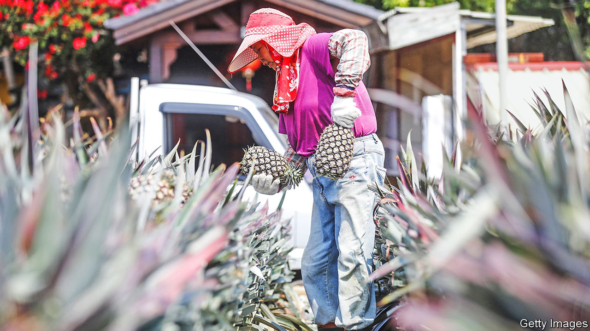

###### Spiky relations

# China’s alleged theft of a pineapple cultivar has Taiwan livid 

##### A completely different kind of grey-zone tactic 

 

> Apr 20th 2023 

In their quest for the perfect pineapple, Taiwan’s agricultural engineers spared no effort. They spent almost 25 years developing a variety with a mango-like fragrance, a longer shelf life than the island’s dominant strain, and a resistance to blemishing in its hot and humid summer. Released in 2018, it was officially named Tainung No. 23. But it soon became known as the Mango Pineapple. 

The cultivar is now the focus of a fresh Chinese attempt at pomological warfare. On April 4th Taiwan’s deputy agriculture minister, Chen Junne-jih, accused China of “plundering” plant breeders’ rights after mainland media reported that Mango Pineapples were being grown in southern China. Smuggling seeds or seedlings to the mainland was “absolutely unacceptable”, he said.

Pineapples are valuable exports for Taiwan. China has targeted them before to put pressure on the island, which it claims. But this latest development comes at a sensitive time, with China and America stepping up preparations for a potential war over Taiwan. The self-governing island will also hold a presidential election in 2024 in which farmers are an important constituency.

Since taking office in 2016, President Tsai Ing-wen has tried to reduce Taiwan’s economic dependence on China by expanding exports to other countries. Her government is making progress towards a trade deal with America, both sides say. For now, though, China remains the island’s biggest trade partner. 

China lifted tariffs on Taiwanese pineapples in 2005, when it hoped to forge closer ties through trade. By 2020 it was buying $49m worth, more than 90% of Taiwan’s annual exports of the fruit. Then, in 2021, China banned all Taiwanese pineapple imports, saying they carried pests. Taiwan called that a political ploy. Soon the pineapple became a symbol of resistance against China. 

Ms Tsai urged her people to “eat Taiwan’s pineapples until you burst”. Local businesses added pineapple to products ranging from beer to beef noodles. Taiwan also called on other countries to buy its “freedom pineapples”. That echoed a campaign to promote Australian “freedom wine” after China hiked tariffs on that product in 2020. 

Japan responded to Taiwan’s appeals with gusto. By the end of 2021 it had bought 62% of the island’s pineapple exports. But further sales were hindered by the short shelf life of Taiwan’s dominant Golden Diamond variety. So Taiwan began promoting Mango Pineapples, which were given temporary intellectual-property protection in Japan in 2022. 

China, meanwhile, has rapidly expanded cultivation of Golden Diamonds and begun marketing them abroad as “Chinese pineapples”. Its farmers now appear to be setting their sights on Mango Pineapples. On March 11th a state-run news website in the province of Hainan reported that both types were being grown on some 60 hectares of farmland. 

Taiwan has just 27 hectares of Mango Pineapple under cultivation, with production restricted to four seedling companies and three farming households. Only Taiwan and Japan legally protect the cultivar. Taiwan and China established a plant-patent work group in 2010, but the Chinese side stopped talking in 2016. 

On March 16th Taiwan’s cabinet approved an increase in the maximum penalty for illegally exporting seeds or seedlings to three years in prison. Still, it will be hard to establish how the new variety reached China: it can be planted using buds from the pineapple’s crown.

The news has been especially tough on staff at the Taiwan Agricultural Research Institute who began developing the cultivar in the 1990s by cross-pollinating different strains by hand. “It’s a real disappointment,” said Huang Shou-horng, a researcher there. “It’s very damaging for us as individuals, as researchers and as a country.”■


