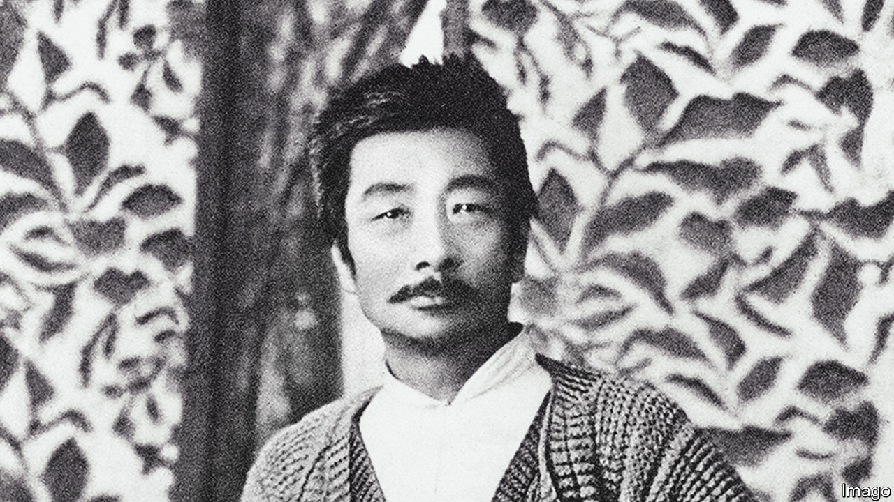
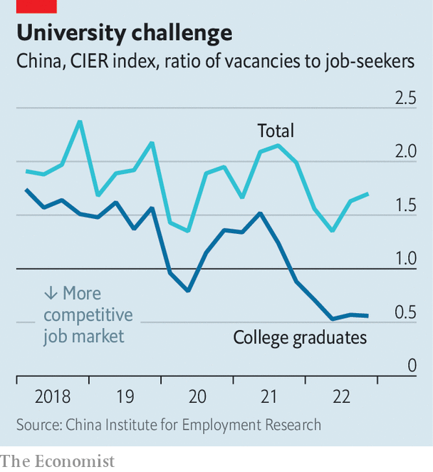

###### The lessons of Kong Yiji

# What China’s graduates really think about their job prospects 

##### They are using a story from 1918 to express their frustration 

 

> Apr 20th 2023 

There are two classes of customers at the tavern in Lu town. The scholars sit inside, sipping wine in the long robes that mark their intellectual status. The workers, dressed in short robes, drink cheaper booze outside. Only one customer wears a long robe and stands outside: Kong Yiji, a miserable scholar-turned-beggar. He is mocked by the other customers for being poor, yet clinging to his erudite image. They sneer at the way he recites classical verse and tries to teach children how to write obscure Chinese characters. Away from the tavern, Kong steals and is beaten as punishment. Yet he still crawls to the bar—leading to more mocking. When he disappears he is assumed dead.

 


The story of Kong Yiji was written in 1918 by Lu Xun, a celebrated Chinese satirist (pictured above). But it is being cited today by young Chinese, who relate to Kong. A record 11.6m of them are expected to graduate from university this year. Many will be unable to find work. The unemployment rate for people aged 16 to 24 in cities is nearly 20%. The CIER index, a measure of labour-market competition produced by Renmin University in Beijing, shows a big gap between the number of college graduates and the number of jobs available (see chart). The phrase “out of school means out of work” is commonly seen online nowadays, as are memes about Kong Yiji.

That has annoyed the authorities, who believe today’s youth should learn a different lesson from Lu Xun’s tale. Kong Yiji could have improved his lot through hard work, but he was too pretentious to step off his intellectual pedestal, says a commentary on the website of CCTV, China’s state television. The implication is that Kong was to blame for his own suffering—as are today’s young people, whose degrees, like Kong’s robe, have made them too arrogant and lazy to do low-skilled jobs.

The government and its backers extol young people who they regard as anti-Kongs. The Communist Youth League recently highlighted a young woman from Jiangsu province called Wei Qiao. Ms Wei was praised by Xi Jinping, China’s leader, for moving to the countryside and becoming a “new farmer”. Young people should learn to “roll up their pants and enter the fields”, said the league. Similarly, state media profiled a young university graduate, referred to as Ms Huang, who earns a living collecting garbage for recycling in Henan province. Office jobs are boring, says Ms Huang in the video. “We should not be shackled by our educational degrees.”

Chinese netizens have ridiculed these reports. “Why don’t we all stop going to school, go turn screws in factories, and save ourselves 15 years of effort?” asked one Weibo user. “My parents spent their lives working in factories and saving money to give me this scholar’s robe. How can I take it off?” asked another. A young vlogger poked fun at how the state expects endless positivity from young people. In a sarcastic music video about “sunny-spirited Kong Yiji” he sings, “I went to school to help China rise, not to be some delivery guy.” It was viewed 3m times before it was censored.

At a recent forum Yu Hua, a novelist, was asked for his views on all this. The problem is not the scholar’s robe, but the job shortage, said Mr Yu, adding that he knew a publisher who had received more than 6,000 applications for six openings. The only solution is to seek economic growth so that more jobs are created, he said. China’s GDP grew faster than expected in the first quarter. But the weak labour market for graduates—and memes about Kong Yiji—are likely to persist for some time. ■


