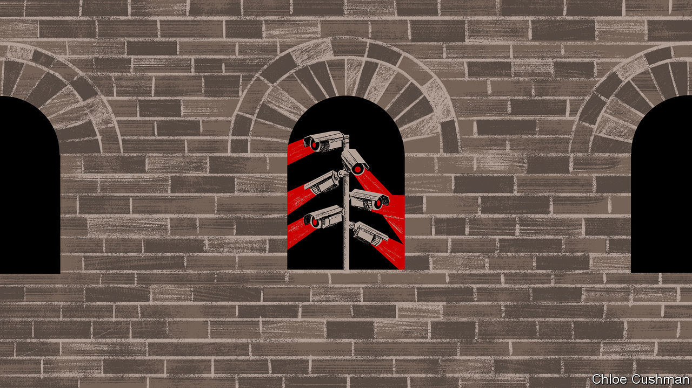

###### Chaguan

# What “de-risking” China means 

##### European leaders call for de-risking but not decoupling from China. Alas, China wants to be a risk 

 

> Apr 20th 2023 

De-risking is an ugly name for an interesting idea. When explaining how they hope to manage future relations with China, a growing number of Western leaders describe some version of risk management. This approach is presented as a middle path between the impossible—ie, trying to contain or isolate a country of China’s size and importance—and the intolerable—namely, dependency on an autocracy that often bullies smaller countries. 

The European Commission president, Ursula von der Leyen, is a prominent user of the term. The head of the European Union’s permanent executive says that it is neither viable nor in Europe’s interest to decouple from China, a vital trading partner and leading player in efforts to tackle climate change and other global challenges. Instead, citing China’s growing repression at home and assertiveness abroad, she calls for de-risking ties. 

De-risking is actually a catch-all for several defensive strategies. Mrs von der Leyen emphasises diplomatic candour, to avoid misunderstandings. Before a recent visit to Beijing she spelled out Chinese actions that damage trust, from unfair trade practices to Xi Jinping’s embrace of Vladimir Putin, even after Russia’s “atrocious and illegal invasion of Ukraine”. In the same vein, on April 18th foreign ministers from the Group of Seven (G7) club of rich countries listed behaviours for China to avoid, among them forcing foreign firms to hand over technologies or data in return for market access and supporting the cyber-theft of commercial secrets. For good measure, G7 ministers warned China against using force to resolve territorial disputes, including in Taiwan (a scenario which could, by itself, devastate the global economy).

In America, the EU and elsewhere, de-risking can involve screening and even curbing investments in and out of China, as well as subsidies for rebuilding domestic industries, to reduce Chinese dominance of vital supply chains. It can also describe the use of national-security tools. To prevent China from building potent weapons with foreign technologies, America, Japan and the Netherlands are restricting exports to China of cutting-edge semiconductors and the equipment needed to make them.

Liberal democracies are even turning to risk management in such fraught domains as human rights. Foreign criticism will not end China’s iron-fisted rule over Xinjiang. In the name of fighting Islamic extremism in that far-western region, authorities have demolished mosques, jailed poets and sent Uyghurs to re-education camps, coercive work programmes and harsh boarding schools. But democracies have a right to protect consumers from buying the fruits of repression. America’s Uyghur Forced Labour Prevention Act, enacted in 2021, bars goods from Xinjiang and those that use inputs from the region, unless traders can prove they were not made with forced labour. In the past ten months, customs agents have impounded almost a billion dollars’ worth of goods including solar panels, a product that often uses polysilicon mined and processed in Xinjiang. Without singling out China by name, the EU has proposed its own ban on products of forced labour.

Alas, to succeed, these various strategies will have to overcome a large obstacle: Mr Xi’s China does not want to be de-risked. Start with diplomatic candour, and the supposed benefits of handing China lists of behaviours that make Western powers cross, or concessions (eg, international commitments over climate change) that would make Europeans and others cheer. In reality, China is increasingly confident that lectures from America and its allies are resented by many countries, especially poorer ones. America-scolding comments by two presidents, Emmanuel Macron of France and Luiz Inácio Lula da Silva of Brazil, during recent visits to China, further confirmed this view. China’s foreign ministry duly spurned the statement issued by the G7 in terms calculated to appeal to the global south. A spokesman accused the group of “arrogance” and of “pointing fingers condescendingly”, in a way that “runs counter to the prevailing trends of today’s world”.

Nor does China want its supply chains de-risked by outsiders. Quite the opposite: China’s dominant role as a producer of vital goods and commodities is Mr Xi’s stated goal. Some years ago the Communist Party boss called foreign dependence on Chinese supply chains “a powerful countermeasure and deterrent capability”. In contrast, Mr Xi repeatedly urges China to avoid dependence on foreigners and achieve self-reliance in key technologies. 

Where everything is a matter of national security

It is risky for foreign firms in Mr Xi’s China even to screen their own supply chains for abuses. The Central Political and Legal Committee, a powerful law-enforcement body, marked National Security Education Day on April 15th by warning Chinese citizens about the devious ways of foreign enemies, including in the realm of economic security. One case study involved a Chinese supply-chain auditor punished under anti-espionage laws for helping a foreign NGO “concoct” allegations of forced labour in Xinjiang. That reflects an unhappy trend, says a supply-chain expert. A few years ago Chinese suppliers tolerated foreign audits as a sign of quality control. Today, he says: “anything related to forced labour, broadly defined, is a total no-go. You can’t ask those questions without endangering everyone you contact.” Major auditing firms refuse to work in Xinjiang, citing restrictions on access.

Revealingly, when self-interest calls, China will allow foreigners to conduct due diligence. In late 2022 American officials were allowed to visit chipmaking firms in China to check that they were not selling US technologies to military end-users. That reflected a contest of strength. America dominates many fields of chipmaking and had threatened to put Chinese firms on a blacklist. 

De-risking is not a foolish way to approach relations with China. When trust collapses, continued engagement requires risk management. Still, expect China to call de-risking just another form of containment. Decoupling will not be easily avoided. ■


