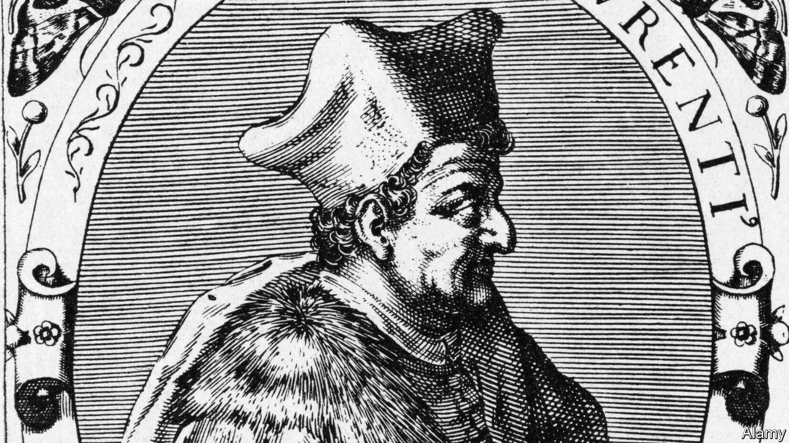

###### Lessons unlearnt

# An entertaining history of humanist thought 

##### Sarah Bakewell’s book arrives as anti-humanist forces muster once again 

 

> Apr 19th 2023 

By Sarah Bakewell. 

Near the start of her account of humanism, Sarah Bakewell draws an important distinction. Anti-humanists, she writes, despise the material world and seek either to escape it using religion or remake it by means of totalitarian politics. Humanists, by contrast, are cautious optimists who embrace the possibility that common endeavour can unite people and improve their lot. 

Ms Bakewell pledges her allegiance to the humanists, yet she also acknowledges that anti-humanism has its place as an antidote to naivety and complacency. “It forces humanism to keep working to justify itself,” she writes. As anti-humanist forces muster today, in authoritarian states and among right- and left-wing populists in democracies, this book is Ms Bakewell’s justification.

Aptly, the early chapters are themselves an exercise in the Renaissance humanist tradition of digging up forgotten texts. Petrarch will be familiar; less so Leontius Pilatus, a shaggy-bearded Calabrian, or Poggio Bracciolini, who wrote what Ms Bakewell describes as the first published joke book. As she romps through the centuries, readers will feel assured that they are in the company of a gifted guide.

Ms Bakewell also has a serious point to make. In 1440 Lorenzo Valla, a priest and scholar (pictured above), demolished the church’s claim to have dominion over western Europe. Valla drew on history and textual analysis to show that the document in which the Emperor Constantine supposedly surrendered the territory to the Vatican was a fake. Many others were to follow Valla, deploying reason to spread the spirit of Enlightenment.

Over the centuries, humanism also found a voice in science. Ms Bakewell could have focused on the discoveries of  or ; instead, somewhat arbitrarily, she identifies scientific humanism with Charles Darwin. The theory of evolution from natural selection  of creation and established the continuity between humanity and the rest of the living world. Her narrative explores how generations of educated Anglican curates struggled to reconcile Darwin’s ideas with their own religious beliefs—and how, as the poet Matthew Arnold was to write in “Dover Beach”, the “Sea of Faith” receded.

Any account of humanism in the 20th century must grapple with its failure to prevent the rise of fascism and communism. Some humanists, such as , thought that belief systems built around violence and power would self-destruct. Yet he eventually concluded that faith in the goodness of mankind was a “beautiful error”.

Alas, humanists themselves also share the blame. The German author , living in exile, said that “in all humanism there is an element of weakness, which…may be its ruin.” It did not help that, with honourable exceptions, many humanists had been blind to the claims of all those who were not fortunate enough to be white, European and male. 

Having alerted readers to today’s populists and dictators, you might think that Ms Bakewell would use the conclusion of her book to explore the threat from contemporary anti-humanism. Instead, she is distracted by modern humanist organisations and their designs, such as the launch of an advertising campaign under the slogan: “There’s probably no God. Now stop worrying and enjoy your life.” 

In that spirit, Ms Bakewell closes with a quotation from her favourite humanist, Robert G. Ingersoll, a 19th-century American lawyer and orator: “Happiness is the only good. The time to be happy is now. The place to be happy is here. The way to be happy is to make others so.” That is indeed one foundation for a good life. But you feel that, faced with threats to the humanist worldview from the likes of the Chinese Communist Party, Vladimir Putin and the forces polarising democratic politics, today’s humanists are ducking the lessons of history. ■


