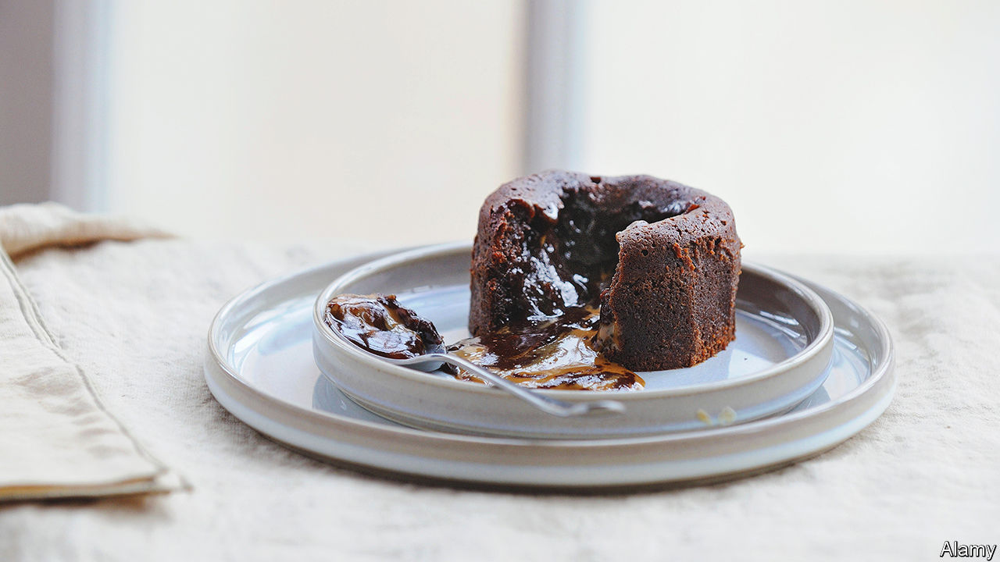

###### World in a dish

# How the chocolate fondant became a ubiquitous indulgence 

##### The dessert can be found in Michelin-starred restaurants and supermarkets alike 

 

> Apr 19th 2023 

Some dishes are unequivocally high-end: a perfectly clear consommé, for instance. Others are less so—a cheeseburger-crust pizza, say. Still others defy the distinction, served in restaurants of all calibres to diners of all tastes. The  fondant is one such dish. Its success is a reminder that, in the end, pleasure is still a universal pursuit.

Two glitzy French cuisiniers claim to have invented the chocolate fondant. The first is Michel Bras, a Michelin-starred chef, who created the  (runny chocolate) in 1981 to evoke the memory of sipping hot chocolate to warm up after a family skiing trip. The second is Jean-Georges Vongerichten, another starry Gallic gourmet. In New York in 1987 he pulled hundreds of miniature chocolate cakes out of the oven before they were cooked. The centres were molten but there was no time to correct the mistake. Despite the error, the diners loved them. He has served them ever since. 

Their techniques are different, but between them Messrs Bras and Vongerichten created a sophisticated confection. It became a phenomenon, served in the toniest establishments on either side of the Atlantic. In America it had the all-important aroma of French refinement and . 

The flavour is straightforward (one-note would be a less charitable description) but getting the dish exactly right is tricky. There are no outward clues to indicate the point at which it is perfectly cooked. The moment of incision provides the thrill of drama. Will the dessert ooze or will it prove to be a dry disappointment?

In 1991 Alain Ducasse, a multi-Michelin-starred chef, told the  that the fondant had reached a point where restaurants “were practically obliged to make it”. It was one of the defining desserts of that decade. But then the tide began to turn. Mr Vongerichten was churning out so many at one point that Mark Bittman, an American food writer, dubbed it “the Big Mac of desserts”. 

The name evolved. In many places it became a “molten chocolate cake” or a “chocolate lava cake”. It travelled from hushed dining rooms to the restaurants of Disney World. Chain restaurants began serving them; takeaway joints can deliver fondants along with your pizza. Supermarkets include the dessert in their  ready-meal deals. Aldi, Costco, Lidl and Walmart all flog iterations of it. In “Chef”, a film of 2014, a critic seethes that he would rather the cook “sit on my face after a brisk walk on a warm day than suffer through that fucking lava cake again.” The dish has become  or, worse, a bit naff. 

And yet like  and —also wildly popular in the 1990s—its ubiquity seems to have inflicted little damage. It exists comfortably on both planes, the blowout and the budget. Any version of it is fundamentally an extravagance. That overcomes any food snobbery. A recent study suggests that people living in “high-indulgence” cultures (as opposed to cultures of restraint) report higher levels of well-being. It turns out a little of what you fancy does, in fact, do you good. ■


