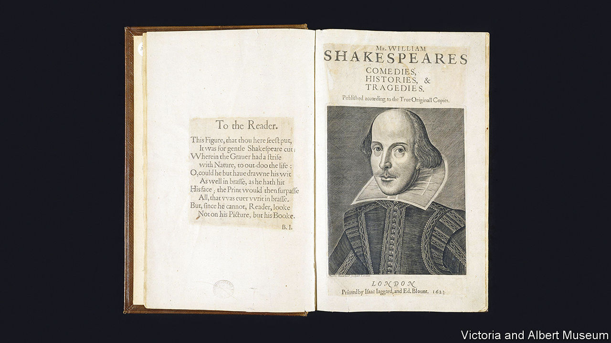

###### With a little help from his friends

# Shakespeare’s First Folio assembled the world’s greatest literature 

##### Published 400 years ago, the book fixed the playwright’s canon for posterity 

 

> Apr 19th 2023 

By Chris Laoutaris. 

 By Emma Smith. 

Not much in European trade runs the same way now as it did four centuries ago. However, English-language publishers still advertise future titles at the Frankfurt Book Fair—just as they did in 1622. In that year, a catalogue of forthcoming English works featured an intriguing volume, announced between blurbs for a biblical commentary and a genealogical tome. It alerted potential buyers to the imminent appearance of “Plays, written by M. William Shakespeare, all in one volume, printed by Isaack Jaggard, in fol[io].” 

The Frankfurt punters had to wait. That bumper book of playscripts by an author who had died in April 1616 proved a tricky, arduous job. The printers completed it in 1623. By 1624, the chunky compilation was pitched at the fair as “Master Shakespeare’s Works”. According to Chris Laoutaris, a historian of the volume, this upgrade in terminology implied the “intellectual gravitas” of an author with “grand achievement” to his name. Among dramatists, only Ben Jonson, Shakespeare’s friend and rival, had presumed to publish a swanky folio of “Works” before. In 1612 the founder of Oxford University’s Bodleian Library had even warned against collecting play-texts: worthless “baggage books”. 

Sir Thomas Bodley lost that battle. The so-called First Folio of Shakespeare’s plays soon entered the Bodleian’s collection. This large-format volume, around 950 pages long, not only gathered 36 out of Shakespeare’s 38 surviving plays, it was also the cornerstone of his , which 400 years later extends to  he never knew existed. Fifty small “quarto” editions of individual Shakespeare plays appeared between 1594 and 1623, and “Henry IV” and “Richard III” proved particularly popular. But 18 Folio items had never seen print before—including “Julius Caesar”, “Macbeth”, “The Tempest” and “Twelfth Night”. The First Folio fixed the Shakespeare canon for posterity (it lacks only “Pericles” and “The Two Noble Kinsmen”) and even—via Martin Droeshout’s frontispiece of the balding playwright—his physical image. 

Readers can now access a digital reproduction of the Bodleian’s “Arch.G c.7” at any time, for nothing: one of several Folios online. If you crave an original copy, the bill will prove steeper. In 2020 Mills College in California sold a high-quality First Folio at Christie’s in New York to a rare-book dealer, Stephan Loewentheil, for $9.98m. Modern celebrity buyers include Sir Paul Getty (who paid £3.5m, or $5.7m, in 2003) and Paul Allen, Microsoft’s co-founder ($6.1m in 2001). In 2021 the University of British Columbia paid $5.9m for a Folio. 

Now, to coincide with the First Folio’s 400th anniversary, Peter Harrington, an antiquarian bookseller in London, is selling a fine copy, previously in private hands, for $7.5m. The firm had the full set of all four 17th-century Folio editions of Shakespeare, plus a scarce edition of his poems from 1640, on offer for $10.5m. Pom Harrington, the proprietor, called that a “once-in-a-generation chance”. The poems, and the Fourth Folio of 1685, have just been sold. (The First remains available.)

Thanks, in part, to his friends’ push to celebrate the playwright’s legacy, Shakespeare’s First Folio is not especially rare compared with other early 17th-century books. From the original print run of around 750 copies, 235 are known to exist. Most, however, lie in hushed, low-lit state in libraries and museums. The Folger Shakespeare Library in Washington, DC, has 82 copies, gems of the  amassed by Henry Folger, the president of Standard Oil, and his wife, Emily. America hosts 149, Britain 50, with the others scattered around the world. Perhaps 27 remain in private hands, and few are likely to enter the open market. 

Your correspondent inspected the First Folio now on sale in London. Inside its handsome calfskin binding—not contemporary, but dating from around 1700—the large pages look, and feel, crisp, clean and strong. Although four of the eight preliminary pages, including poems, dedications and Droeshout’s famous engraving, are marked as facsimiles on this copy, the pages containing the plays’ texts remain intact and unrestored.

Sold in 1950 for £5,000 (then a steep price tag), this Folio had perhaps rested in the library of some proud but not-too-bookish hunting squire in northern England. Its bright and legible leaves of imported French paper showcase the array of crafts that blended to make the volume. Professor Emma Smith of Oxford University, whose study of the Folio’s creation has been revised for the quatercentenary, writes that it was “the product of many different people with different amounts of agency and investment—personal, intellectual and economic—in the project.”

Professor Smith’s book, and Mr Laoutaris’s history of the interlinked careers behind the Folio scheme, bring that network to life. Henry Condell and John Heminge, two of Shakespeare’s actor colleagues from the King’s Men company, co-ordinated the project. Edward Blount, a publisher-bookseller known for his cosmopolitan, upmarket list, led a syndicate that included the father-and-son printers William and Isaac Jaggard, as well as fellow booksellers William Aspley and John Smethwick.

Mr Laoutaris traces the tangled negotiations that led to their acquisition of printing rights for the 22 plays the King’s Men did not control. His resourceful sleuthing ties the Folio’s birth to the politics of its time. Partisans of an Anglo-Spanish alliance—such as Blount and the poets who praised Shakespeare in prefatory verses—were in conflict with a more insular Protestant camp at James I’s court. Hedging their bets, the Folio syndicate dedicated its book to the Earl of Pembroke and his brother: not only backers of the King’s Men, but stalwarts of the anti-Spanish faction.

The printing proved a slow, intricate job, with source texts drawn from Shakespeare’s own manuscripts (none of which survives), theatre prompt copies, old quarto editions and cleaned-up “fair copies” recorded by a scribe. The team of around ten compositors included both highly skilled veterans and a notoriously error-prone teenage apprentice, John Leason. Piecemeal corrections with the print run in progress mean that “each copy is a unique collation”, Professor Smith writes. 

Yet the venture, which Mr Laoutaris calls “a bold, gutsy and daring initiative”, paid off. A costly 15 shillings unbound, the Folio nevertheless reached its “elite” target audience of buyers willing to treat an anthology of modern plays as a token of “exclusivity, good taste and grandeur”. Soon a “profitable undertaking”, the Folio did well enough to trigger a revised update in 1632: the Second Folio. 

The First Folio carried Shakespeare through what Professor Smith dubs his “post-popular doldrum”: that awkward posthumous patch when art is “neither classic nor current”. Condell, Heminge and colleagues managed to sprinkle the stardust of luxury, glamour and prestige over an assemblage of old plays. In doing so, they ensured that Shakespeare—as Jonson’s dedicatory poem puts it—“was not of an age, but for all time”. ■


