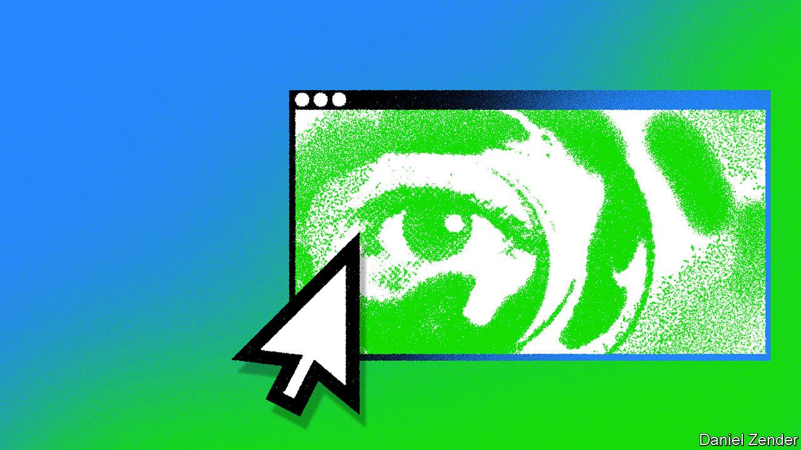

###### Browsers, the printing press, Freud and AI

# How AI could change computing, culture and the course of history 

##### Expect changes in the way people access knowledge, relate to knowledge and think about themselves 

 

> Apr 20th 2023 

Among the more sombre gifts brought by the Enlightenment was the realisation that humans might one day become extinct. The astronomical revolution of the 17th century had shown that the solar system both operated according to the highest principles of reason and contained comets which might conceivably hit the Earth. The geological record, as interpreted by the Comte de Buffon, showed massive extinctions in which species vanished for ever. That set the scene for Charles Darwin to recognise such extinctions as the motor of evolution, and thus as both the force which had fashioned humans and, by implication, their possible destiny. The nascent science of thermodynamics added a cosmic dimension to the certainty of an ending; Sun, Earth and the whole shebang would eventually run down into a lifeless “heat death”. 

The 20th century added the idea that extinction might not come about naturally, but through artifice. The spur for this was the discovery, and later exploitation, of the power locked up in atomic nuclei. Celebrated by some of its discoverers as a way of indefinitely deferring heat death, nuclear energy was soon developed into a far more proximate danger. And the tangible threat of imminent catastrophe which it posed rubbed off on other technologies.

None was more tainted than the computer. It may have been guilt by association: the computer played a vital role in the development of the nuclear arsenal. It may have been foreordained. The Enlightenment belief in rationality as humankind’s highest achievement and Darwin’s theory of evolution made the promise of superhuman rationality the possibility of evolutionary progress at humankind’s expense.

Artificial intelligence has come to loom large in the thought of the small but fascinating, and much written about, coterie of academics which has devoted itself to the consideration of existential risk over the past couple of decades. Indeed, it often appeared to be at the core of their concerns. A world which contained entities which think better and act quicker than humans and their institutions, and which had interests that were not aligned with those of humankind, would be a dangerous place.

It became common for people within and around the field to say that there was a “non-zero” chance of the development of superhuman AIs leading to human extinction. The remarkable boom in the capabilities of large language models (LLMs), “foundational” models and related forms of “generative” AI has propelled these discussions of existential risk into the public imagination and the inboxes of ministers. 


As the special  in this issue makes clear, the field’s progress is precipitate and its promise immense. That brings clear and present  which need addressing. But in the specific context of GPT-4, the LLM , and its generative ilk, talk of existential risks seems rather absurd. They produce prose, poetry and code; they generate images, sound and video; they make predictions based on patterns. It is easy to see that those capabilities bring with them a huge capacity for mischief. It is hard to imagine them underpinning “the power to control civilisation”, or to “replace us”, as hyperbolic critics warn. 

Love song

But the lack of any “Minds that are to our minds as ours are to those of the beasts that perish, intellects vast and cool and unsympathetic [drawing] their plans against us”, to quote H.G. Wells, does not mean that the scale of the changes that AI may bring with it can be ignored or should be minimised. There is much more to life than the avoidance of extinction. A technology need not be world-ending to be world-changing. 

The transition into a world filled with computer programs capable of human levels of conversation and language comprehension and superhuman powers of data assimilation and pattern recognition has just begun. The coming of ubiquitous pseudocognition along these lines could be a turning point in history even if the current pace of AI progress slackens (which it might) or fundamental developments have been tapped out (which feels unlikely). It can be expected to have implications not just for how people earn their livings and organise their lives, but also for how they think about their humanity. 

For a sense of what may be on the way, consider three possible analogues, or precursors: the browser, the printing press and practice of psychoanalysis. One changed computers and the economy, one changed how people gained access and related to knowledge, and one changed how people understood themselves. 

The humble web browser, introduced in the early 1990s as a way to share files across networks, changed the ways in which computers are used, the way in which the computer industry works and the way information is organised. Combined with the ability to link computers into networks, the browser became a window through which first files and then applications could be accessed wherever they might be located. The interface through which a user interacted with an application was separated from the application itself. 

The power of the browser was immediately obvious. Fights over how hard users could be pushed towards a particular browser became a matter of high commercial drama. Almost any business with a web address could get funding, no matter what absurdity it promised. When boom turned to bust at the turn of the century there was a predictable backlash. But the fundamental separation of interface and application continued. Amazon, Meta (Facebook) and Alphabet ( Google) rose to giddy heights by making the browser a conduit for goods, information and human connections. Who made the browsers became incidental; their role as a platform became fundamental.

The months since the release of OpenAI’s ChatGPT, a conversational interface now powered by GPT-4, have seen an entrepreneurial explosion that makes the dotcom boom look sedate. For users, apps based on LLMs and similar software can be ludicrously easy to use; type a prompt and see a result. For developers it is not that much harder. “You can just open your laptop and write a few lines of code that interact with the model,” explains Ben Tossell, a British entrepreneur who publishes a newsletter about AI services.

And the LLMs are increasingly capable of helping with that coding, too. Having been “trained” not just on reams of text, but lots of code, they contain the building blocks of many possible programs; that lets them act as “co-pilots” for coders. Programmers on GitHub, an open-source coding site, are now using a GPT-4-based co-pilot to produce nearly half their code. 

There is no reason why this ability should not eventually allow LLMs to put code together on the fly, explains Kevin Scott, Microsoft’s chief technology officer. The capacity to translate from one language to another includes, in principle and increasingly in practice, the ability to translate from language to code. A prompt written in English can in principle spur the production of a program that fulfils its requirements. Where browsers detached the user interface from the software application, LLMs are likely to dissolve both categories. This could mark a fundamental shift in both the way people use computers and the business models within which they do so. 

Every day I write the book

Code-as-a-service sounds like a game-changing plus. A similarly creative approach to accounts of the world is a minus. While browsers mainly provided a window on content and code produced by humans, LLMs generate their content themselves. When doing so they “hallucinate” (or as some prefer “confabulate”) in various ways. Some hallucinations are simply nonsense. Some, such as the incorporation of fictitious misdeeds to biographical sketches of living people, are both plausible and harmful. The hallucinations can be generated by contradictions in training sets and by LLMs being designed to produce coherence rather than truth. They create things which look like things in their training sets; they have no sense of a world beyond the texts and images on which they are trained. 

In many applications a tendency to spout plausible lies is a bug. For some it may prove a feature. Deep fakes and fabricated videos which traduce politicians are only the beginning. Expect the models to be used to set up malicious influence networks on demand, complete with fake websites, Twitter bots, Facebook pages, TikTok feeds and much more. The supply of disinformation, Renée DiResta of the Stanford Internet Observatory has warned, “will soon be infinite”.

 


This threat to the very possibility of public debate may not be an existential one; but it is deeply troubling. It brings to mind the “Library of Babel”, a short story by Jorge Luis Borges. The library contains all the books that have ever been written, but also all the books which were never written, books that are wrong, books that are nonsense. Everything that matters is there, but it cannot be found because of everything else; the librarians are driven to madness and despair. 

This fantasy has an obvious technological substrate. It takes the printing press’s ability to recombine a fixed set of symbols in an unlimited number of ways to its ultimate limit. And that provides another way of thinking about LLMs. 

Dreams never end

The degree to which the modern world is unimaginable without printing makes any guidance its history might provide for speculation about LLMs at best partial, at worst misleading. Johannes Gutenberg’s development of movable type has been awarded responsibility, at some time or other, for almost every facet of life that grew up in the centuries which followed. It changed relations between God and man, man and woman, past and present. It allowed the mass distribution of opinions, the systematisation of bureaucracy, the accumulation of knowledge. It brought into being the notion of intellectual property and the possibility of its piracy. But that very breadth makes comparison almost unavoidable. As Bradford DeLong, an economic historian at the University of California, Berkeley puts it, “It’s the one real thing we have in which the price of creating information falls by an order of magnitude.”

Printed books made it possible for scholars to roam larger fields of knowledge than had ever before been possible. In that there is an obvious analogy for LLMs, which trained on a given corpus of knowledge can derive all manner of things from it. But there was more to the acquisition of books than mere knowledge. 

Just over a century after Gutenberg’s press began its clattering Michel de Montaigne, a French aristocrat, had been able to amass a personal library of some 1,500 books—something unimaginable for an individual of any earlier European generation. The library gave him more than knowledge. It gave him friends. “When I am attacked by gloomy thoughts,” he wrote, “nothing helps me so much as running to my books. They quickly absorb me and banish the clouds from my mind.” 

And the idea of the book gave him a way of being himself no one had previously explored: to put himself between covers. “Reader,” he warned in the preface to his , “I myself am the matter of my book.” The mass production of books allowed them to become peculiarly personal; it was possible to write a book about nothing more, or less, than yourself, and the person that your reading of other books had made you. Books produced authors.

As a way of presenting knowledge, LLMs promise to take both the practical and personal side of books further, in some cases abolishing them altogether. An obvious application of the technology is to turn bodies of knowledge into subject matter for chatbots. Rather than reading a corpus of text, you will question an entity trained on it and get responses based on what the text says. Why turn pages when you can interrogate a work as a whole?

Everyone and everything now seems to be pursuing such fine-tuned models as ways of providing access to knowledge. Bloomberg, a media company, is working on BloombergGPT, a model for financial information. There are early versions of a QuranGPT and a BibleGPT; can a puffer-jacketed PontiffGPT be far behind? Meanwhile several startups are offering services that turn all the documents on a user’s hard disk, or in their bit of the cloud, into a resource for conversational consultation. Many early adopters are already using chatbots as sounding boards. “It’s like a knowledgeable colleague you can always talk to,” explains Jack Clark of Anthropic, an LLM-making startup. 


It is easy to imagine such intermediaries having what would seem like personalities—not just generic ones, such as “avuncular tutor”, but specific ones which grow with time. They might come to be like their users: an externalised version of their inner voice. Or they might be like any other person whose online output is sufficient for a model to train on (intellectual-property concerns permitting). Researchers at the Australian Institute for Machine Learning have built an early version of such an assistant for Laurie Anderson, a composer and musician. It is trained in part on her work, and in part on that of her late husband Lou Reed. 

Without you

Ms Anderson says she does not consider using the system as a way of collaborating with her dead partner. Others might succumb more readily to such an illusion. If some chatbots do become, to some extent, their user’s inner voice, then that voice will persist after death, should others wish to converse with it. That some people will leave chatbots of themselves behind when they die seems all but certain. 

Such applications and implications call to mind Sigmund Freud’s classic essay on the, or uncanny. Freud takes as his starting point the idea that uncanniness stems from “doubts [as to] whether an apparently animate being is really alive; or conversely, whether a lifeless object might not be in fact animate”. They are the sort of doubts that those thinking about LLMs are hard put to avoid.

Though AI researchers can explain the mechanics of their creations, they are persistently unable to say what actually happens within them. “There’s no ‘ultimate theoretical reason’ why anything like this should work,” Stephen Wolfram, a computer scientist and the creator of Wolfram Alpha, a mathematical search engine, recently concluded in a remarkable (and lengthy) blog post trying to explain the models’ inner workings. 

This raises two linked but mutually exclusive concerns: that AI’s have some sort of internal working which scientists cannot yet perceive; or that it is possible to pass as human in the social world without any sort of inner understanding. 

“These models are just representations of the distributions of words in texts that can be used to produce more words,” says Emily Bender, a professor at the University of Washington in Seattle. She is one of the authors of “On the Dangers of Stochastic Parrots: Can Language Models Be Too Big?” a critique of LLM triumphalism. The models, she argues, have no real understanding. With no experience of real life or human communication they offer nothing more than the ability to parrot things they have heard in training, an ability which huge amounts of number crunching makes frequently appropriate and sometimes surprising, but which is nothing like thought. It is a view which is often pronounced in those who have come into the field through linguistics, as Dr Bender has. 

For some in the LLM-building trade things are not that simple. Their models are hard to dismiss as “mere babblers”, in the words of Blaise Agüera y Arcas, the leader of a group at Alphabet which works on AI-powered products. He thinks the models have attributes which cannot really be distinguished from an ability to know what things actually mean. It can be seen, he suggests, in their ability reliably to choose the right meaning when translating phrases which are grammatically ambiguous, or to explain jokes. 

If Dr Bender is right, then it can be argued that a broad range of behaviour that humans have come to think of as essentially human is not necessarily so. Uncanny “doubts [as to] whether an apparently animate being is really alive” are fully justified. 

To accept that human-seeming LLMs are calculation, statistics and nothing more could influence how people think about themselves. Freud portrayed himself as continuing the trend begun by Copernicus—who removed humans from the centre of the universe—and Darwin—who removed them from a special and God-given status among the animals. Psychology’s contribution, as Freud saw it, lay in “endeavouring to prove to the ‘ego’ of each one of us that he is not even master in his own house”. LLMs could be argued to take the idea further still. At least one wing of Freud’s house becomes an unoccupied “smart home”; the lights go on and off automatically, the smart thermostat opens windows and lowers blinds, the roomba roombas around. No master needed at all. 

 


Uncanny as that may all be, though, it would be wrong to think that many people will take this latest decentring to heart. As far as everyday life is concerned, humankind has proved pretty resilient to Copernicus, Darwin and Freud. People still believe in gods and souls and specialness with little obvious concern for countervailing science. They could well adapt quite easily to the pseudocognitive world, at least as far as philosophical qualms are concerned. 

You do not have to buy Freud’s explanation of the unsettling effect of the uncanny in terms of the effort the mind expends on repressing childish animism to think that not worrying and going with the animistic flow will make a world populated with communicative pseudo-people a surprisingly comfortable one. People may simultaneously recognise that something is not alive and treat it as if it were. Some will take this too far, forming problematic attachments that Freud would have dubbed fetishistic. But only a few sensitive souls will find themselves left behind staring into an existential—but personal—abyss opened up by the possibility that their seeming thought is all for naught. 

New gold dream

What if Mr Agüera y Arcas is right, though, and that which science deems lifeless is, in some cryptic, partial and emergent way, effectively animate? Then it will be time to do for AI some of what Freud thought he was doing for humans. Having realised that the conscious mind was not the whole show, Freud looked elsewhere for sources of desire that for good or ill drove behaviour. Very few people now subscribe to the specific Freudian explanations of human behaviour which followed. But the idea that there are reasons why people do things of which they are not conscious is part of the world’s mental furniture. The unconscious is probably not a great model for whatever it is that provides LLMs with an apparent sense of meaning or an approximation of agency. But the sense that there might be something below the AI surface which needs understanding may prove powerful. 


Dr Bender and those who agree with her may take issue with such notions. But they might find that they lead to useful actions in the field of “AI ethics”. Winkling out non-conscious biases acquired in the pre-verbal infancy of training; dealing with the contradictions behind hallucinations; regularising rogue desires: ideas from psychotherapy might be seen as helpful analogies for dealing with the pseudocognitive AI transition even by those who reject all notion of an AI mind. A concentration on the relationship between parents, or programmers, and their children could be welcome, too. What is it to bring up an AI well? What sort of upbringing should be forbidden? To what extent should the creators of AIs be held responsible for the harms done by their creation? 

And human desires may need some inspection, too. Why are so many people eager for the sort of intimacy an LLM might provide? Why do many influential humans seem to think that, because evolution shows species can go extinct, theirs is quite likely to do so at its own hand, or that of its successor? And where is the determination to turn a superhuman rationality into something which does not merely stir up the economy, but changes history for the better?■


