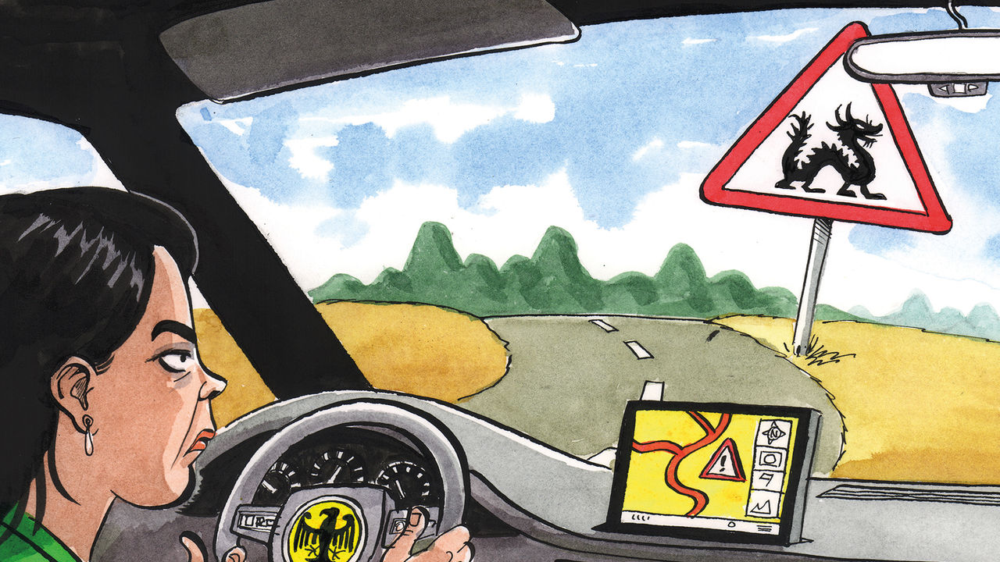

###### Charlemagne

# Annalena Baerbock’s trip to China shows her talent and her limitations 

##### She would like to be chancellor, but it will take a lot of luck 

 

> Apr 20th 2023 

IT WAS AN idyllic scene in Karuizawa, a mountain resort not far from Tokyo. Surrounded by snow-capped mountains and cherry trees still in blossom, a group of children struck up jolly tunes on their violins for the foreign ministers of the G7 group of industrialised countries who had just got off the , Japan’s famous high-speed train. Holding a bouquet of yellow flowers, Annalena Baerbock was beaming. Germany’s foreign minister seemed relieved to be surrounded by Antony Blinken and her other counterparts from friendly countries. Behind her was the most difficult trip of her 16 months in the job: a visit to China.

Considered in Germany to be a hawk on China, Ms Baerbock has had to strike a balance. She wants to stay true to her principles, yet also to defend the interests of German business and rebut criticism of her supposedly anti-China strategy from the conservative wing of the Social Democratic Party (SPD), her Green party’s coalition partner. She has managed best to stick to her first instinct. Even as a candidate for chancellor last year she had advocated “dialogue and toughness” in relations with China. At her joint press conference on April 14th with Qin Gang, her Chinese counterpart, her tone certainly made her sound more of a hawk. She warned that a unilateral or violent change in the status of Taiwan would be “unacceptable”, she insisted on respect for the rights of the Uyghurs, a repressed Muslim minority, and called on the Chinese to use their influence on Russia to end the war in Ukraine. 

Her penchant for calling a spade a spade is admired by those who are exasperated by the tendency of Olaf Scholz, the chancellor, to talk like a robot (“the Scholzomat”) and to tread hesitantly in foreign affairs. She scores well in popularity rankings, though not quite as well as a few months ago, thanks to various if minor gaffes and to a general waning of enthusiasm among the more pacifist of Green voters, because of her party’s strong support for Ukraine and its relative neglect of its core environmental agenda. Her most ardent admirers see her as Germany’s next chancellor. That would require her party to rebuild its strength and to nominate her rather than Robert Habeck, the economy minister, as its candidate for chancellor at the next election in 2025. Both are big ifs.

There is little doubt that Ms Baerbock would like the top job, in spite of her dismal experience in 2021. Her campaign then was plagued by accusations of plagiarism in her book, that she had embellished her CV and that she had only belatedly reported some extra income. And she knows she is still prone to gaffes. For instance, she said on French television in January that she saw no problem with Poland sending German-made Leopard tanks to Ukraine: this was before Mr Scholz had given the green light, thus greatly annoying the chancellor and his entourage. 

Yet Ms Baerbock’s slips are also part of what makes a lot of ordinary people feel they can relate to her. In stark contrast with Mr Scholz, who clams up as soon as a reporter is in sight, she delights in speaking at high speed (occasionally mangling her words) in off-the-record chats with gaggles of journalists. She connects easily with people from all walks of life. She tries to retain a semblance of normality with her family, going on bike rides with her two young daughters (plus bodyguards) around Potsdam, the historic townlet where she lives just south-west of Berlin. Though she was born in Hanover, she sometimes slips into , the city’s idiosyncratic slang. 

In her time in office, and even as a candidate to be chancellor, she has become closer to German business than many expected for an idealistic Green. This should serve her well in her ambition for the top prize. On her China trip she visited Flender, a maker of wind turbines, Vitesco, a car-parts supplier, and Volkswagen (vw). This, she says, should give her a better understanding of what it is like to operate in a country that offers foreign investors a skewed playing field. Despite the legal risks, international tension and the constant surveillance of their staff by the Chinese state, German companies such as the big carmakers VW, Daimler and BMW, as well as BASF, a chemicals giant, are still investing in China with undiminished enthusiasm. Last year German direct investment there totted up to a record €11.5bn ($12.6bn). BASF is ploughing €10bn into a new production site in southern China. vw wants to invest €2.4bn in a joint venture for self-driving cars. 

The second fiddle is the only one she can play

Ms Baerbock’s biggest frustration is that she is not chancellor. Since the days of Konrad Adenauer after the war, Germany’s chancellor has called the shots in the most important decisions in foreign policy. Lately, that has included the supply of tanks to Ukraine and whether to approve a Chinese investment in the port of Hamburg. Tensions between the chancellery and the foreign ministry are the main reasons for delays in agreeing on Germany’s national security strategy and its China strategy. In both cases the foreign ministry is drafting the document, taking soundings from others involved; but the final decisions are the chancellor’s. The idea of creating an American-style national security council has already been swatted because of disagreements over whether it should come within Mr Scholz’s fief or Ms Baerbock’s. 

The 42-year-old Ms Baerbock has surprised many with her generally strong performance as foreign minister. “When I think about what makes me optimistic in these times, it’s having a partner who so seamlessly blends principle and pragmatism,” Mr Blinken recently wrote about her in a short profile in , an American weekly. Mr Scholz was part of the previous government of Angela Merkel, who treated China with kid gloves throughout her years as chancellor. These days he has been starting to sound a bit more like Ms Baerbock on China. That makes it easier for her to stick to her “dialogue and toughness” course. But ultimately the biggest decisions on how Germany deals with China will still be decided in the chancellery. ■


