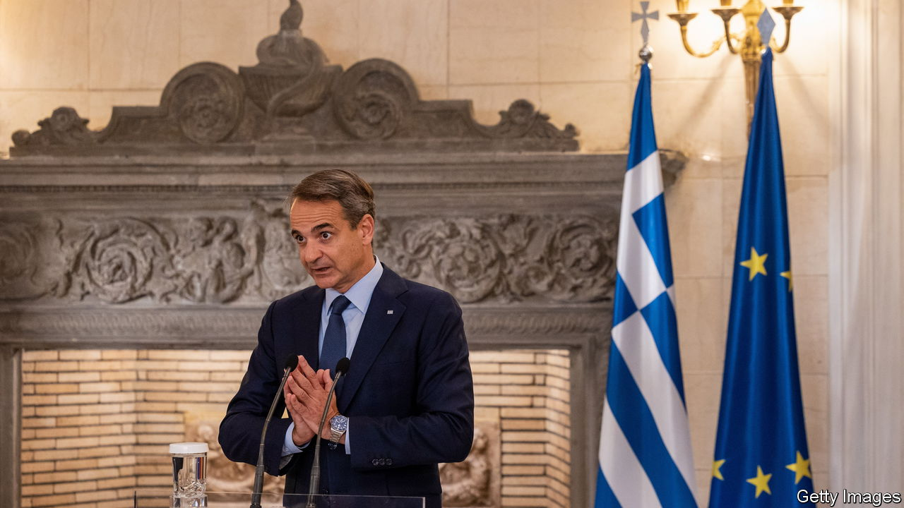
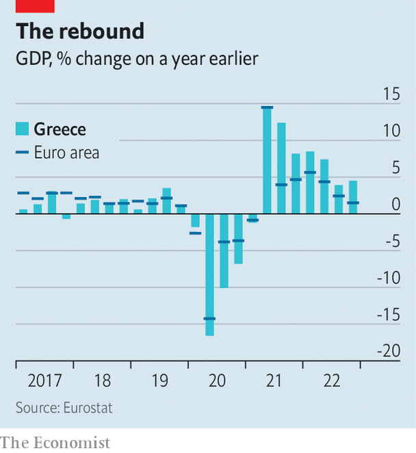
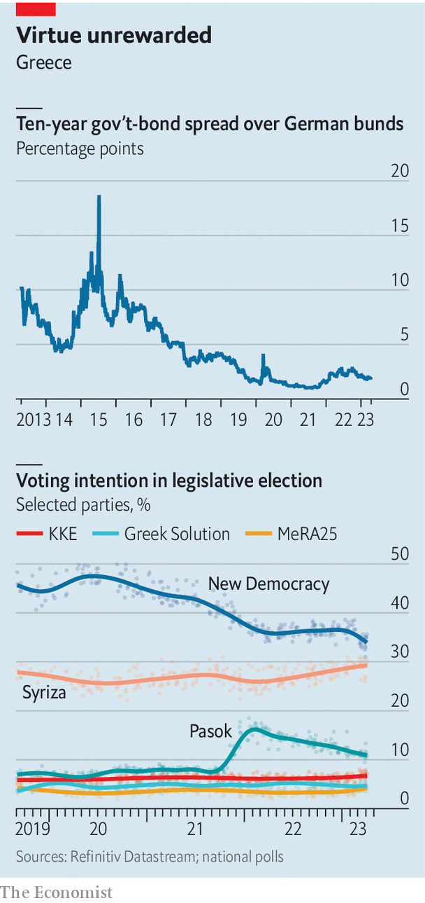

###### Elections in Greece

# Greece is a European success story 

##### But the prime minister may not get much credit for it in the coming election 

 

> Apr 19th 2023 

KYRIAKOS MITSOTAKIS, 55 but looking much younger, fizzes with energy and satisfaction as he reviews  in the Greek prime minister’s office with a rapid-fire list of . It is hard to imagine, as he reels off the sunny statistics, that he might be about to lose his majority and even his job; yet that is what the opinion polls predict. 

A polished technocratic type, Mr Mitsotakis is one of Brussels’s darlings. After the pandemonium of his predecessor’s administration, when under the radical left Syriza party Greece came close to ejection from the euro, the past four years have been a huge relief. Mr Mitsotakis has steadily calmed tension with his neighbour Turkey: rushing aid to the victims of February’s earthquake there was shrewd as well as humanitarian.

 


He has revolutionised the way citizens interact with the state, thanks to an impressive digitalisation programme. He has trimmed corporate taxes, raised the minimum wage and pensions, yet still managed to reduce Greece’s sky-high debt-to-GDP ratio, though that is mostly due to the effects of inflation, which has raised nominal revenues faster than nominal outgoings. 

On his watch, last year Greece grew almost twice as fast as the euro zone’s average, and is projected to be well ahead of it this year too. A steady stream of inward investment, including from such notables as Microsoft and Pfizer, shows that Greece is no longer regarded as one of Europe’s sickest men. A year ago Greece even produced its first “unicorn” startup, an online-only bank called Viva Wallet.

All this means that last August Greece was allowed by its creditors to leave the surveillance mechanisms that had been imposed for the previous 12 years, after the country had to beg for a series of huge bailouts, which are being repaid early. Greece can now borrow from the markets in the regular way, paying a spread of less than two points over the German government’s rate, about the same as Italy’s. The Greek spread peaked in 2015 at about ten times its current level. “We’ve done a pretty good job in very taxing times,” says Mr Mitsotakis—immodest, perhaps, but accurate.

 


So why are dark clouds now hovering around the prime minister? Greece goes to the polls on May 21st, and on current numbers his New Democracy party is still set to win the most seats, but only a dozen or so more than Alexis Tsipras’s Syriza. That will leave him well short of a majority, and he has no obvious coalition partners. A bonus system, unique to Greece and San Marino within Europe, used to give 50 seats to the largest party in order to make majorities easier to reach, but that system has now been abolished. 

Mr Mitsotakis has suffered from two big problems. The first is a murky scandal revolving around the phone-tapping of dozens of politicians, journalists, businessmen and others by the Greek security service. Among those targeted (though unsuccessfully) was Nikos Androulakis, the leader of Pasok-Kinal, the third-biggest party. Mr Mitsotakis has admitted that abuses occurred, but denies knowing anything about them. Yet they happened on his watch. Many Greeks view it as highly suspicious that, as the scandal broke last summer, his own nephew, who served as his chief of staff, quit the government.

A wreck too many

An even bigger problem was a dreadful train crash on February 28th in northern Greece in which 57 people were killed, many of them in their 20s. Greece was convulsed not just by mourning but with anger, as details emerged of the incredibly lax procedures and outmoded equipment that had led to the disaster. Though Greece’s railways have suffered from decades of neglect, the crash seemed to many people to give the lie to Mr Mitsotakis’s claims about modernisation. “They have given us a lot of new apps, but underneath nothing at all has changed,” says one Athens businesswoman. “Public services in this country are still just as terrible as ever.” 

The civil service and, even more tellingly, the justice system remain Byzantine and creaking, and Mr Mitsotakis has done nothing to take either of them on. “He has dealt with the surface, not the deep state,” says a senior banker. One of Greece’s richest businessman is blunter. “All this bullshit about modernisation,” he says. “It’s not the case.” 

The prime minister rejects this criticism, pointing to improvements, for instance in Greece’s main electricity generator, which he has privatised, or to the fact that this year for the first time recruits to the civil service have had to sit a competitive exam. But he admits he needs a second term to complete his work. The train crash serves as an obligation to do more, he says. 

He may not get the chance. The current near-certainty is that no one will be able to form a majority after the next election, and that the president will appoint a caretaker prime minister (probably a senior judge) until fresh elections can be held, most likely in July, which is when the real battle will be fought. At that point, a revised but less generous version of the bonus-seat system will be reintroduced.

Under it, Mr Mitsotakis would still need around 38% of the vote. Most opinion polls suggest he will get only 34-35%. What then? He will try to form a coalition with the angry Mr Androulakis of Pasok, who at the moment says that the price of his support would be another leader to head Mr Mitsotakis’s New Democracy. Pasok may instead try to team up with Syriza, but they would need support from a gaggle of other left-wing parties. “It would be a madhouse,” says the businessman.

So a third election might even be required this year: a prospect that fills everyone with gloom. Everyone, that is, except the markets, which remain calm. And that is a remarkable testament to progress made in the second part of Mr Tsipras’s term—and by Mr Mitsotakis himself. ■

