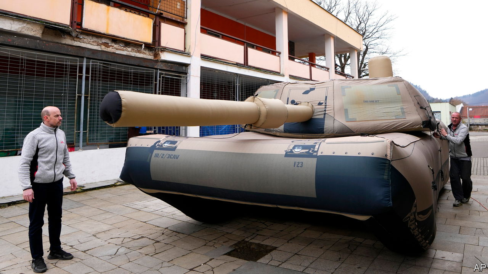

###### Enter the dummies

# How Ukraine is using fake tanks and guns to confuse the Russians 

##### Inflatables are the way forward 

 

> Apr 17th 2023 


FROM THE Trojan horse to the stuffed sackcloth paratroopers known as “Ruperts” dropped to confuse the Germans on D-Day, deception in war is as old as war itself. As  evolve, so must the cunning plans to blunt their advantage. Drones have rendered the battlefield in Ukraine highly visible; enter the dummies. 

As soon as the tank was invented in the first world war, spoofs made from painted hessian stretched over wooden frames were deployed to distract and confuse. In Ukraine, the Russians claim to have taken out several precision  first supplied by America last June; the Ukrainians say none have been lost on the battlefield. Somewhere in the discrepancy is a small fleet of replica HIMARS, wooden models mounted on heavy trucks, trundling along muddy tracks behind the frontline. 

“You have to understand that this a war of innovation,” says Anton Gerashchenko, an advisor to the Ukrainian government. “The drones and satellites are more sophisticated and can see in greater detail. It’s harder to fool the enemy who have cameras and live video. But high-quality decoys can work very well.” 

In the past Ukrainian efforts with military decoys have been somewhat ad hoc, amateurs nailing bits of scrap together. “Let’s call it handicrafts,” says Andrii Rymaruk, Director of Military Affairs for Come Back Alive, an NGO that has been at the forefront of supplying Ukrainian soldiers with materiel since the war in the Donbas began in 2014. Since 2018, Come Back Alive has been working on designing inflatable prototypes, of the kind usually used by armies in training exercises. Before the invasion, the top brass were unimpressed. “The army said, ‘We don’t need it,’” says Mr Rymaruk. 

Inflatable dummies have several advantages. Wooden models are heavy and awkward, made of several parts. They need a vehicle to transport them and a team to assemble and disassemble a folding wooden frame. An inflatable is sewn together from nylon fabric, cheaper to manufacture, potentially light enough to be carried in a backpack and “very fast to deploy”, says an engineer with Inflatech, a Czech company that specializes in inflatable Soviet and Chinese armaments. “Plug in the blower and in ten minutes it’s a tank.” 

Tanks, field artillery, mortars, machine guns; almost any piece of military equipment can be replicated in inflatable form. The Russians, supposed masters of , the art of military disguise and trickery have hot air balloon factories producing inflatables including fighter planes that can be parked in rows to look like busy airbases. There are some issues recreating spindly parts of equipment that stick out, like antennae on radar systems. The Inflatech engineer explains that “for example, a tank cannon is too long and the pressure is not so high, so we have to use some aluminum tubes as supports.” Demand is rising; Inflatech has seen its orders increase by 30% since the start of the war in Ukraine.

At the same time, dummies are becoming more life-like. Collapsible wooden replica tanks are so detailed and realistic, says Gerashchenko, “you can’t tell it’s fake even from five metres.” Trucks can be driven across fields to make tank tracks, comms traffic broadcast to create the impression of a military position. Inflatech uses flexible reflectors to simulate the heat of a gun that has just been fired, to fool the thermal imaging cameras on drones. Dummies also have to be able to produce a valid radar signal, despite being full of air. Mr Rymaruk says that “we are making quite a lot of technical improvements, but I don’t want to share them now.”

Dummies could be effective at countering the menace of the Russian Lancet drones, which are currently decimating Ukrainian artillery. “The Lancet drone is the most dangerous drone for us,” says Mr Gerashchenko. “It has a 40km range and carries 3kg of explosive. Very useful for destroying artillery.” A Lancet drone, produced in Russia, probably costs under $50,000; an American M777 howitzer, currently in use by the Ukrainians, can cost nearer $4m. “If your enemy sees you on the battlefield, you’re not only dead,” says Mr Gerashchenko, “it is also very expensive.” If, on the other hand, you can convince the Russians to waste resources shooting at fakes, says Mr Rymaruk, “you are economically depleting the enemy.” ■

