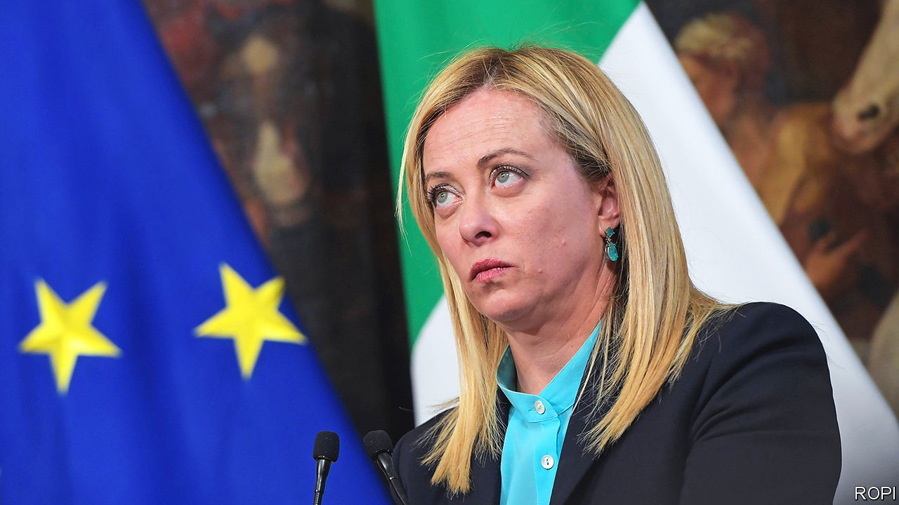

###### Financial indigestion

# Italy needs to spend more, faster 

##### It is struggling to use nearly €200bn of EU cash 

 

> Apr 20th 2023 

Paolo Gentiloni, the EU commissioner overseeing its €750bn ($820bn) post-pandemic recovery fund, said last month that if it failed because of his fellow Italians, “that would really be a disaster”.

Indeed. Italy is by far the biggest beneficiary of a vast facility that, for the first time, is financed with debt jointly underwritten by the member states. It stands to receive €191.5bn in grants and soft loans. If it does not spend the money fully and productively, economists will need to trim, if not eliminate, the annual 1-1.5 percentage points they have tentatively added to forecasts of Italian GDP growth over the next ten years. And it would impair the commission’s aim of using the fund to close the gaps between Europe’s—and Italy’s—richer norths and poorer souths. It would also have serious implications for EU financial integration. “If Italy fails to spend this money, its dream of persuading its European partners to jointly underwrite future EU debt will be just a chimera,” says Eleonora Poli, head of economic analysis for the Centre for European Policy, a think-tank.

Yet failure is starting to look alarmingly possible. Brussels is refusing to release Italy’s latest tranche, of €19bn, because of doubts over the eligibility of some of the projects in which it plans to invest. These include the refurbishment of Florence’s Serie A football stadium and the construction of a sports complex on a site outside Venice. Neither exactly fits the commission’s requirement for projects that revitalise “degraded urban areas”. Fiorentina’s stadium is in a comfortable middle-class area of the club’s home city. The other project is on a greenfield site. It scarcely helps that it would include a basketball arena and that the mayor of Venice is the owner of the local basketball club.

The inability of Italian officials to initiate and manage suitable projects presents a more fundamental challenge. By March 13th, more than a third of the way through the scheme’s implementation, Italy had managed to spend less than half what was originally intended by then. Raffaele Fitto, the European affairs minister in Giorgia Meloni’s conservative government, has since acknowledged that some of the projects that the plan originally envisaged cannot be completed by the end of 2026, when the last euro is due to be paid.

What is going wrong? One big snag is a shortage of administrative capacity. The scheme aims a disproportionate share of the money at the Mezzogiorno, Italy’s south, where the ability of officials to design suitable projects and guide them to completion is generally weakest. A lot of the investment, moreover, is in the hands of local authorities. Most are tiny (70% of Italian municipalities have fewer than 5,000 inhabitants), with correspondingly puny administrations. By contrast Giuseppe Sala, the mayor of big, prosperous Milan, said he could spend at least double the amount earmarked for his city (not that it needs it). There is a danger that if local authorities in the north spend their quotas while those in the south do not, the recovery plan will end up widening the gap between the two halves of Italy.

Other problems concern the firms whose job it is to build the infrastructure projects that account for a large part of the scheme. As elsewhere in Europe, they face increased prices for raw materials and a workforce depleted by recession, first, and then by the pandemic. But they must also cope with a more specifically Italian difficulty: that of obtaining temporary credit from the banks for projects that have been commissioned, but for which the public financing is not yet available.

The government has attempted to remove at least some of these hurdles. Most notably, and controversially, it has approved legislation to speed up the spending process. Henceforth, officials will be able to place orders for up to €150,000 without tendering for bids. But that highlights a second risk: that shortcuts introduced with the best of intentions could intensify corruption and favouritism in a country where both are widespread and where organised crime is entrenched.

In a bid to ensure that Italy takes full advantage of the cash on offer, Mr Fitto has been trying to get the commission to agree to a revision of its national plan. The idea is that the projects that are most likely to miss the recovery fund’s 2026 cut-off point, are instead to be financed by the EU’s regional funds, which are part of a current package that will remain open for a further three years.

Some in the Northern League, the feistiest of the three junior partners in Ms Meloni’s coalition, have a more radical idea. On April 3rd Riccardo Molinari, the League’s chief whip in the lower house of parliament, proposed shrinking the national recovery plan by renouncing some of the low-cost borrowing (not the grants, of course) along with the investment it was intended to finance. The official line, not only of the government but also of the League, is that no such move is even being considered. But if the problems continue to mount, it could start to seem like a sensible way to avert the worst. ■

