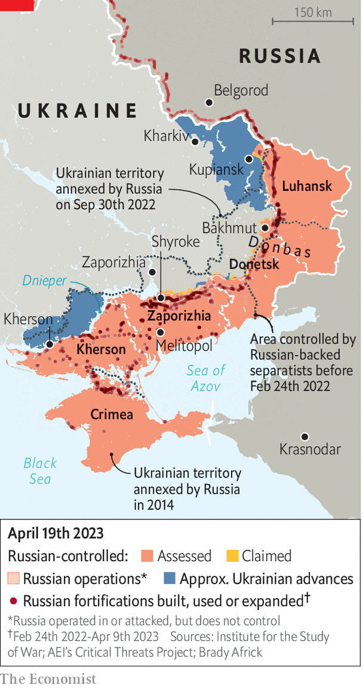

###### Waiting for D-Day

# Ukraine’s counter-offensive is drawing near 

##### Its Western allies want success—but not too much 

> Apr 16th 2023 


“BREAK THE spine!” shouts the man in Russian, chiding his colleague. “What, you’ve never cut a head off before?” The video shows what appears to be a knife-wielding Russian soldier beheading a Ukrainian one, alive. “Put it in a fucking bag,” demands another voice, “and send it to his commander.” The footage, posted by a popular Russian far-right account on , a social-media site, on April 11th, provoked outrage in Ukraine. “Everyone must react,” said Volodymyr Zelensky, the country’s president. “We are not going to forget anything.” Mr Zelensky’s army will soon have a shot at revenge.

A Ukrainian  is due in the coming days or weeks. Almost no one knows precisely where or when it will come. Only five officials have all the details, noted Oleksiy Danilov, Ukraine’s security chief, on April 6th. But Russian troops are braced. On April 12th British defence intelligence said that Russia had finished building three layers of defensive lines along 120km (75 miles) of the front line in Zaporizhia province in anticipation of a Ukrainian assault towards Melitopol, including dragon’s teeth anti-tank obstacles stretching south-east along the p37 highway from Shyroke. Conquering Melitopol would help Ukraine sever Russia’s land bridge between the occupied regions of Donbas and .

Ukraine’s offensive force consists of at least a dozen brigades (some sources say up to 18), nine of which have been armed and supplied by Western allies (a brigade tends to be several thousand men). Those nine are due to have more than 200 , 800 other armoured vehicles and 150 pieces of field artillery in total, according to American intelligence documents which  in early March and widely circulated in April. It is a large force, but with some glaring weaknesses.

The majority of its vehicles are unarmoured. The amount of artillery is relatively modest—the 21st brigade appears to have just ten guns allocated to it. Notably, the newest equipment is spread thinly across units rather than concentrated in a few. Ukraine might make changes to its order of battle in response to the leaks, but it cannot dismantle and reconstitute brigades that might have been training and preparing together for weeks or months.

One problem for Ukraine is how to achieve surprise. If it masses its forces at a particular spot, Russia might detect those preparations and shore up its lines accordingly. That puts a premium on deception, notes Mick Ryan, a retired Australian major-general. Ukraine will have to conceal troop concentrations, artillery positions, headquarters and logistics hubs. “It could also mean we will see lots of smaller mini-offensives rather than a couple of large ones,” says Mr Ryan, “just to confuse the Russian targeting cycle and to deceive them about Ukraine’s main effort.”

 


If Ukraine can achieve surprise, the next question is whether it can punch through Russian defences and send more forces quickly through the gap. It will need mobile air defences to keep Russian planes at bay; it is not clear if it has enough. It will have to cross rivers and —obstacles that have consumed entire Russian brigades in the east—as well as a formidable network of Russian trenches and fortifications (see map). “There is no military endeavour that is more difficult to plan, orchestrate and execute than combined-arms obstacle breaching,” says Mr Ryan.

In theory, precision artillery can quickly take out prepared defences, says Ben Barry of IISS, a think-tank in London, pointing to Britain’s use of such systems to destroy bunkers in Afghanistan. But that requires expert synchronisation of artillery, infantry and armour so that troops advance neither too early, while the defences are intact, nor too late, when Russia’s rear echelon has reinforced a barrage’s site. 

To date, Ukraine’s army has largely conducted sequential operations—first artillery fire, then a ground advance—rather than these more demanding co-ordinated ones, says Franz-Stefan Gady, a military analyst. That is in part because of  and a lack of combined-arms training at scale, he says. Improving Ukraine’s command and control has been a priority for Western officials helping to train and advise Ukrainian generals in Germany over recent weeks.

The timing of an offensive is also uncertain. Weather is one factor. American intelligence analysts reckon that the ground in eastern Ukraine will remain muddy until early May. Kit is another. A third of the Western-supplied brigades are not due to be fully equipped and trained until the end of April. Ukraine’s general staff could launch a staged attack, with some brigades thrown in later as they arrive, but might choose to “save it all up for a big bang”, says Mr Barry. This could maximise the pressure on Russian defences. Waiting for too long could also let Russia dig in further and replenish ammunition.

A question of calibration

Western officials familiar with Ukraine’s preparations are unsure how everything will pan out. It is vital, they say, that Ukrainian forces have the confidence to keep moving forward. Russia’s layered defences are designed to lure advancing columns into “kill zones” covered by pre-sighted artillery. If troops panic and freeze up, they could be decimated. But there are also concerns about the opposite: an unexpected collapse of Russian forces that puts Ukraine’s army at the edge of Crimea, in a position to seal off the peninsula, attack Russian ports and bases there and deny the Sea of Azov to Russian ships. Large pockets of Russian troops could also be trapped in Kherson and Zaporizhia oblasts.

Such a humiliation is deemed unlikely—a leaked American assessment predicts only “marginal” gains for either side this year—but not impossible. Many Ukrainian officials would welcome it. But some Western ones are concerned that a rout would destabilise Russia to a dangerous degree, making it harder for the Kremlin to swallow any negotiations that might follow. Far preferable, they say, for Vladimir Putin to order a semi-voluntary retreat, as he did from the western bank of the Dnieper river in Kherson province in November. The aim is not to defeat Mr Putin militarily but to persuade him that recovering the lost territory would require wave after wave of politically risky mobilisation.

But that will not be easy. Mr Putin is thought to remain convinced that time is on his side. He has reinforced failure at every turn, frittering away tens of thousands of mobilised recruits on a futile offensive around the town of Bakhmut since January. The dia assessment, first published by the , says that even if Ukraine were to inflict “unsustainable losses on Russian forces”, Russia would prefer to conduct a fresh mobilisation rather than enter negotiations. On April 12th Russia’s parliament passed a new law allowing the defence ministry to issue electronic rather than physical summons for military service, making it easier to dragoon recruits. On April 18th Mr Putin visited Kherson province personally. Another round seems inevitable.

Ukraine can sustain a counteroffensive through the spring and perhaps into the summer, says Michael Kofman of cna, a think-tank. But it will burn through ammunition and men in the process, he warns, and this could be the “high-water mark” of Western aid. The coming months could be the decisive period of the war. ■


