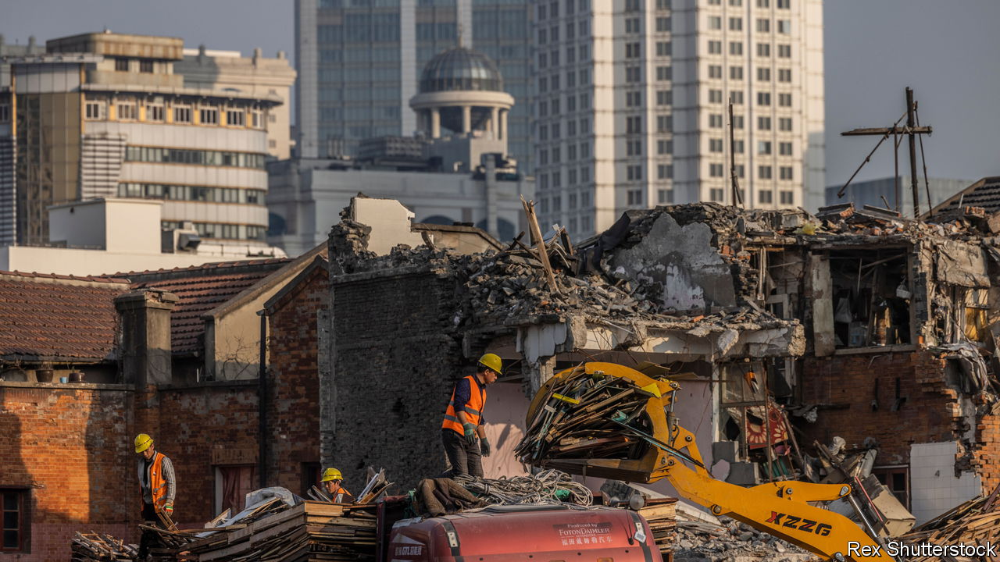

###### Waiting for ever

# As China fixes its property mess, can foreign capitalists benefit? 

##### Needless to say, they are not top of the state’s priority list 

 

> Apr 20th 2023 

Overseas investors have been pecking at the Evergrande empire for well over a year. They have so far come away with very little. The Chinese company, which is the world’s most indebted property developer, with some $300bn in liabilities, defaulted in late 2021 and has been fending off creditors ever since. When the firm delayed a restructuring plan last year, a group of bondholders demanded that Hui Ka Yan, Evergrande’s chairman, put up $2bn of his own cash—a demand which went precisely nowhere. The billionaire, Evergrande and many other failing property companies have so far done well to continue to keep their assets out of foreign clutches. 

China’s property industry was flung into crisis in the middle of 2021 as companies such as Evergrande struggled to meet stringent government limits on debt levels while also continuing to build homes and pay creditors, both those in China and overseas. In the years since then, 39 companies with close to $100bn in dollar-denominated debts have defaulted. In recent weeks, a few have publicly announced proposals for how they will repay offshore creditors. Have they offered up enough?

The property crisis means different things to different people. It has left ordinary folk without homes for which they have paid, as companies come up short on the cash needed to build them. It has cut off the most important sources of revenue for local officials—those of land sales to developers—and has hindered their ability to pay their own debts. This is leading to worries about a much bigger onshore debt crisis in future, linked to financing vehicles run by city and provincial governments. For local creditors, meanwhile, the worry is that small banks have lent too much to developers and local-government firms, and could therefore collapse.

Of all those involved, foreign bondholders have been noisiest. That might be because they are lowest on the totem pole of parties likely to be compensated. The property crisis has devastated the offshore market for Chinese debts. There are $170bn-worth of outstanding dollar-denominated bonds issued by Chinese firms. According to Goldman Sachs, a bank, just a third of issuers have made payments on time. Yet Chinese authorities are loth to bail out hedge funds run by foreign capitalists, so have offered next to no support. 

The legal structures that underpin these debts are based on the laws of Hong Kong or other offshore jurisdictions but—in the event of a dispute—involve claiming assets almost exclusively based in China, and therefore governed by Chinese law. This has created a buffer between creditors such as BlackRock, an American asset manager, and the holdings of Evergrande. 

Only recently have developers given a sense of what they are willing to offer the foreigners. So far the outlook is far from encouraging. Since the start of the year five companies have put forward restructuring plans, including Evergrande and Sunac, another highly indebted firm that recently defaulted. The proposals could become templates for other restructuring attempts over the years to come.

What is on offer is mainly debt extensions rather than “sustainable and permanent restructurings”, note analysts at Fitch, a rating agency. For example, one group of Evergrande creditors will receive new bonds with maturities of up to 12 years—a frightfully long wait. Those willing to accept riskier equity-linked instruments can expect repayment in under a decade. Sunac investors have been offered a similar, albeit slightly better, deal.

Both Evergrande and Sunac are also offering to swap debt for stakes in some of their operations. The former has been trying for several years to build an electric-vehicle business, and is willing to give creditors a slice. Sunac has a property-management arm that it is offering up. Such investments pay nice dividends when firms perform well, but offer far less protection than fixed-income investments when they collapse. Accepting such offers would be a “leap of faith”, according to Sandra Chow of CreditSights, a research firm. Few creditors will willingly take so much as a hop.

One Hong Kong-based lawyer has called the early restructuring proposals “a bad punchline at the end of a long joke”. They will, however, buy developers some time. The central government’s priority now is to re-establish confidence among homebuyers. To do that officials must ensure that homes for which payments have been made actually get delivered. This strategy does not include direct support for foreign creditors. Yet if the state can muster a gradual recovery in the property market, some companies may be able to offer offshore bondholders better deals.

The government has loosened some of the restrictions that threw the sector into turmoil in the first place. An improvement is clearly in the works. In 30 of China’s big cities, sales in March increased by 44%, year on year. The same month, average property prices across 70 cities rose, too. If the revival continues, the proposals from Evergrande and Sunac might mark a low point for the market, and for foreign confidence in it. That, at least, is the hope. ■


