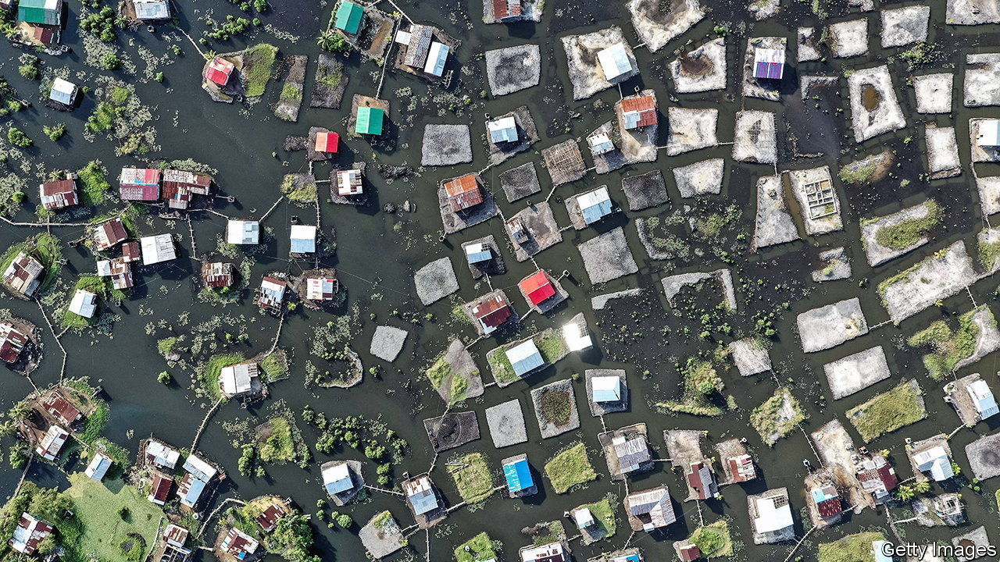
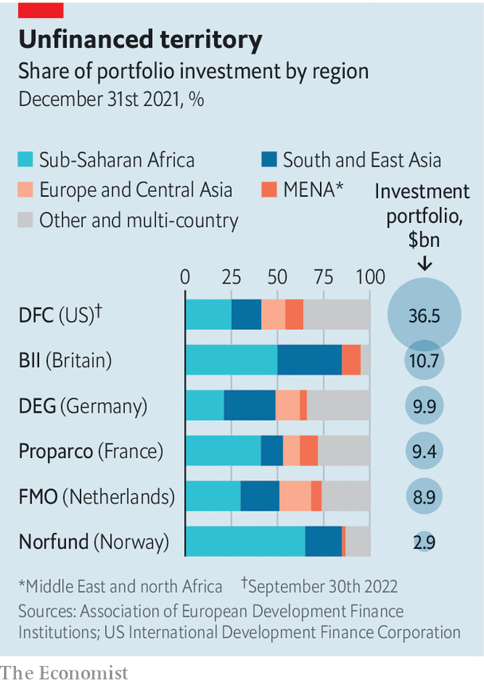

###### Cautious pioneers

# Development finance needs to be bolder 

##### Institutions are caught between competing expectations 

 

> Apr 20th 2023 

For cash-strapped governments, development-finance institutions (dfis) offer an understandably alluring vision: that of development executed by the private sector at little cost to the state. Such institutions try to build businesses and create jobs by lending money and buying stakes in firms, and seeking healthy returns. Their aim is “to do good without losing money”, as an early chairman of the British one put it. Of late they have been tasked with fixing the climate, promoting sustainable-development goals and shepherding investors to difficult markets, too.

This grand vision explains a recent rush of money into bilateral dfis. In 2019 America set up the us International Development Finance Corporation (dfc), with an investment limit of $60bn, twice that of its predecessor. The year before, Canada launched its first dfi. In Europe the combined portfolio of the 15 biggest institutions has doubled in a decade, to €48bn ($53bn) by the end of 2021. Some organisations operate as wholly owned investment arms of their governments; others are more like public banks, in which commercial investors have a minority stake. There is a common problem, however: dfis are yet to show their model can meet ambitions in the world’s poorest places. 

 


The funds end up in all sorts of businesses, from risk insurance for marine conservation in Belize to investing in Ethiopian telecoms operators. European outfits allocate a third of their cash to financial institutions, which lend it on to local firms. Another quarter goes to energy projects, such as solar panels and hydroelectric dams. dfis have mostly avoided losing money, making modest returns in the process, though covid-19 temporarily pushed many into the red. By their own reckoning, they have created millions of jobs.

Yet this avoidance of loss may reflect excessive caution. In theory, dfis go where private investors fear to tread, demonstrating the possibilities of new markets. In practice, they often look for cheap co-financing from donor agencies that give grants or concessional loans, in order “to take the risk off the table” by making the firms involved less likely to fail, says Conor Savoy of the Centre for Strategic and International Studies, a think-tank. Philippe Valahu of the Private Infrastructure Development Group says his donor-backed fund, which focuses on Africa and Asia, has taken on projects that dfis turned down “because they were viewed as too risky”.

One issue is where to spend. In 2021 some European dfis made only half their investments in sub-Saharan Africa or South Asia, the two places where almost all the world’s poor live. In tough countries it can be hard to find projects that are ready to receive finance. A failed investment may be bad for development as well as for the balance-sheet, argues Colin Buckley of the Association of European Development Finance Institutions. “You have a negative demonstration effect,” he says. “What you’re telling all investors is: ‘Don’t come here, you’re only going to lose money.’”

Another issue is the type of investments dfis make. Businesses in developing countries need capital that is going to stick around and shoulder risk, as equity does. But only a few dfis, such as those in Britain and Norway, hold large equity portfolios. In America the dfc’s use of equity is constrained by federal budget rules, which treat it like a grant rather than a recoupable investment. In Europe some big dfis are set up and regulated like banks, with loans as their bread and butter. Banking rules designed for Europe are hard to apply in countries where some customers lack documents such as certificates of incorporation, says Michael Jongeneel, chief executive of fmo, the Dutch dfi.

Many institutions are trying to be more adventurous. America’s dfc last year made around 70% of new investments into countries with average incomes of below the $4,256 threshold at which a country becomes upper-middle income according to the World Bank. British International Investment (bii) puts most of its money into Africa, and holds about 9% of its portfolio in a “Catalyst” fund, which seeks out the very riskiest investments. In 2021 a group of dfis launched a new platform to pool expertise and map markets in so-called “fragile” states, including fact-finding visits to Liberia and Sierra Leone.

But dfis are caught between competing expectations, explains Samantha Attridge, co-author of a recent study for odi, a think-tank. Governments want them to generate a financial return, to go where private investors will not and to draw many more private investors into their projects. “If you want to create the maximum impact by going to the most difficult places, you’re not going to be able to bring pure commercial investors alongside you,” says Nick O’Donohoe, chief executive of bii.

Governments, as the primary shareholders, must decide what precisely is the purpose of dfis. That means being realistic about what markets can achieve amid obstacles to investment such as political insecurity or a lack of contract enforcement—the kind of gnarly problems which dfis are not designed to solve. “Robust private-sector development and access to capital is critical for growth,” as Scott Nathan, chief executive of dfc, points out. But they cannot always come first. ■


