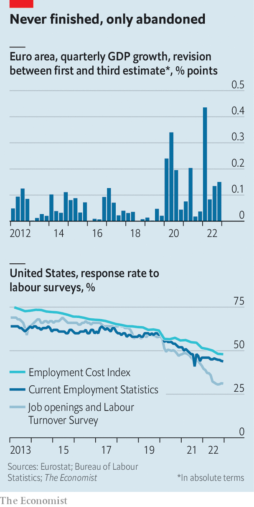
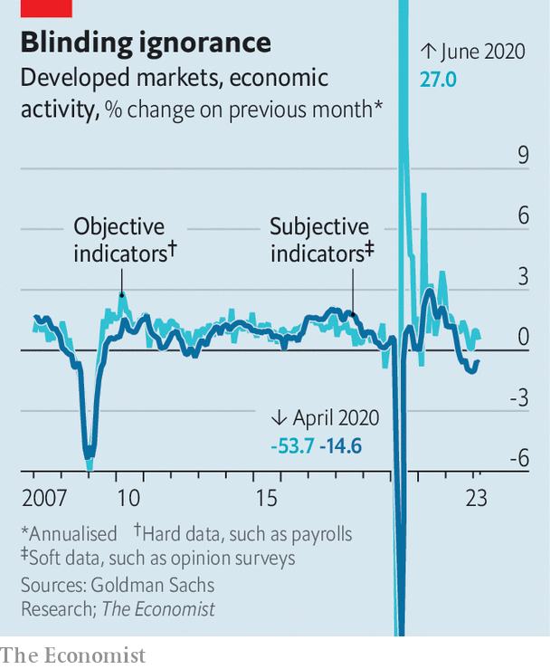

###### The art of interpretation

# How to explain the puzzle of the world economy 

##### Welcome to the Mona Lisa effect 

 

> Apr 17th 2023 

What is mona lisa doing? At first glance the subject of the world’s most famous painting seems to be smiling. Look again and her smile fades. When it next reappears, it is a different sort of smile. Leonardo da Vinci achieved this ambiguous effect with the use of , where he blurred the lines around Mona Lisa’s face. No matter how many times you look, you are unsure quite what is happening. 

The post-pandemic economy is like the Mona Lisa. Each time you look, you see something different. After chaos in the banking industry, many analysts are now convinced that the world economy is heading for a “hard-landing” recession. Few seem to expect a “no-landing” scenario, in which the economy remains untroubled by rising interest rates—a fashionable opinion just weeks ago, and one which itself supplanted a common view late last year that a mild recession was certain. 

In short: forecasting has rarely been harder. In the past year the range of analysts’ expectations for American quarterly gdp growth has been twice as wide as in 2019. The word “uncertainty” appears more than 60 times in the imf’s latest global economic outlook, about twice as many as in April and October 2022. When the banking panic struck, no one had the slightest idea what the Federal Reserve would do with interest rates in March—some investors expected a rate rise, some no change, some a cut—and the next few meetings look equally unpredictable. At the European Central Bank’s most recent monetary-policy meeting last month, Christine Lagarde, its president, was blunt about her institution’s role. “It is not possible to determine at this point in time what the path will be going forward,” she said. 

Official statisticians are struggling to understand the picture. As a matter of course they update their estimates of everything from gdp to employment as more data come in. But something profound has changed. gdp revisions in the euro area are four times bigger than normal. In March Britain’s statistics office issued some huge revisions. The release showed real business investment was in line with its pre-pandemic level, not 8% below as once believed. Last month Australian statisticians more than halved their estimate of productivity growth in the third quarter of 2022. That year America’s Bureau of Labour Statistics (bls) issued revisions to its estimate of nonfarm payrolls (not adjusting for seasonality) of 59,000 a month between the first and third estimates, compared with 40,000 in 2019. 

What is going on? Perhaps the world is simply more volatile. In the past year Europe has seen its biggest war in seven decades, supply-chain snarl-ups, an energy crisis and banking panic. The rest of the rich world has only been a bit more stable.

 


Yet there are also deeper changes at play. The first relates to covid-19 disruptions. The world lurched from crashing to soaring growth as lockdowns came and went. This has played havoc with the “seasonal adjustments” common to most economic numbers. In February the bls changed the factors that it applies to inflation, which makes interpreting monthly rates much more difficult. Annualised core inflation in the final quarter of 2022 “increased” from 3.1% to 4.3%. It is also harder than normal to understand euro-zone inflation. Kamil Kovar of Moody’s Analytics, a consultancy, notes that depending on how seasonal adjustment is done, core month-on-month inflation in March was as low as 0.2% or as high as 0.4%. 

The second change relates to sample sizes. The pandemic accelerated a trend in which a growing share of people fail to respond to official surveys. In America the response rate for the survey used to estimate vacancies has fallen from nearly 60% just before the pandemic to around 30%. When covid struck, the response rate to Britain’s labour-force survey fell by roughly half. During lockdowns, some businesses closed. People fell out of the habit of filling in questionnaires. Distrust in government may also have grown, leaving people disinclined to help statisticians. 

Blanked

Falling response rates probably increase data volatility. They may also lead to bias. The people who stopped responding to surveys appear less prosperous than those who continue to do so, misleadingly inflating income. Jonathan Rothbaum of the Census Bureau suggests that real median household income growth in America from 2019 to 2020 was 4.1%, not 6.8% as originally reported, after proper corrections for non-response. Since 2020 non-response has continued to push up income statistics by about 2%. A report by Omair Sharif of Inflation Insights, a consultancy, suggests that correcting for “non-response bias” may also have contributed to recent big revisions to American earnings data. 

 


The third reason for confusion stems from the disparity between “hard” and “soft” data—objective measures such as the level of unemployment, and subjective measures such as people’s future expectations. Normally the two types move in sync. Right now they are far apart. “Soft” measures look recessionary. “Hard” measures point to a decent expansion. The divergence may reflect people’s grumpiness with inflation. Prices in the rich world are still rising by 9% year on year.

Investors and statisticians will get better at understanding the world economy during periods of volatility and inflation. As the effects of the pandemic fade, so will distortions to seasonal adjustments. Economists have already made progress in incorporating alternative data into forecasts, helping to overcome the problem of declining responses. But this is scant comfort for governments and businesses that need to make decisions right now—or for people just trying to keep up with the news. Do not be surprised if the global economy remains for a while yet. ■


