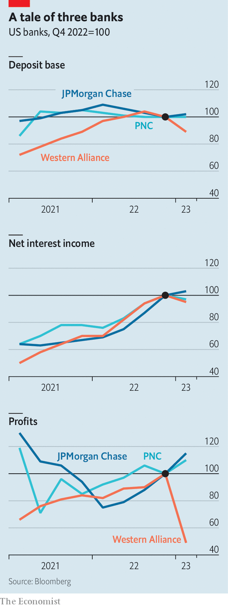

###### After the storm

# Is the worst now over for America’s banks? 

##### In order to assess the damage, we look at three financial institutions 

 

> Apr 19th 2023 

After a hurricane has passed there is a period of calm that can feel euphoric. Survival is no longer at stake. Then, once the relief begins to fade, it is time to assess the damage. What destruction has been wrought? How difficult will it be to recover? This sequence will be familiar to anyone who has been paying attention to American banks this year. In the days that followed the sudden failure of Silicon Valley Bank, once the country’s 16th-largest lender, as well as two other banks, panic and fear ripped through the financial system. Now, though, the storm seems to have passed. Certainly, no lender has been imperilled since. Cue the relief. 

What of the wreckage? The extent can be hard to discern in the immediate aftermath. But America’s listed banks must, once a quarter, disclose their balance-sheets and earnings, offering a 30,000-foot view of the mess. Results season, which began on April 14th, when Citigroup, JPMorgan Chase, pnc Bank and Wells Fargo reported their first-quarter results, will continue to be closely watched through to April 24th. That is when First Republic, a bank in San Francisco which narrowly avoided failure in March, will belatedly disclose its results, having postponed its normal schedule in light of events. 

 


The panorama so far visible indicates that damage has not struck each part of the banking industry evenly. The simplest way to see this is to examine three measures—deposit bases, interest income and profits—at three differently sized banks. The biggest, with $3.7trn in assets, is JPMorgan Chase; one of the largest regional banks, pnc, with $560bn in assets, is up next; Western Alliance Bancorp, an Arizona-based lender with a mere $70bn in assets, completes the trio. 

On each measure, JPMorgan is doing well. Flight from other parts of the industry, as institutions and individuals moved to bigger and safer-seeming banks, resulted in deposit “flock”. Thus the bank’s deposit base grew by 2% from the end of 2022. Although Jeremy Barnum, JPMorgan’s chief financial officer, cautioned that he would not assume these deposits would stick because, “by definition, [they] are somewhat flighty”, the bank nonetheless expects to earn a lot more interest income now (that is the difference between what a bank collects on its loans and what it pays for its funding). At the end of last year, JPMorgan thought it would make $74bn in interest income in 2023. The bank now thinks it will make some $81bn, since it will have to pay less to retain deposits across the board. All this has helped increase profits at the firm to $12.6bn, up by 15% on the previous quarter and 50% on the previous year. JPMorgan looks just as structurally sound—perhaps even more so—than it did before the storm arrived. 

Things are not quite so comfortable at pnc, our midsized bank. The good news is that the firm’s deposit base has held up—it was $435bn on average in the final quarter of 2022 and ended the first quarter of 2023 at $437bn. The bad news is that the firm is paying considerably more for these deposits. At the end of last year, pnc customers held around 31% of their deposits in non-interest-bearing accounts, and pnc paid around 1.07% on the deposits that did earn interest. Now customers hold just 28% of deposits in non-interest-bearing accounts and pnc paid an average of 1.66% on the rest during the quarter. Although increases in the interest pnc is paid on its loans has numbed the pain, the bank’s net-interest income still dropped from $3.7bn to $3.6bn. The institution is clearly being cautious—it grew its loan book by just 1% in the first quarter—and this caution means it also set aside less for loan losses than it did in the final quarter of last year. The overall result is that profits ticked up just a little in the first quarter.

Next, consider Western Alliance, the puniest of the three banks. Here the damage is most evident. Western Alliance lost some 11% of its deposits in the first quarter of the year, although the bank’s management pointed out that deposits bottomed out on March 20th and have since climbed. As deposits are a low-cost source of funding, this pushed up the bank’s interest expense by almost 50%, from $250m in the fourth quarter of 2022 to $360m in the first quarter of 2023. Again the impact was dampened by rising interest on loans, which climbed by 10% on the quarter. Thus the institution’s net interest income only dipped 5% compared with the previous quarter. The clearest evidence of damage is in its profit figures, however. As Western Alliance shrank, it sold off parts of its balance-sheet, including loans and securities. This resulted in $110m of losses in the first quarter. Profits fell to $142m, down by half compared with the previous quarter. The firm is now planning to build up capital.

These metrics do not paint a picture of an institution near collapse. The clearest proof of impending peril for a bank would be evidence that it has lost so much of its funding—its deposits—that it needs to fire-sell vast quantities of assets even at the cost of enormous outright losses. An alternative harbinger of doom would be if a bank’s funding costs have climbed by so much that its net interest income is wiped out, indicating that it will struggle to make profits in future and maintain its capital levels. None of this is yet evident at the Arizona-based lender.

Sweat the small stuff

For the moment, investors seemed to be soothed by the facts laid out by Western Alliance. The financial institution’s shares rallied by 24% on April 19th (although they are still down by a third in the year to date). Its net interest income fell in the first quarter, but is still well above where it was when interest rates were at zero in 2021. Now that the bank has pruned its balance-sheet and is starting to build capital, it could even end up in better shape than it was during the era of low rates. 

It is nonetheless likely that other banks yet to report, including First Republic, have been more grievously wounded. It is also possible that the full extent of the damage might not have been revealed. Most banks report a quarterly average for their net interest margins, not an end of quarter figure, which will mask recent events. Funding costs may have spiralled more than is apparent. Living through a storm can be a scary experience; making it through one intact is a relief. Not all banks have made it through just yet. ■


