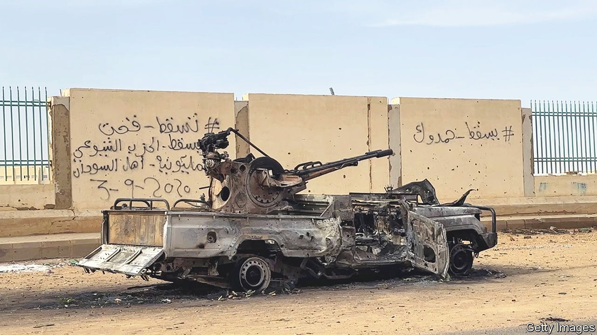
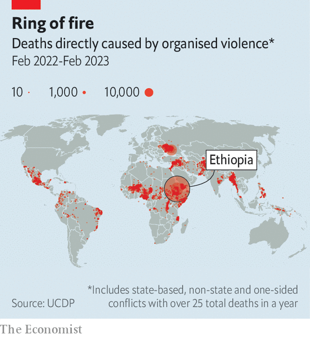
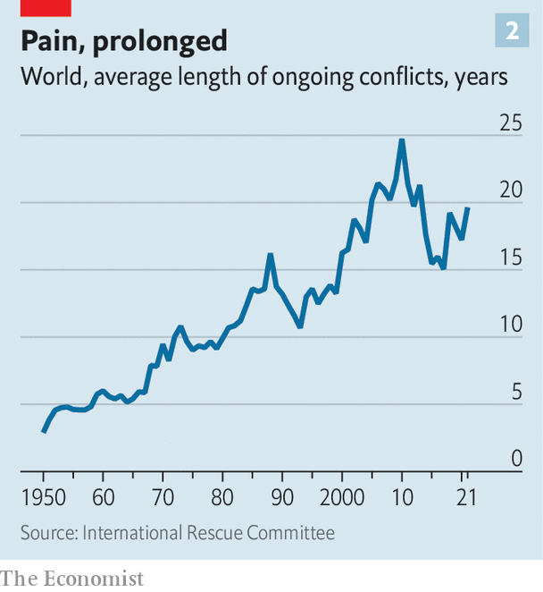
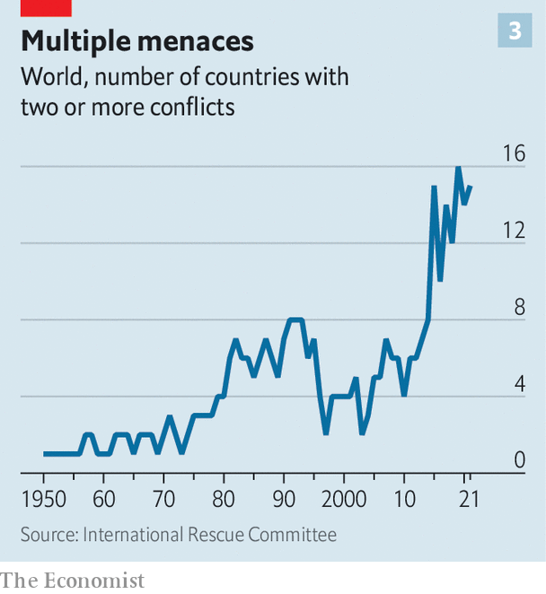

###### Forgotten conflicts

# The world’s deadliest war last year wasn’t in Ukraine 

##### Sudan is not a one-off. There’s a disturbing resurgence in civil wars 

 

> Apr 17th 2023 

Fighter jets roar over Khartoum. . Many civilians, sheltering from what may be the start of a civil war, wonder: “why?”

It is tempting, and correct, to blame individuals. A conflict cannot erupt unless someone starts fighting, and  has two . The army’s head is battling a militia boss for control of Africa’s third-largest country. General Abdel Fattah al-Burhan, Sudan’s de facto ruler, runs a military junta that keeps delaying a promised handover of power to civilians. Muhammad Hamdan Dagalo (better known as “Hemedti”), leads paramilitaries called the Rapid Support Forces, which in an earlier guise committed genocide in Darfur. 

Both sides have the kind of ambition that often leads to bloodshed in countries with few checks and balances. They crave unaccountable power and the perks that come with it. The army already has a vast, shady business empire; Hemedti has reportedly made a fortune from gold mines and selling military services abroad. Neither man seems willing to share power. Each calls the other a “criminal”.

Yet Sudan’s misfortunes are not simply the fault of these two odious men. The country has been tormented by civil war for most of the time since independence in 1956. It is an example of a global problem: the increasing persistence of conflict. 

As attention is focused on great-power rivalry between America, Russia and China, conflicts in the rest of the world are getting worse. The number of people who have been forced to flee their homes has doubled in the past decade, to roughly 100m. Even as global poverty has retreated, the number of desperate people needing emergency aid has doubled since 2020, to 340m. Some 80% of this is driven by conflict, estimates the International Rescue Committee (irc), an ngo. 

Since 1945, conflicts have come in three overlapping waves. First, people in European colonies struggled for independence. Then, rival groups fought for control of these newly independent states. The cold war raised the stakes: the West backed insurgencies against governments that professed to be Marxist, from Angola to Nicaragua. The Soviet Union supported anti-capitalist guerrillas and revolutionary regimes on every continent. 

After the collapse of the Soviet Union in 1991, the number of wars fell sharply. So, too, did the estimated number of deaths in battle. But after 2011 came a third wave. Both the number of wars and their deadliness increased, as the Arab spring led to conflagrations in the Middle East, a new form of jihadism spread across the Muslim world and Vladimir Putin resurrected old-fashioned Russian imperialism. 

 


Mr Putin’s invasion of Ukraine is unusual: a straightforward attempt by one state to conquer another and steal its territory. Most modern armed conflicts are harder to understand. They are usually civil wars, though many involve foreign meddling. They are largely in poor countries, especially hot ones like Sudan. (Indeed, they form a belt of pain around the equator—see map) They cause millions of deaths, but exactly how many is hard to estimate. Far more perish from war-induced hunger or disease than from bullets or shrapnel. 

 


Fighting makes poor places rapidly poorer. A typical five-year civil war reduces income per head by a fifth, estimates Christopher Blattman of the University of Chicago in his book “Why We Fight”. So it is alarming that wars are lasting longer (see chart 1). The average ongoing conflict in the mid-1980s had been happening for about 13 years; by 2021 it was nearly 20 years. 

There are several plausible reasons for this. First, global norms are eroding. When Russia, a permanent member of the un Security Council (unsc), brazenly violated the un’s founding charter by invading Ukraine, murdering civilians and kidnapping children, it showed how much taboos have weakened. When China, another permanent member of the unsc, called Mr Putin a “dear friend” despite his indictment for war crimes, it confirmed that for some world powers, might makes right. This emboldens smaller bullies. 

 


In Sudan, for example, hardly anyone has been held to account for mass slaughter during the country’s various wars, nor for mass rape, nor the widespread enslavement of black Africans by the country’s Arabic-speaking elite. General Burhan and Hemedti pretended to listen to popular demands for justice after the overthrow of a former dictator, Omar al-Bashir, who has since been convicted of corruption. But it seems unlikely that they ever planned to hand over the reins to civilians, as they were supposed to do last week.

Impunity is not the whole story, however. Other factors are causing conflicts to burn for longer. Climate change is fuelling fights over water and land. Religious extremism is spreading. Organised criminals are making the world’s most unstable states even more so. And conflicts are growing more complex. 

The stuttering rifles’ rapid rattle

 


Between 2001 and 2010 around five countries each year suffered more than one simultaneous war or insurgency. Now 15 do (see chart 2). Sudan has conflicts in the east, west and south. Complex wars are in general harder to end. It is not enough to find a compromise that satisfies two parties; a deal may need to please dozens of groups, any one of which may cock its Kalashnikovs again if unsatisfied. 

Civil wars are also becoming more international. In 1991 only 4% of them involved significant foreign forces. By 2021 that had risen 12-fold to 48%, reckons the Uppsala Conflict Data Programme, a research project. In the past decade this process has been driven partly by America’s retreat from its role as global policeman, and mid-sized powers filling the vacuum. Russia and Turkey spar over Libya and Syria; Saudi Arabia and Iran have fought a proxy war in . In Sudan, Egypt supports General Burhan while Hemedti is pals with Russia.

Foreign meddling can be benign, as un peacekeeping operations generally are, even if they often blunder. But interventions by external powers with selfish agendas tend to make civil wars last longer and cost more lives, finds David Cunningham of the University of Maryland. The costs for external actors are lower—their own cities are not being destroyed—so they have less incentive to make peace. 

Climate change is aggravating the mayhem. It does not directly cause conflict, but when pastures dry up, herders drive their hungry cattle farther afield, often encroaching on land claimed by rival ethnic groups. A review of 55 studies by Marshall Burke of Stanford University and others found that a one-standard-deviation increase in local temperature raises the chance of intergroup conflict by 11% compared with what it would have been at a more normal temperature. 

Globally, some 24m people were displaced by extreme weather in 2021, and the un expects that figure to soar. In Sudan, some 3m people were displaced by conflict and natural disasters even before the current round of fighting began. 


The bloodiest war in the world last year was not in Ukraine but in Ethiopia, notes Comfort Ero, the head of Crisis Group, a think-tank. Olusegun Obasanjo, a former president of Nigeria who helped broker a peace deal in November between the government and the Tigray region, has put deaths at 600,000 between 2020 and 2022. No estimate for Ukraine is as high. 

Mohammed Kamal, an Ethiopian farmer, was ploughing his fields when he heard shooting. Returning to his village, he found that gunmen had murdered 400 people, mostly women and children. “Only a small number survived,” he says. 

Even if the peace deal holds, which is uncertain, it will not help Mohammed. For the massacre he witnessed was part of an entirely separate conflict, which is still blazing. While government troops were distracted by the war in Tigray, members of Ethiopia’s largest ethnic group, the Oromo, revived an old insurgency, and are trying to drive other ethnic groups out of their home region. Mohammed says the gunmen who killed his neighbours were from the Oromo Liberation Army (ola), a rebel group; their victims were from the Amhara ethnic group. (The ola denies involvement.)

If that sounds complicated, it is actually much more so. Ethiopia has more than 90 ethnic groups, many of whose leaders are tempted to stir up hatred to win control of one of the country’s 11 ethnically based regions. It hosts hundreds of thousands of refugees from four turbulent neighbours (Eritrea, Somalia, South Sudan and Sudan). The dictatorship next door (Eritrea) has sent armies to fight against a previous Ethiopian government, and arm-in-arm with the current one. 

War creates a vicious circle. As droughts and floods have devastated rural areas, young men with no prospects feel more tempted to pick up a gun and grab land or loot. Rebel recruiters understand this only too well. Facebook accounts linked to OLA show videos of young fighters celebrating with stacks of cash they have liberated from banks. With so many fighters lurking in the bush, kidnapping shopkeepers and murdering officials, businesses flee the area and public services get even worse. Locals then grow even more frustrated and angry, especially when the state responds with repression, which it often does. 

The holy glimmers of goodbyes

To countries destabilised by bad governments and climate change, extremism adds gelignite. Consider the Sahel, a vast arid area below the Sahara desert. Five countries—Burkina Faso, Chad, Mali, Niger and (northern) Nigeria—suffered droughts in 2022 and the most severe food crisis in 20 years. Nearly 6m people were also hit by floods. Some 24m in these five countries are “food insecure” (meaning they struggle to feed themselves). In just one sub-region of Mali, the irc found no fewer than 70 conflicts in late 2021. Half were about land; a third were about water. A seventh resulted in lots of people being driven from their homes. 

Into this desperate environment have stepped jihadist groups. Since the Arab spring affiliates of al-Qaeda and (later) Islamic State have spread across the Middle East, Africa and beyond. They promise justice—such as the restoration of stolen grazing land—in countries where formal courts barely function. Once they have gained a foothold, they accelerate the collapse of state authority. Between 2020 and 2022 in the five countries mentioned above, the number of schools that were closed due to violence trebled, to 9,000. Half the region’s children do not feel safe in school.

In Burkina Faso rival jihadist groups have made much of the country ungovernable. Towns are besieged. The government’s efforts to vanquish the jihadists often make matters worse. Trucks carrying goods to jihadist-controlled areas must have a military escort, which may or may not be available. Jihadists block roads and plant bombs on bridges. All this gums up trade and makes remote areas even poorer. The government’s inability to beat the jihadists infuriates nearly everyone: the country suffered two coups in 2022. 

A similar dynamic afflicts the whole of the Sahel. Instability is infectious. Farmers displaced by climate change cross unmarked borders and spark clashes. Jihadists seek havens in neighbouring countries. Their ideas spread rapidly online and in radical madrassas. 

Western powers have tried to help, but failed. In November 2022 France gave up on Operation Barkhane, a military intervention to help the governments of Burkina Faso, Chad, Mali, Mauritania and Niger suppress jihadists. Earlier that year Mali’s new military regime ordered French troops out and welcomed help from Russia’s Wagner mercenary group, which has already been accused of massacring civilians. 

Sebastian von Einsiedel of the United Nations University in Tokyo argues that the spread of jihadist groups makes it harder to end wars. Their demands are often impossible to meet, their footsoldiers are fanatical, and external mediators hate dealing with terrorists.


For rebel groups with no religious inspiration, mammon provides motive enough to take up arms. A study by James Fearon of Stanford University finds that civil wars in which a major rebel force earns money from illicit drugs or minerals tend to last longer. And the globalisation of crime has made it “easier than ever before” for such groups to get their hands on guns and cash, notes Mr von Einsiedel. 

Government forces are often greedy, too. Among the reasons why Congo’s war is “self-perpetuating”, argues Jason Stearns in his book “The War That Doesn’t Say Its Name”, is that officers are paid a pittance but can make fortunes from embezzlement and extortion when deployed to combat zones. Locals complain about the “pompier-pyromane” (firefighter-pyromaniac) problem: regional strongmen who start a fire so the central government has to negotiate with them to put it out.

An extreme example of the links between crime and conflict is Haiti. In 2021 its president, Jovenel Moïse, was assassinated. No one knows who ordered the hit, but many suspect a link to the drug trade. The country has been in chaos since. Gangs that once dominated only slums now control much of the capital, Port-au-Prince. They have seized roads, market places and anywhere convenient for extorting money from terrified civilians. Joe, a school director who prefers to stay anonymous, describes how his school received a bullet in an envelope, with a demand for $50,000 protection money to keep classes open. “On the spot, we had to close the school until further notice,” he sighs. 

Haiti’s prime minister, Ariel Henry, is begging for a foreign military intervention to help the police restore order. Many locals would welcome it. Ralph Senecal, the boss of a private ambulance firm, who was kidnapped in October, says that only American troops can restore order. However, opposition groups fear that such an intervention would only prop up Mr Henry, who seized power after Moïse’s death and is widely regarded as illegitimate. 

One country in Asia illustrates all the ills that make civil wars endure. In an old wooden farm house near the Thai-Myanmar border, Ko Khaht is boiling chicken and rice. When it is cooked, he liquidises it, sucks it up with a syringe and feeds it to his injured comrade, who is missing part of his skull and cannot move or speak. 

Myanmar is home to some of the world’s oldest insurgencies, and some of the newest. Ko Khaht belongs to the People’s Defence Force (pdf), which was set up after a military junta seized power in 2021. It is the armed wing of the National Unity Government, a parallel state of activists, politicians and ethnic leaders that aims to restore democracy. He joined it after he saw soldiers murder a man in front of his home. He packed a small bag and fled to the Thai border, where he worked in a bomb-disposal unit. He has lost his right hand, and his skin is pockmarked by shrapnel.

Myanmar’s strife is staggeringly complex. Perhaps 200 armed groups control slices of territory or are fighting to overthrow the government. Some are armies seeking autonomy for large ethnic groups; others are local militias trying to defend a single village. The country has not had a conflict-free year since independence in 1948. Even compared with this violent past, though, norms have atrophied in the past two years. “There’s a new level of brutality, with the tone set at the top,” says Richard Horsey of Crisis Group. 

In March a company calling itself the “Ogre column” was dropped into Sagaing, central Myanmar. They went on a killing, raping and torturing spree. But rebels say such atrocities only serve to strengthen their resolve. 

Climate change is at work: the insurgency has gained strength in the central dry zone, which has been made poorer by drought. Crime, too, gives many fighters a reason to keep fighting. The army is deeply enmeshed in heroin and jade smuggling, as are some ethnic militias. Mr Horsey expects the war “to grind on for a generation to come”.

No prayers nor bells

The world is not short of ideas for how to end wars. Find a respected mediator. Start unofficial talks long before the belligerents are prepared to meet publicly. Include more women and civil-society groups in the peace process. Accept that any peace deal is likely to be ugly. “Excluding people you don’t like from politics doesn’t work,” notes David Miliband, the head of the irc. Purging the Iraqi army of all supporters of Saddam Hussein’s regime was a mistake, as was trying to build a system in Afghanistan without the Taliban. But the most important measures (build functional states in war-torn countries, curb climate change) could take decades to implement.

And global efforts to promote peace are hobbled by the fact that two veto-wielding members of the unsc are serial human-rights abusers that object to interference in the internal affairs of blood-spattered regimes. Russia has used its unsc veto 23 times in the past decade, scotching resolutions to allow more aid into Syria, investigate war crimes in the Balkans and (of course) to uphold Ukraine’s sovereignty. China has issued nine. America has issued three, mostly to protect Israel; France and Britain, none at all. In 2001-10, when Mr Putin’s imperial ambitions were more limited and Xi Jinping was not yet in power, Russia issued only four vetoes; China, two. 

A French proposal to suspend the veto when mass atrocities are occurring passed the un’s general assembly last year, but has no way past Mr Putin’s veto pen. The world is entering what Mr Miliband calls “an age of impunity”.■


