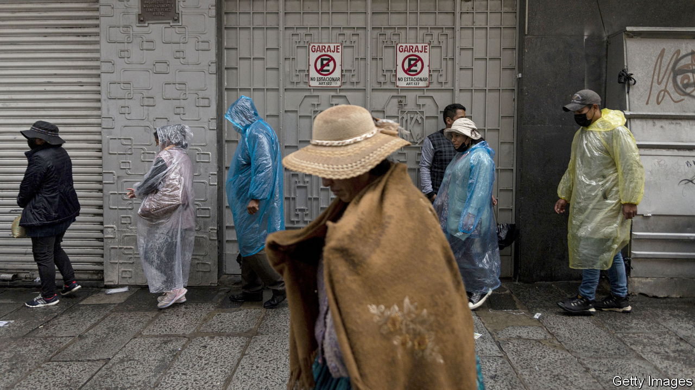
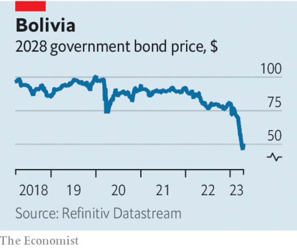

###### On the brink

# Bolivia’s crisis shows the limits of left-wing populism 

##### The country is running out of money. It should serve as a warning to Latin America 

 

> Apr 20th 2023 

For several weeks extraordinary scenes have been taking place in Bolivia. As we , last month the central bank started selling dollars directly to the public after it appeared that exchange houses had run out of greenbacks. The queues to buy them stretched along the streets of La Paz, the capital. The central bank has stopped publishing data on its foreign-currency reserves, suggesting that it has perilously little hard cash left. The price of government bonds has collapsed as investors flee: a bond due in 2028 is now trading at just 48 cents on the dollar.

Bolivia’s nightmare reflects several short-term problems, such as a  around the world and  because of the war in Ukraine. These have made it more expensive to borrow and increased the cost of imports. But the real cause of its predicament is a reckless economic model that has been in place ever since left-wing populists took control nearly two decades ago. When , a former coca farmer, was sworn in as president in 2006 he declared an end to “the colonial and neo-liberal era” and hung behind his desk a portrait of Che Guevara, a violent Marxist revolutionary, made out of coca leaves. Today the full cost of economic populism is becoming clear, as are three lessons for the many other Latin American countries tempted by it.

 


The first lesson is an old one: don’t count on commodity booms. Mr Morales hit the jackpot when he arrived in office, as natural-gas prices soared, providing a windfall for the country, which produces 0.4% of global gas even today. Exports rose. Bolivia was able to accumulate the largest foreign reserves in its history: they jumped from the equivalent of 12% of GDP in 2003 to 52% by 2012. Mr Morales and Luis Arce, who is now president but who was the finance minister, used the proceeds to spend profligately, including on fuel subsidies, which were worth almost 4% of GDP in 2022. Unfortunately gas prices and production have been falling and the cash gusher is running dry. 

The second lesson is to beware of currency pegs. In 2008 a fixed exchange rate was introduced, which since 2011 has been set at 6.96 bolivianos per dollar. For a while this kept inflation low and provided an anchor for an economy with a history of turbulence. But over time the peg has proved exorbitantly costly. Instead of providing stability it has bottled up problems. 

Finally, hostility towards private capital eventually comes back to bite you. Bolivia went on a nationalisation spree that included the gasfields and electricity grid. Its government has treated business with contempt. Unsurprisingly, investment has shrivelled. The flow of long-term investment by multinational companies has dropped from a peak of 12% of gdp in 1999 to an average of just 0.1% in the past five years. Total investment is likely to be just 14% of gdp this year, the lowest rate in South America. There are no big listed companies.

Mr Arce’s talk of attracting entrepreneurs is too little, too late. He has only bad options left. His government could impose austerity, try to borrow even more from multilateral lenders, default or sell some of its ample lithium deposits to China, whose government-backed firms are relaxed about flaky property rights but will demand fire-sale prices. 

Few other Latin American countries have currency pegs. But many depend on commodities of one kind or another. And the region is experiencing a new “pink tide”, with left-leaning governments in power, most of which are debating just how much to indulge their instinct for heavy state intervention. The message from Bolivia, a country that is literally running out of money, is that there are limits. ■

