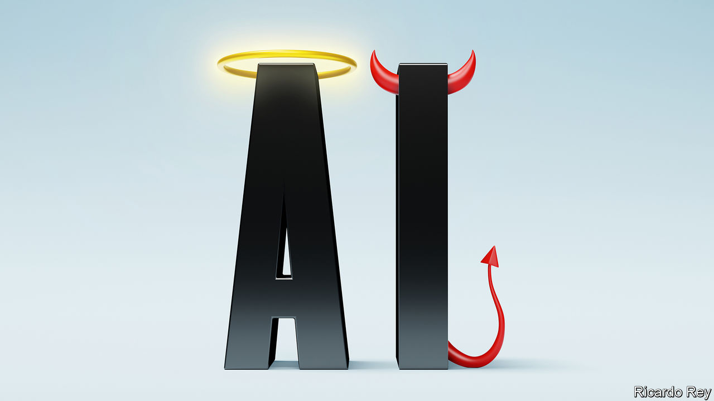

###### Technology and society

# How to worry wisely about artificial intelligence 

##### Rapid progress in AI is arousing fear as well as excitement. How worried should you be? 

 

> Apr 20th 2023 

“Should we automate away all the jobs, including the fulfilling ones? Should we develop non-human minds that might eventually outnumber, outsmart...and replace us? Should we risk loss of control of our civilisation?” These questions were asked last month in an open letter from the Future of Life Institute, an ngo. It called for a six-month “pause” in the creation of the most advanced forms of artificial intelligence (AI), and was signed by tech luminaries including Elon Musk. It is the most prominent example yet of how rapid progress in AI  about the potential dangers of the technology.

In particular, new “large language models” (LLMs)—the sort that powers , a chatbot made by OpenAI, a startup—have surprised even their creators with their unexpected talents as they have been scaled up. Such “emergent” abilities include everything from solving logic puzzles and writing computer code to identifying films from plot summaries written in emoji. 

These models stand to  with computers, knowledge and even with themselves. Proponents of AI argue for its potential to solve big problems by developing new drugs, designing new materials to help fight climate change, or untangling the complexities of fusion power. To others, the fact that ais’ capabilities are already outrunning their creators’ understanding risks bringing to life the science-fiction disaster scenario of the machine that outsmarts its inventor, often with fatal consequences.

This bubbling mixture of excitement and fear makes it hard to weigh the opportunities and risks. But lessons can be learned from other industries, and from past technological shifts. So what has changed to make AI so much more capable? How scared should you be? And what should governments do?

In a , we explore the workings of llms and their future direction. The first wave of modern AI systems, which emerged a decade ago, relied on carefully labelled training data. Once exposed to a sufficient number of labelled examples, they could learn to do things like recognise images or transcribe speech. Today’s systems do not require pre-labelling, and as a result can be trained using much larger data sets taken from online sources. LLMs can, in effect, be trained on the entire internet—which explains their capabilities, good and bad.

Those capabilities became apparent to a wider public when ChatGPT was released in November. A million people had used it within a week; 100m within two months. It was soon being used to generate school essays and wedding speeches. ChatGPT’s popularity, and Microsoft’s move to incorporate it into Bing, its search engine, prompted rival firms to release chatbots too. 


Some of these produced strange results. Bing Chat suggested to a journalist that he should leave his wife. ChatGPT has been accused of defamation by a law professor. LLMs produce answers that have the patina of truth, but often contain factual errors or outright fabrications. Even so, Microsoft, Google and other tech firms have begun to incorporate LLMs into their products, to help users create documents and perform other tasks. 

The recent acceleration in both the power and visibility of AI systems, and growing awareness of their abilities and defects, have raised fears that the technology is now advancing so quickly that it cannot be safely controlled. Hence the call for a pause, and growing concern that AI could threaten not just jobs, factual accuracy and reputations, but the existence of humanity itself. 

Extinction? Rebellion?

The fear that machines will steal jobs is centuries old. But so far new technology has created new jobs to replace the ones it has destroyed. Machines tend to be able to perform some tasks, not others, increasing demand for people who can do the jobs machines cannot. Could this time be different? A sudden dislocation in job markets cannot be ruled out, even if so far there is . Previous technology has tended to replace unskilled tasks, but LLMs can perform some white-collar tasks, such as summarising documents and writing code.

The degree of existential risk posed by AI has been hotly debated. Experts are divided. In a survey of AI researchers carried out in 2022, 48% thought there was at least a 10% chance that AI’s impact would be “extremely bad (eg, human extinction)”. But 25% said the risk was 0%; the median researcher put the risk at 5%. The nightmare is that an advanced AI causes harm on a massive scale, by making poisons or viruses, or persuading humans to commit terrorist acts. It need not have evil intent: researchers worry that future AIs may have goals that do not align with those of their human creators.

Such scenarios should not be dismissed. But all involve a huge amount of guesswork, and a leap from today’s technology. And many imagine that future AIs will have unfettered access to energy, money and computing power, which are real constraints today, and could be denied to a rogue AI in future. Moreover, experts tend to overstate the risks in their area, compared with other forecasters. (And Mr Musk, who is launching his own AI startup, has an interest in his rivals downing tools.) Imposing heavy regulation, or indeed a pause, today seems an over-reaction. A pause would also be unenforceable. 

Regulation is needed, but for more mundane reasons than saving humanity. Existing AI systems raise real concerns about bias, privacy and intellectual-property rights. As the technology advances, other problems could become apparent. The key is to balance the promise of AI with an assessment of the risks, and to be ready to adapt. 

So far governments are taking three different approaches. At one end of the spectrum is Britain, which has proposed a “light-touch” approach with no new rules or regulatory bodies, but applies existing regulations to AI systems. The aim is to boost investment and turn Britain into an “AI superpower”. America has taken a similar approach, though the Biden administration is now seeking public views on what a rulebook might look like.

The eu is taking a tougher line. Its proposed law categorises different uses of AI by the degree of risk, and requires increasingly stringent monitoring and disclosure as the degree of risk rises from, say, music-recommendation to self-driving cars. Some uses of AI are banned altogether, such as subliminal advertising and remote biometrics. Firms that break the rules will be fined. For some critics, these regulations are too stifling. 

But others say an even sterner approach is needed. Governments should treat AI like medicines, with a dedicated regulator, strict testing and pre-approval before public release. China is doing some of this, requiring firms to register AI products and undergo a security review before release. But safety may be less of a motive than politics: a key  is that AIs’ output reflects the “core value of socialism”.


What to do? The light-touch approach is unlikely to be enough. If AI is as important a technology as cars, planes and medicines—and there is good reason to believe that it is—then, like them, it will need new rules. Accordingly, the EU’s model is closest to the mark, though its classification system is overwrought and a principles-based approach would be more flexible. Compelling disclosure about how systems are trained, how they operate and how they are monitored, and requiring inspections, would be comparable to similar rules in other industries. 

This could allow for tighter regulation over time, if needed. A dedicated regulator may then seem appropriate; so too may intergovernmental treaties, similar to those that govern nuclear weapons, should plausible evidence emerge of existential risk. To monitor that risk, governments could form a body modelled on CERN, a particle-physics laboratory, that could also study AI safety and ethics—areas where companies lack incentives to invest as much as society might wish. 

This powerful technology poses new risks, but also offers extraordinary opportunities. Balancing the two means treading carefully. A measured approach today can provide the foundations on which further rules can be added in future. But the time to start building those foundations is now. ■


