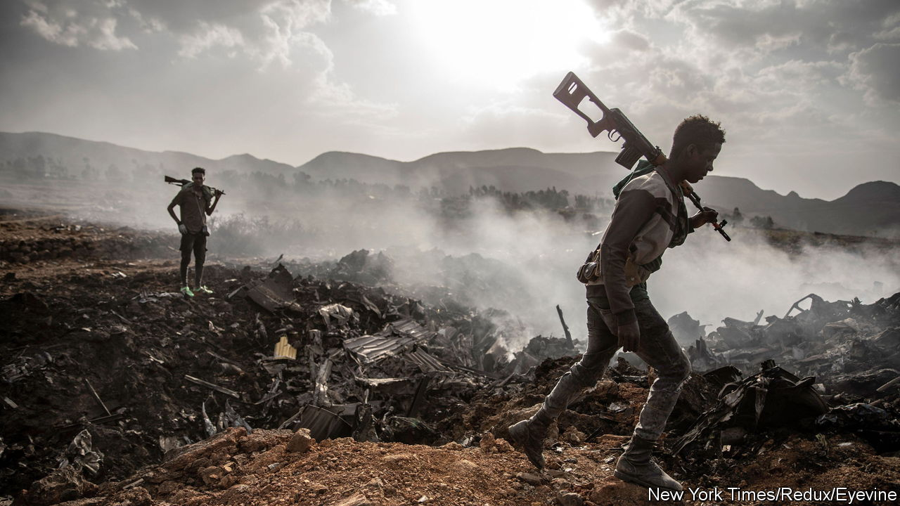

###### The curse of civil war

# In Sudan and beyond, the trend towards global peace has been reversed 

##### Conflicts are growing longer. Blame complexity, criminality and climate change 

 

> Apr 19th 2023 

In Sudan the laws of war carry no more weight than the rules of Quidditch. As two thuggish generals , civilians have been murdered, diplomats attacked and patients evicted from a hospital so that soldiers can use it as a fortress. The battle that began on April 15th could be the start of a  (see Middle East &amp; Africa section). But another way of looking at it is even gloomier. Sudan has endured a kaleidoscope of  for most of the time since independence in 1956. The mayhem this week illustrates an underreported global calamity: the increasing duration of war.

The average ongoing conflict in the mid-1980s had been blazing for about 13 years; by 2021 that  to 20. Since the Arab spring in 2011 a new wave of wars has begun and battle deaths have risen, bucking a long trend towards greater global peace. The total death toll is hard to measure. Most victims die not in battle itself but because war makes them hungrier and less able to resist disease. By one estimate 600,000 people perished during Ethiopia’s recent crushing of the breakaway region of Tigray—more than in Ukraine—partly because the government blocked aid to the starving. Globally, the number of people forced to flee from their homes has doubled in a decade, to roughly 100m. And even as the world grows richer, conflict makes unlucky countries swiftly poorer.

One reason why wars are lasting longer is that they are growing more complex. Most are civil wars in poor places. Many have multiple belligerent groups, who must all be satisfied if peace is to stick. Between 2001 and 2010 roughly five countries a year suffered two or more simultaneous conflicts; now 15 do. (Pacifying Myanmar or Congo, with their dozens of armed factions, would be hellishly hard.) And since 1991 there has been a 12-fold increase in the proportion of civil wars involving foreign forces. Foreign meddlers bear fewer costs—their own cities are not flattened—so they have less incentive to make peace.

Another reason is criminality. Nearly all civil wars rage in corrupt countries where power is a quick route to wealth, spurring the unscrupulous to kill for it. (One of Sudan’s feuding warlords has reportedly made a fortune peddling gold and mercenaries; the other leads an army with a business empire.) Meanwhile, the globalisation of criminal networks makes it easier for rebel groups to deal drugs or launder looted diamonds.

The most worrying factor, however, is climate change. It does not directly cause war, but it makes it more likely. When farmers are displaced by droughts or floods, they often move onto lands that traditionally belong to other ethnic groups. In just one region of Mali, an ngo counted 70 conflicts, mostly over land and grazing rights. In the Sahel, an arid vastness below the Sahara desert, climate change has disrupted livelihoods so badly that jihadist groups find it easy to recruit. They promise divine justice—and stress that this means getting your pasture or farmland back. Civil wars are already concentrated in hot, poor countries; as the climate grows harsher, the belt of bloodshed around the equator will surely grow wider.

Compounding all these ills is a new atmosphere of impunity. If Russia can behead prisoners and China can commit crimes against humanity in Xinjiang, smaller bullies may conclude that international law can safely be ignored. Certainly, many are flouting it, from the bloodstained scrub of Burkina Faso to the torture dungeons of Syria. America is distracted by superpower rivalry, and the un is hogtied by vetoes from Moscow and Beijing. The vast resources rightly deployed to defend Ukraine will never be deployed to unscramble Sudan, even if outsiders could devise a plausible way to do so.

Peacemaking is hard, but not impossible. In the short term, it is often wise to start unofficial talks long before the belligerents are ready to talk openly. (It worked in South Africa and Northern Ireland.) Including more women and civil-society groups in a peace process seems to make settlements more durable, and videoconferencing means they no longer have to make hazardous journeys to be in the room. Including awful people is often necessary, too, otherwise they may go back to fighting. There is a painful tension between justice and peace. The former demands that war criminals be jailed; the latter may require giving them cabinet posts. Finally, because all conflicts are different and no peacemaking template works everywhere, it is helpful to experiment. Donors hoping to rebuild war-ravaged Liberia backed a variety of projects. Training the police to be less predatory turned out to make locals less likely to rebel.

In the long run, the most important ways to promote peace are to build better institutions in fragile states, and to curb (and help people adapt to) climate change. Those tasks are vast, and could take decades. But the alternative is a world where life is short in poor, hot countries—and war is long. ■

