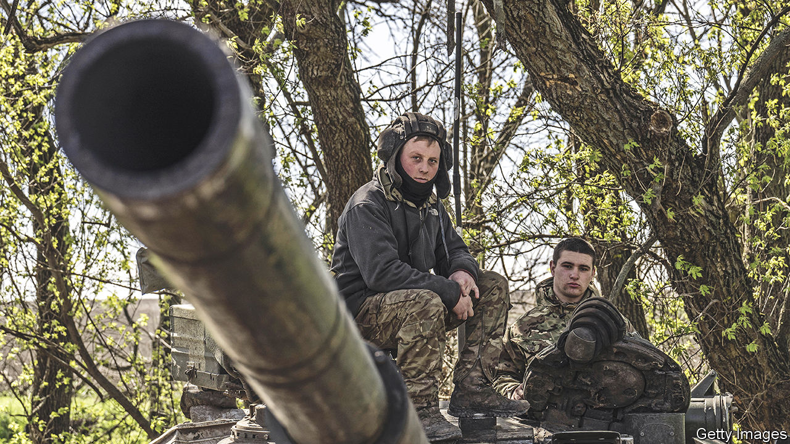

###### Waiting for the order

# Ukraine’s coming counter-offensive may shape its future—and Europe’s 

##### It will set the scene for any future peace talks 

 

> Apr 20th 2023 


Tens of thousands of  are readying for action; checking their kit, writing what might be their last letters. We do not know when or where, but soon Ukraine will launch its  against the invaders who squat, illegally and murderously, in almost a fifth of the country. The fate of Ukraine and the shape of the West’s alliances may depend on what happens in the next few weeks.

Ukraine may never have a better chance than this. The occupiers are weakened; during the past two months, Russia has marched into a killing zone around , in the Donbas region, and it has so far failed to replace the tens of thousands of men it has lost there. Vladimir Putin has passed new laws that will make it easier to draft more cannon fodder, but it will be months before his unlucky new recruits are available for action. 

Ukraine has received  of NATO-standard weapons: tanks, precision missile systems, powerful artillery; and millions of rounds of ammunition. Fighter planes are on the way, though only from Poland and Slovakia. America and the main European powers are still holding back, as they did for too long over supplying tanks.

What should Ukraine do with the advantage it currently enjoys? It should try to break, or at least disrupt, the land bridge that connects Crimea to Russia, via Donbas. Creating this bridge is the only achievement Mr Putin can boast of for all the Russian blood and treasure he has poured into his war; but it is a considerable one. Without it, Crimea, a Ukrainian peninsula which he seized and annexed in 2014, is vulnerable, reachable only by sea or via the Kerch road-and-rail bridge, which someone (presumably Ukraine) partly blew up last October.

The battlefield has been remarkably static for the past five months, since Ukraine drove the Russians back across the Dnieper in Kherson province in November. This is bad news, because it suggests that the conflict is in danger of freezing along a new “contact line” that would leave Ukraine challenged along most of its south and east, and shorn of most of its sea access; a big problem for a country that depends on exporting commodities. Far better for Ukraine to go into any future talks holding more of an advantage, and with Russia facing a genuine challenge to its occupation of Crimea. That might convince Mr Putin that if he does not settle, he could lose what he has gained.

The risks are high, though. Ukraine has a limited supply of the surface-to-air missiles needed to deter Russian bombers. Russia is well dug in along most of the front line, with multiple layers of trenches and dragons-teeth anti-tank obstacles. When attacking, Ukraine will need its troops to outnumber the defenders, and it can only muster such numbers in limited areas. Even if it punches through Russia’s defences, it will need to exploit such breakthroughs carefully, or risk its troops being encircled. 

So Ukraine, and its Western backers, should prepare for the possibility that the counter-offensive will yield only marginal gains, or worse. And even if it does break the land bridge, there is no guarantee that Mr Putin will come to the negotiating table. He no doubt hopes that if he drags the war on long enough, Western support for Ukraine will start to wobble.

Ukraine’s backers should not assume that the coming battle will be the last one. It is almost certainly not. Once the dust settles, Ukraine will still need to secure whatever gains it has made, and stiffen its defences to make future Russian land grabs more difficult. The fact that Russia’s renewed offensive around Bakhmut has gone so poorly does not mean that all such attacks will be bungled. America and Europe must make clear that they will support further military pushes by Ukraine. 

And to deter Mr Putin, they should also make plain that they will back Ukraine for many years to come. The sooner the West starts spelling out the details of the security guarantees it will offer to Ukraine, the better. America and Britain (as well as Russia) underwrote Ukraine’s territorial integrity in 1994, and then did nothing as Mr Putin brazenly violated it in 2014. The next guarantees must be genuine.■

