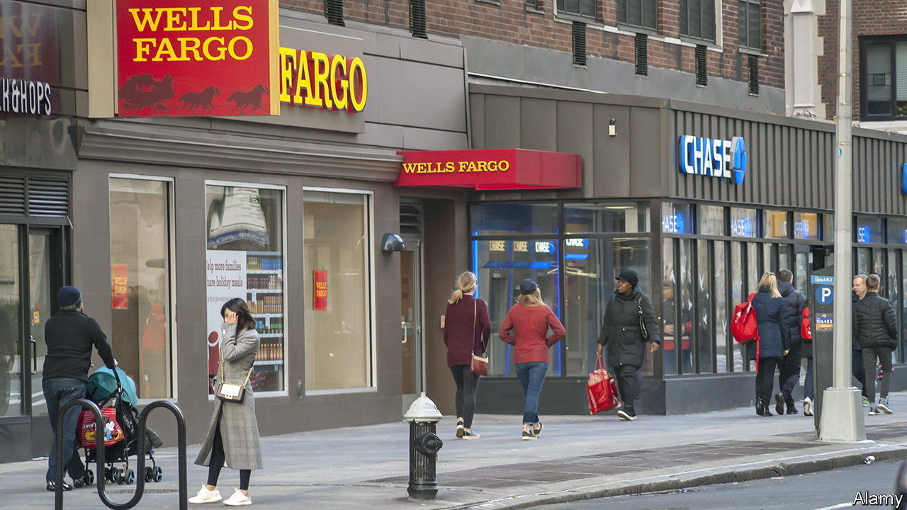
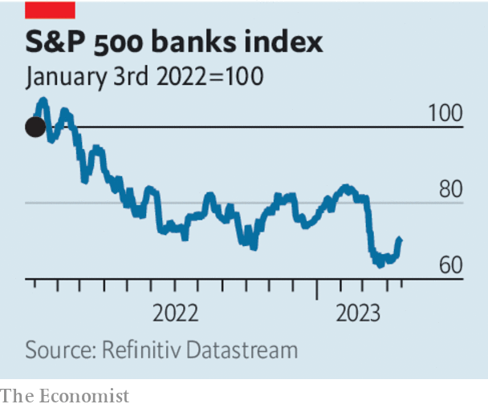

###### The prize of size

# Why America will soon see a wave of bank mergers 

##### Cheap valuations and a stricter rulebook point towards more consolidation 

 

> Apr 20th 2023 

The trouble facing many of America’s banks is coming into sharp relief. After the failures of  and Signature Bank in March, behemoths such as JPMorgan Chase and Bank of America attracted deposits despite paying minimal interest, according to earnings reports released since April 14th. Many small and medium-sized banks, by contrast, face increasing competition for customers and rising funding costs. On April 18th Western Alliance, a lender with $71bn of assets, reported that it had lost 11% of its deposits this year. To tempt deposits back, banks will have to pay more for them; in the meantime many have turned to temporary loans, including from the , that incur today’s high rates of interest. Yet lots of banks’ assets are low-yielding and cannot be sold without crystallising losses. A big profits squeeze is .

More banks were due to report earnings after we published this leader. But the market has already made a judgment: America’s banks are worth only about their combined book value, having traded at nearly a 40% premium at the start of the year. The likely result of their low valuations, combined with a landscape in which size matters, is a tried-and-tested response to banking crises over the past four decades: consolidation.

 


America has 4,700 banks and savings institutions, or one for every 71,000 residents. To observers in the eu, which has only one bank for every 85,000 people, that seems excessive. Yet it is a historical low: in 1984, when comparable data begin and the population was much smaller, there were nearly four times as many institutions. Since then the industry has seen almost continuous consolidation. The biggest wave of mergers came after a long-running crisis among savings and loan associations (S&amp;Ls), lenders specialising in mortgages, reached its apex in the late 1980s. It left many carcasses over which stronger banks could pick. Rule changes, such as the lifting of restrictions on banking across state lines, also encouraged banks to grow in size.

There are several parallels between then and now. Many S&amp;Ls went bust because their funding costs rose as interest rates surged, while their mortgage-loan books brought in low, fixed rates of interest. At one point nearly two-thirds of S&amp;Ls would have been insolvent had their assets been marked to market. Although the balance-sheet problems of today’s banks are less severe, they are similar in nature. At the end of 2022 more than 400 banks with nearly $4trn in combined assets had unrealised losses on their securities portfolios worth at least half of their core equity capital. Include their fixed-rate loan books, and possible losses to come on lending against commercial property, and the hole would be greater still.

At the same time, smaller banks are at risk of losing the regulatory advantages they now enjoy. When calculating their regulatory capital, banks with less than $700bn in assets typically do not have to mark to market even the securities that they class as “available for sale” and which are meant to be a source of quick cash in an emergency. Those smaller than $250bn are exempted from the strictest liquidity rules, stress tests and failure planning. This light-touch regulatory regime is now being reviewed by domestic and international regulators. The Basel Committee on Banking Supervision, which writes the global rulebook, is studying the lessons to be learned from the failure of SVB, whose depositors were bailed out even though it was too small and domestically focused to be subject to the strictest rules. In Washington, an easing of the rules for midsized banks by Congress and the Fed in 2018 and 2019 is under fresh scrutiny.

The most important changes to the market’s structure are likely to be among banks which are close to significant regulatory thresholds. There are 20 banks which are between $100bn and $250bn in size. If the penalty for crossing the $250bn threshold is reduced, many may find it advantageous to merge. Doing so would allow them to spread the growing costs of complying with regulation over a bigger business, while making it even more likely that their depositors would be bailed out in a crisis. Regulators would probably look favourably on tie-ups that swallowed up zombie banks which might otherwise “gamble for resurrection” by taking big risks—a tactic that made the S&amp;L crisis in the 1980s much worse. If so, then the latest crisis will provide the latest impetus for banks to get bigger. ■

