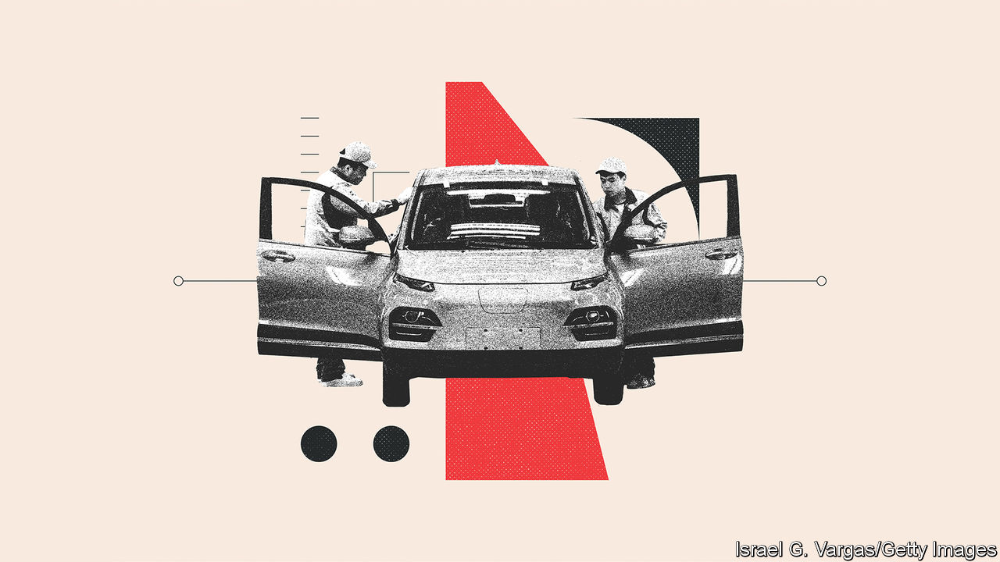

###### Great wheels from China

# Why the world should welcome competition from Chinese carmakers 

##### Deglobalisation would be bad for drivers and the planet 

 

> Apr 20th 2023 

If fresh evidence were needed of the importance of China to the , the Shanghai motor show, which opened on April 18th, provides it. The world’s other big jamborees have been permanently cancelled or downgraded, but China’s showcase has attracted 1,000 exhibitors from many countries with 100 new models on show. 

Only a few years ago  and shoddily put together. Today they are mostly as good as foreign ones in both respects, and surpass them in the software-driven digital experience that will define car brands in the future. Yet for the world as a whole, the rise of Chinese cars will be more significant still. To curb global warming, it is essential to replace carbon-spewing petrol-powered vehicles with cleaner battery-powered ones. And China is both the world’s biggest market for, and maker of, . 

Vehicles powered by internal combustion have been a great success story over the past century, bringing mobility to the masses and fat profits to shareholders. A handful of giant carmakers have made steady improvements to their products and assembled ever more complex supply chains spread across the globe. This has brought greater comfort and safety to passengers, as well as low prices. Competition from Japanese carmakers (which roared into the fast lane in the 1970s) and South Korean firms (which did so in the 1990s) spurred innovation worldwide. 

Today the industry, with nearly $3trn in annual global revenues, is experiencing its most  yet . Established carmakers are scrambling to electrify, improve their software and prepare for autonomous driving. 

The disruption is in part a result of Tesla’s success, both as a maker of evs and as a firm that puts technology at the heart of its business. But it is also caused by greater competition in China, where local firms, supported by state subsidies, are winning market share from Western rivals. byd and Changan, the country’s two biggest homegrown firms, now have a domestic market share of 18%, and sell around 4m cars a year. China’s carmakers are especially innovative when it comes to infotainment and the seamless integration of smartphones. A healthy head start and huge scale, meanwhile, have helped byd become a leader in evs at the cheap end of the market. All told, the competition is leaving Japanese firms, once leaders, .

The world’s drivers stand to gain from cheaper and greener cars. But can the race for market dominance continue? China’s emergence as an ev superpower is taking place just as the geopolitical climate worsens, and protectionism is finding greater favour in the West. 

In America, where few Chinese cars roam the roads, tariffs on them are already forbidding. In addition, President Joe Biden’s Inflation Reduction Act (ira) uses incentives and subsidies to try to turn North America into an ev powerhouse, encouraging locals to buy domestically made cars and components. Fears also swirl that sensor-packed Chinese cars might guzzle sensitive data. (China has barred Tesla cars from military bases and cities holding party meetings, presumably out of the same concerns.) 

In Europe, where Chinese carmakers are gaining a foothold and planning a big push, some domestic firms are calling for higher tariffs. Politicians want an IRA-like effort to protect the continent’s car industry, along with other sorts of manufacturing. 

Risks to privacy and national security both warrant vigilance against the misuse of data by carmakers. There is a risk, however, that these also become excuses for crude protectionism. That may preserve some domestic jobs, but only by harming a much larger number of drivers. A sharp jolt of competition from Chinese carmakers would force domestic firms to innovate harder. That should make evs cheaper, helping the planet, and better, benefiting motorists. 

Wheels, not walls

Chinese firms are racing to improve autonomous cars, and to make riding more pleasurable with software-enhanced big screens, mood lighting and other goodies. Just as it was foolish to try to keep out Japanese and South Korean cars, it would be foolish now to erect road blocks against Chinese ones. ■

