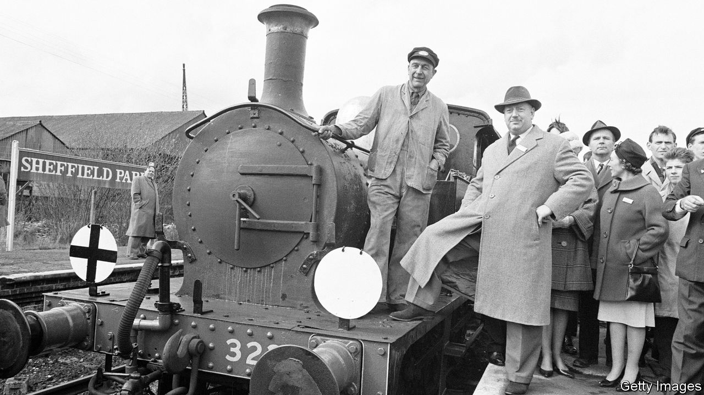

###### On economics and business, the rice crisis, cyberwar, drought, cycling in London, the Beatles

# Letters to the editor 

##### A selection of correspondence 

 

> Apr 20th 2023 


The business of economics

The Free exchange column on why economics does not understand business stated that “economics likes to see itself as a foundational discipline, like physics, not a practical one, like engineering” (). In their quest to be physics-like and evidence based, economists are prone to a form of selection bias by focusing on problems where data are relatively abundant. In doing so, they tend not to study problems where data are necessarily scarce. 

Often when studying firms that are leaders in adopting technology or innovative business models we can only analyse small samples, or even a sample of one in the case of a pioneer. Studying small samples means obtaining qualitative information and inferring logically causal processes about management decision-making, organisational governance, culture and politics within and across firms as they strive to innovate and remain competitive. Such approaches are well developed in cognate disciplines such as management, sociology and politics, among others. Adopting such approaches by working collaboratively with such disciplines can only strengthen the toolbox of economists and contribute to a better understanding of business. 

Economics may still continue to be a foundational discipline, but it has the potential to become as practical as engineering.

Chander Velu

Professor of innovation and economics 

Department of Engineering

Sriya Iyer

Professor of economics and social science

Faculty of Economics

University of Cambridge

The column concluded that “economics has little of practical use to say about what makes a successful company.” I must defend the profession. In the consultancy firm where I was a partner I was, despite being chief economist, also at various times head of strategy and head of international privatisations. We were not there to advise only on GDP trends or interest-rate policy.

If things have changed we need to get our act together to reverse the trend. It is important to encourage the young to study economics as a degree and then apply it in practice, whether in the private or public sector. As I discovered repeatedly during my career, strategies done in a vacuum without proper analysis and understanding of what makes an economy and an industry tick rarely work. 

Vicky Pryce

Former joint head of the UK Government Economic Service 


 


Rice and climate change

“” (April 1st) could be solved with new but proven methods of cultivation. These agroecological approaches require fewer chemicals and less water, but increase yield and reduce greenhouse-gas emissions. Crops are not only more resilient, they draw carbon down from the atmosphere into soil and root systems. 

One example is the System of Rice Intensification (SRI), one of the most cost-effective climate solutions identified in 2017 by Project Drawdown, a non-profit organisation. SRI involves the wider spacing of plants and careful management of seedlings and water. Research shows that water consumption and emissions, mainly methane, can be halved. With 80% less seed, farmers’ yields consistently increase, often doubling or more. Smallholder farmers across Asia and Africa have already adopted these practices. Innovative farmers in Pakistan and Arkansas have shown that SRI can be mechanised and scaled. 

SRI is practised in over 60 countries, but still accounts for only 5-10% of global production. Helping farmers change their practices mainly requires non-financial support such as training, demonstration and access to equipment. The payback to farmers and governments in productivity, food security, water savings and greater resilience to climate stresses will be measured in months. This is the kind of initiative that should be a priority at COP28, to be held in Dubai later this year.

Dr Adam Parr

Business fellow

Smith School of Enterprise and the Environment

University of Oxford

 


Psychological warfare

The commander of Britain’s National Cyber Force, James Babbage, revealed that Britain’s “doctrine of cognitive effect” has only recently adopted the principles of aiming for long-term results in offensive cyber (“”, April 8th). That involves targeting elites rather than the masses and emphasising content based on truth rather than intentional falsehood, as being appropriate for a liberal democracy. 

These are the same principles identified and practised by Charles Masterman’s famous war-propaganda bureau at Wellington House during the start of the first world war. Regrettably, they are so contrary to conventional military thinking and culture that they have had to be rediscovered in every war since.

Stephen Badsey

Professor of conflict studies

University of Wolverhampton 

 


Charity begins at home

Aid agencies and international governments too often take a whack-a- mole approach to disaster response (“”, April 1st). The result is short-term relief but long-term instability. This mindset means that if rains do return to Somalia, the flow of funding will dry up.

As the chief executive of Somalia’s largest foundation, this stop-and-start approach limits my capacity to plan and put the infrastructure in place that could better prepare us for the next disaster. So international organisations must work harder to empower local ones. We will be there to push Somalia forward, through good times and bad.

Otherwise, a country’s development trajectory lies in the hands of those who do not call it home. This cannot be a recipe for success.

Abdullahi Nur Osman

Chief executive

Hormuud Salaam Foundation


 


Cycling in London

We agree that improving road safety means focusing on road junctions and improving vision for lorry drivers (“” April 1st). Transport for London has indeed made changes at more than 40 junctions, but many of these redesigns retain what are known as “critical issues” that the UK Department for Transport’s junction-assessment tool and TfL’s own Healthy Streets check for designers highlight as objectively dangerous. For example, some junctions continue to allow heavy flows of left-turning vehicles across the path of cyclists.

Moreover, TfL has routinely weakened or delayed progress on rolling out safety measures, primarily it seems to avoid impacting bus-journey times. The stark reality of dangerous junctions, particularly in urban areas, is that any improvements for safety must come mostly by reducing motor-traffic capacity, which means cities being clear about their priorities to stop serious road collisions. It is possible to cut bus-journey times and collisions, but to do so means reducing private-vehicle traffic significantly. Bank Junction in the City of London is a good example of this. 

Unless TfL and London’s boroughs tackle dangerous junctions with far more clarity, the mayor’s strategy for “Vision Zero”—no road deaths or serious injuries—will remain unachievable.

Simon Munk

Campaigns manager

London Cycling Campaign

 


Let me tell you how it will be

Your article on the mistakes made by Richard Beeching when he reshaped Britain’s railways in the 1960s reminded me that not everyone in that decade disapproved of his parsimony (“”, April 1st). Beeching also had his admirers. By the late 1960s the Beatles’ record label, Apple Corps, was out of control financially and losing so much cash that John Lennon decided that one solution was to meet Beeching in the hope he would take control of the business and apply his famous cost-cutting skills. 

The meeting did not go well. Beeching told Lennon to “stick to making records”.

Chris Drake

Director

H&amp;D


