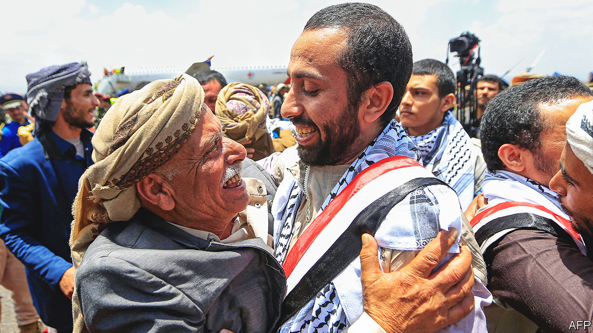
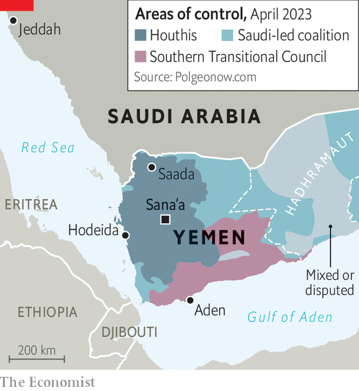

###### It’s time we stop

# A prisoner swap is a symbolic step towards ending the Saudi-led war in Yemen 

##### The Houthis are close to a Pyrrhic victory, but Yemen is still far from peace 

 

> Apr 20th 2023 

They were rare scenes of joy in a war that has brought eight years of misery. For three days lines of grinning men (and the occasional woman) stepped off Red Cross planes in Sana’a and Aden, the biggest cities in Yemen. After years in captivity, some looked the worse for wear: faces drawn, black hair turned grey. But they were eager to embrace family members and celebrate their new-found freedom.

 


A total of 887 people were released in this month’s prisoner swap between the Houthis, a Shia rebel group that controls much of Yemen (see map), and the Saudi-led coalition that has been fighting them for eight years. Immediately after the exchange was complete, the Houthis mooted another, larger one. It was a further sign that both sides are nearing a deal to end their war. But peace in our time this is not: more likely it is the end of one conflict and the start of another.

It has been the most pointless of wars. At first Saudi officials said “Operation Decisive Storm” would remove the Houthis within weeks and restore Yemen’s internationally recognised government. That was 421 weeks ago. A Saudi-led bombing campaign has killed around 9,000 civilians, including guests at a wedding, children on a school bus and mourners at a funeral. The United Arab Emirates (UAE), the coalition’s most effective army, began to withdraw most of its troops in 2019 after it concluded the campaign had reached a stalemate.

Where they once sought to overthrow the Houthis, the Saudis now have one overarching priority: to end their own involvement in the war, and the torrent of cross-border missiles and drones it has invited. The Armed Conflict Location and Event Data Project, an American monitoring group, says the Houthis have carried out more than 1,000 rocket or missile attacks on Saudi Arabia and flown at least 350 drones into the country since the war began.

Their attacks have become steadily more accurate: just 15% of them used guided munitions in 2015, a number that rose to 89% last year. Fatalities have been rare. Reputational damage has not. Last year the Houthis struck an oil depot in Jeddah days before the city hosted a Formula 1 race. The Saudis want to attract investors and tourists to help diversify their economy. Ballistic missiles tend to scare off both.

The cross-border attacks worked. After months of talks, on April 9th a Saudi delegation landed in Sana’a, the Yemeni capital, to discuss terms. The first step will probably be to extend a temporary truce agreed last April. Though it expired six months later, both sides have more or less continued to abide by it, and it may now be made permanent. The Houthis also want the Saudi-backed government to pay salaries for civil servants in areas they control.

For the Houthis, victory will be Pyrrhic. They survive to rule a ruined country. Fully 80% of its 30m people rely on foreign aid, and between 2015 and 2020 disease and famine killed at least 131,000. They have forced children into service as cannon fodder, stolen foreign aid, repressed women and turned schools into factories for indoctrination. None of this has endeared them to the populace.

The group has been fighting a civil war against the Yemeni state since the 1990s. Many Yemenis fear it will continue, despite any peace deal. The Houthis have offered vague words about power-sharing. “If we were not looking for full control during the war, then we will not look for full control at any other time,” Mohammed Ali al-Houthi, one of the group’s leaders, told CNN. A keen observer might recall that, during the war, the Houthis seized the capital in central Yemen and the main port in the west, then tried to capture Aden in the south and oilfields in the east, which looks an awful lot like vying for full control.

Add to that a bewildering mix of other disputes. Rebels in the south, who enjoy support from the UAE, want their region to be independent, as it was from 1967 to 1990. Militias on the west coast want some measure of autonomy. So do those in Hadhramaut, in the south-east, an area that has long had a distinct identity from the rest of Yemen. These groups found a degree of common cause against the Houthis, but their unity may dissolve if they no longer perceive a shared threat.

Yemen has long been hard to govern. With so many foes and so little wider popular support, the Houthis will probably find the task impossible. The country will go on fragmenting. The Saudis did not want a hostile regime on their southern border. But what they and their allies have helped create in the past eight years—a patchwork of competing militias and ungoverned spaces—is hardly better. ■

