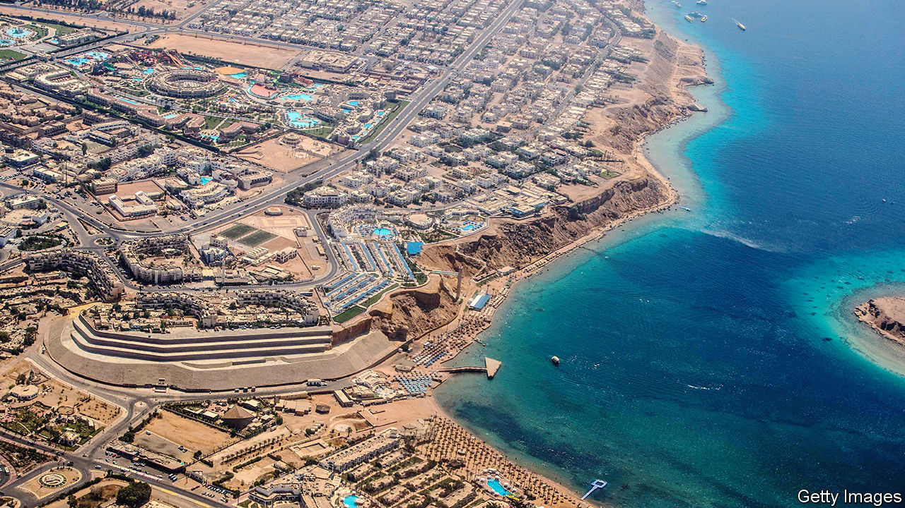

###### Together in the Sinai desert

# Arab tourism to Israel is still thwarted by politics and Palestine 

##### Enduring hostility makes Arabs loth to visit the Holy Land 

 

> Apr 20th 2023 

The indigo festival near the seaside southern foot of Egypt’s Sinai peninsula sounded jolly enough. Its organisers promised five days of “psychedelic music, sun and sea” in a mood of peace and love. Yet the fiesta has proved controversial, largely because the show was being run by Israelis. The Egyptian branch of a global campaign to boycott and divest from Israel denounced the organisers as “racist Zionist occupiers”. After Israeli police recently clashed with young Palestinians near Jerusalem’s al-Aqsa mosque, the festival was axed. Israeli-Arab tourism is still blighted by politics and tensions over Palestine.

Similar jamborees on Sinai’s southern coast, an easy drive from Israel’s border crossing at Taba, have become increasingly popular with Israelis, partly because they are cheaper than in Israel. Almost 700,000 Israelis visited southern Sinai last year. Tourists from Cairo and Tel Aviv rub along happily at the diving centres and beach resorts on the Red Sea. Some local Egyptian businesses advertise their wares in Hebrew and take payment in Israeli shekels. Visitors can buy T-shirts that say “I love Dahab”, one of the most popular spots, in Hebrew.

Some Egyptians, however, are less keen. Last year many were irked by photos of an Israeli flag on the beach during the Hashmaliko festival. Egypt’s anti-Israel twitterati raged at two other gigs held in the week when their compatriots celebrated Sinai Liberation Day, marking the end of Israel’s occupation of the peninsula in 1982. Organisers’ efforts to promote such occasions as peace-building bridges between the two cultures have failed—especially since Egyptians are often not allowed to buy tickets.

Few Arabs across the wider region seem interested in beachside bonhomie. The Israeli tourist industry hoped that the Abraham accords of 2020, which officially normalised Israel’s relations with Bahrain, Morocco, Sudan and the United Arab Emirates (UAE), would cause an influx of holiday-making Arabs keen to see the Holy Land. It hasn’t happened. 

One reason is Arabs’ continuing anger about the Palestinians. Most Egyptians abhor the treaty that made peace with Israel in 1979. Polls say the share of Emiratis who view the Abraham accords favourably dropped from 47% when they were signed to 25% at last count.

Still, the accords have encouraged Israelis to head for the Gulf. Last year 150,000 of them visited the UAE. A few chanced a first-time visit to Bahrain. But Israeli tourism to Egypt beyond Sinai has still not taken off. Last year a mere 45,000 Israelis flew directly to Cairo.

Even fewer Arabs visited Israel as tourists. Those from Egypt, Jordan, Morocco and the UAE, which provided most Arab visitors, numbered just 26,400, compared with 2.7m from elsewhere in the world; 5,100 were Egyptian and 1,600 Emiratis. Bahrainis, says Israel’s tourism ministry, were “too few to count”.

