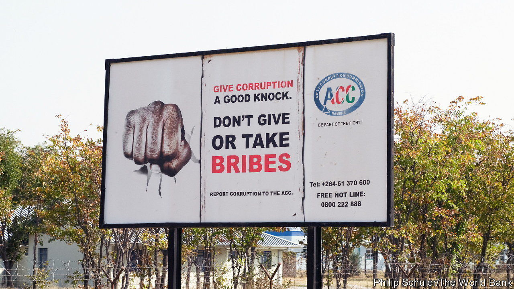

###### Pretty words for petty corruption

# How to ask for a bribe without asking for a bribe 

##### In southern Africa try invoking thirst; in west Africa, religion 

 

> Apr 20th 2023 

“Corruption is our biggest enemy and is not welcome here.” So goes the slogan of Malawi’s most recent anti-graft campaign. Similar messages can be found in public places in many other African countries. In some, such as South Africa and Kenya, citizens are encouraged to call hotlines to report kickbacks. 

In most African countries citizens tell pollsters that graft is getting worse. High-profile scandals among bigwigs are one reason for that, though it may also be that dodgy deals are being uncovered more often, rather than becoming more common. For most people, though, it is because they still face regular shakedowns from officials and the police. Fully one in four Africans who used public services or interacted with police told pollsters they had paid a bribe in the previous year, according to a report in 2019 by Transparency International, a Berlin-based NGO. Still, widespread anti-corruption efforts do at least pose awkward questions to the determinedly unscrupulous. For example, how do you best ask for a bribe when you are sitting under an anti-corruption poster? 

Some still trust in impunity. “Give me something,” demands a woman X-raying bags at Enugu airport in Nigeria, conceding impressively little to anti-graft efforts. Others make small concessions to subtlety. “Can you help me?” asks an immigration officer in Abuja, Nigeria’s capital. 

Others seem to have grown wary of making blunt demands amid the campaigns against graft. One approach is to talk about something other than money. Some officials, for example, like to keep citizens well abreast of their food and drink preferences. “I really want to drink a Nescafe,” declares an airport security guard six times as he frisks your correspondent in Burkina Faso. In Uganda traffic police find ways to mention their favourite soda. In South Africa such requests are so common that bribes for driving offences are known as “cold drink money”. 

Those wishing for a little more deniability like to imply the drink might not be for them. In Kenya police sometimes ask for  (“tea for the elders”). In Nigeria police officers might suggest that they are simply trying to do their job by saying they need fuel for their patrol vehicle. All still expect cash. 

Skilled exponents of extortion often approach their targets with an amiable air. “Are you my friend?” asks a smiling traffic cop in Nigeria. Having elicited a solicitous “Yes, sir”, he swiftly delivers his demand for a bung. Others mix a measure of concern with a pinch of menace. “We are here for you,” says a policeman to a motorist, even as he prevents him from moving on. 

Religion can be surprisingly useful to those looking to subtly request a sweetener. Some might invoke Christian charity with an innocent-sounding inquiry: “Anything for Sunday?” Others cloak their extortion as a request to ”bless the table.” 

Foreigners can sometimes feign ignorance by, for instance, taking the request for a drink literally by handing over a bottle or promising to return with a can when next passing that way. Those who come from rich countries are seldom pressed too hard, since arresting or roughing them up would lead to consular protests. Many locals, alas, have no such privilege. ■

