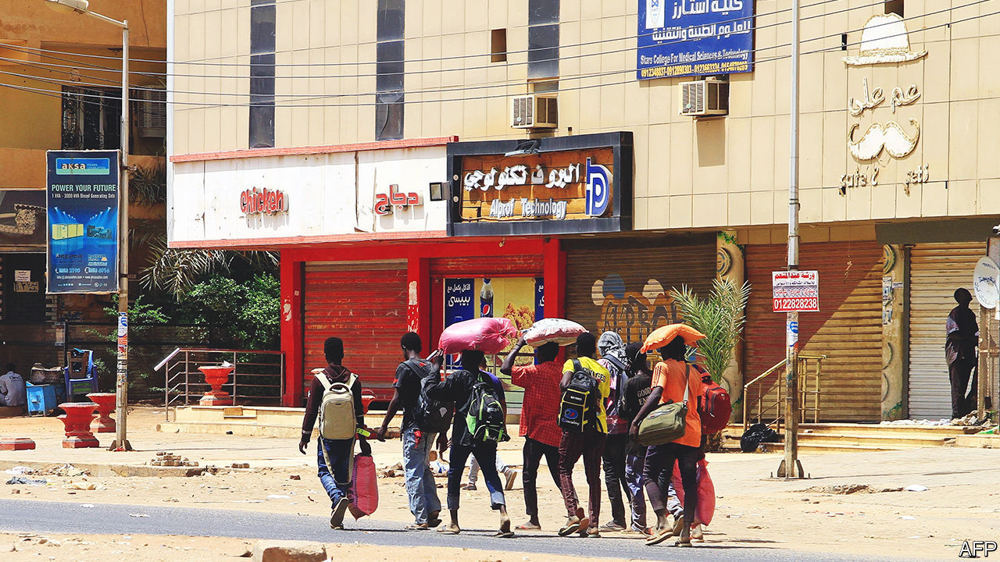
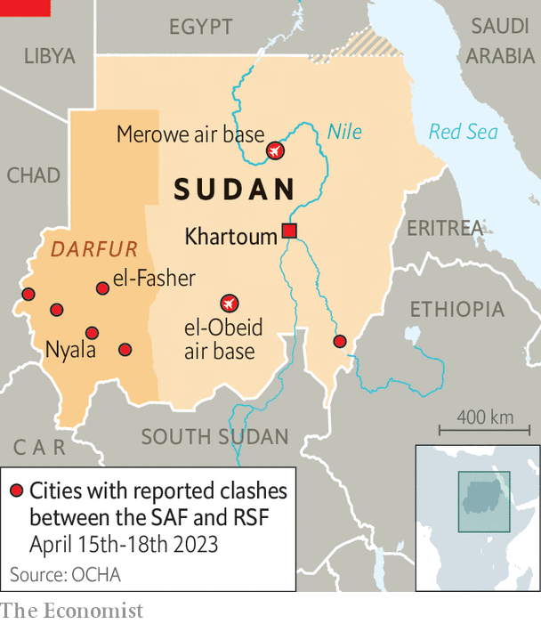

###### Sudan’s crisis

# Sudan is sliding towards civil war 

##### Fighting between rival Sudanese generals could trigger ethnic conflict 

 

> Apr 20th 2023 

Each morning since April 15th, residents of Khartoum, Sudan’s capital, have woken to the thunder of air strikes and the crackle of nearby gunfire. In just the first four days of fighting between the forces of two rival Sudanese generals, nearly 300 people have been killed (most of them civilians) and more than 2,600 injured. Armed men have been raiding and looting homes. “It’s like ‘Call of Duty’,” says a resident whose house was struck by a bullet. Food, water and medical supplies are starting to run out. 

The warning signs of an impending crisis were not hard to read. For months tensions had been building between the two most powerful figures in Sudan’s military government: General Abdel Fattah al-Burhan, Sudan’s de facto leader since a coup in 2019; and Muhammad Hamdan Dagalo (better known as Hemedti), a warlord. He is the leader of the Rapid Support Forces (RSF), a paramilitary unit that grew out of the Janjaweed militias accused of genocidal acts of murder and rape in Darfur. Many warned of an impending clash between the RSF and the government’s Sudanese Armed Forces (SAF) loyal to General Burhan.

The crisis worsened fast in the morning of April 13th, when residents of Merowe, in northern Sudan, saw soldiers from the RSF rolling through town and taking up positions around the airport, a base for fighter jets. In response, SAF soldiers surrounded the RSF men and reportedly ordered them to withdraw. Soon the government warned of an imminent confrontation between the two forces, as did representatives of America, the European Union and several other Western governments. Over the next 24 hours, diplomats dashed between the two camps trying to head off a conflict. In Khartoum, residents braced for the worst. 

It came early in the morning of April 15th as fighting broke out between the SAF and RSF. Each side accused the other of shooting first. According to the national army, Mr Dagalo’s forces had launched a rebellion against the state. The RSF replied that the army had in fact launched a “sweeping attack” against its members. Mr Dagalo called his boss a “criminal” who would either be captured or “die like a dog”. Both sides claimed to have swiftly gained the upper hand. 

Within hours of the first shots being fired, tanks were driving through the streets of central Khartoum as fighter jets screamed overhead. As the air force bombed RSF bases, the RSF attacked the international airport; videos circulating online showed thick clouds of smoke rising from the tarmac. Clashes have occurred in the area around the state broadcaster and the presidential palace. Soldiers from both sides fired rockets near residential homes where civilians cowered. “We are hearing very heavy artillery,” said one resident of central Khartoum by text message. “The voices and sounds are terrifying.”

 


Fighting has also spread to other parts of Sudan (see map). Almost immediately the RSF claimed to have captured the airport at Merowe. Heavy gunfire was also reported near the el-Obeid air base in the North Kordofan region, as well as in multiple places in Darfur; three un aid workers were killed in clashes between the two armies in the city of el-Fasher. It is still unclear whether the conflict will blow up into a full-scale war. But neither man appears inclined to stop the violence and negotiate. Temporary ceasefires brokered by mediators have collapsed in minutes. 

Behind the latest clashes is a struggle for power between General Burhan and Mr Dagalo, and between the complex constellations of political parties, militias, rebel leaders and foreign powers allied to them. This is a fight over who will control the direction of Sudan’s political transition, which began four years ago with the overthrow of the brutal Islamist regime led by the former dictator, Omar al-Bashir. 

Democracy crushed

Mr Bashir was forced out of power in 2019 after months of protests led by an alliance of pro-democracy activists. Sensing Mr Bashir’s time was up, his own generals—among them General Burhan and Mr Dagalo—staged a coup to eject him. Protest leaders and the armed forces then struck a power-sharing deal which was supposed to lead to elections and a civilian government. But Mr Bashir’s divide-and-rule tactics, honed over his three decades in charge, left behind a time-bomb: a motley group of militias and armed factions now jockeying for power. 

The most powerful and prominent is the RSF. Mr Bashir created it as a counterweight to the army and the intelligence service, with its own command structure and funding. The man at its helm, Mr Dagalo, makes no secret of his ambition to rule. 

Neither does General Burhan, who also rose to prominence under Mr Bashir and sees himself as custodian of the army’s interests, including its sprawling business empire. Sudan’s armed forces have dominated its politics since independence in 1956. Both of the country’s previous experiments in democracy—in 1964 and 1985—were crushed by soldiers. General Burhan, who is also backed by powerful Islamist groups linked to Mr Bashir’s regime, dealt democracy its latest blow in 2021, when he carried out a second coup against the civilian leaders of a transitional government set up after the ouster of Mr Bashir. The country has been in turmoil ever since.

In December, leaders of the civilian bloc and the junta signed a provisional accord promising a fully civilian government and elections in two years. If implemented, it would help Sudan’s collapsing economy by opening the door to foreign aid and debt relief. But it would also mean the integration of the RSF into the SAF, and the creation of a single national army under civilian oversight. A final agreement was due to be signed in early April. 

The prospect of a settlement appears to have hastened a showdown. Both men stand to lose from the agreement, which would reduce the power of the armed forces in politics and the economy. Loth to hand over command of his force, Mr Dagalo insisted on being given a decade to integrate the RSF into the national army, while still claiming that he supported the agreement. General Burhan is said to have wanted this to happen within two years in order to defang his rival and to ensure the pre-eminence of the SAF.

More fundamentally, neither he nor the Islamist old guard around him would accept any deal that really curbed the SAF’s business interests. Mr Dagalo’s additional demand, in the most recent round of negotiations, that more than 800 senior officers be removed from the SAF as part of the integration process, was “simply too much” for General Burhan, notes Jonas Horner, an expert on the region. In early April an Islamist official from Mr Bashir’s party, now outlawed, told Reuters that their group was trying to prevent the pending deal.

Islamists within the army may therefore have decided to launch a quick strike in order to “reassert Islamist control over the transition and the country”, argues Mr Horner. In recent months both sides have steadily built up their forces and reinforced their positions in the capital and other strategic places. Tanks were spotted moving over the Nile in Khartoum. General Burhan and Mr Dagalo were said to be no longer on speaking terms in the days before the start of the fighting. 

The danger of a wider conflagration is considerable. Both the SAF and the RSF have extensive ethnic and patronage networks across Sudan. The Islamists around General Burhan are especially well entrenched in the Sudanese state and economy. As both of these unravel, lawlessness is spreading. In Khartoum, gunmen fired on an American diplomatic convoy and attacked the EU’s ambassador in his home. In Nyala, South Darfur, armed men on motorbikes are robbing people in the streets, says Mohammed Osman of Alberdi, a Sudanese rights group. Warehouses belonging to aid agencies have been stripped bare.

The involvement of other countries in the region could also complicate matters. Mr Burhan has the political support of neighbouring Egypt. He may also have its military backing. The  reported that an Egyptian jet had struck an RSF ammunition dump. Videos released by the RSF on April 15th showed captured Egyptian soldiers or pilots and jets at the Merowe air base. Egypt denies any military involvement in the conflict.

Mr Dagalo, by contrast, is close to Khalifa Haftar, a Libyan warlord, and to Issaias Afwerki, the president of Eritrea, who has a long history of meddling in the affairs of his neighbours. Mr Haftar has reportedly sent a shipment of arms to the RSF. Both Mr Haftar and Mr Dagalo have been backed by the United Arab Emirates (UAE) in the past, and RSF troops have fought for Saudi Arabia and the uae in their war in Yemen.

In a clear bid to win Gulf support for his own war, Mr Dagalo claims he is fighting against “radical Islamists who hope to keep Sudan isolated”. So far neither man appears to be doing much to stop the fighting. Mr Dagalo has also ludicrously claimed he is fighting to “protect democracy and uphold rule of law”, omitting to mention that in 2019 the RSF massacred more than 100 peaceful pro-democracy protesters. 

In the balance

It is still too early to tell which side will prevail. The national force controls the skies, which is why Mr Dagalo’s men seem to have concentrated on seizing Sudan’s airfields. It also has tanks and the heavier weaponry. But in Khartoum neither appears to have landed a decisive blow. Perhaps if Mr Dagalo is eventually run out of the capital, he will try to hole up in his tribal base in Darfur. That risks turning what is for now a narrow fight between two factions into a wider civil war between regions and ethnic groups. But if he is killed, the RSF could splinter, which might be a recipe for anarchy.

None of this bodes well for Sudan’s troubled but once hopeful transition to democracy. Unable to see any light at the end of the tunnel, civilians caught in the middle are now trying to flee Khartoum to seek safety in the countryside. “We don’t back either side,” says Ahmed Ismat, a protest leader in Khartoum. “Any war means the end of the revolution.” ■

