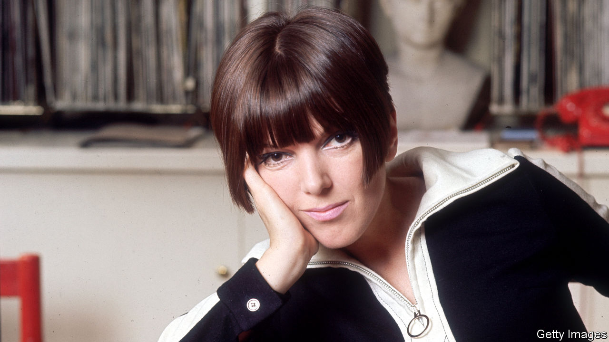

###### The look of an era

# Mary Quant launched the clothes that made the Sixties swing 

##### The fashion designer who broke all the rules died on April 13th, aged 93 

 

> Apr 20th 2023 

Tunics were at the back. Once you had worked through the immense Butterick pattern catalogue, past pages of pastel A-line dresses or tight-skirted suits, suddenly the look changed. It became rectangular, plain, sleek and very short, and if you were a teenager in the early 1960s that was what you wanted. Your parents would never buy such clothes for you, but if you were determined you would make them yourself. Out on the lounge floor you’d spread the fabric, a shock of scarlet, orange or electric blue, and in a few days you, too, would be wearing Mary Quant. 

Wearing it, over a polo-neck and contrasting tights (oh, the joy of losing that fiddly suspender belt!), made you feel different. You were not a version of your mother any more. You were modern. Even more so when you plastered down your hair with spray, framed your eyes with kohl and piled on the mascara. High boots, if you had them, perfected the look. Now you could stride. 

At the start of her career Mary Quant, too, spent hours on her bedsit floor pinning and cutting. She worked at night to restock her first shop, Bazaar, in the King’s Road in Chelsea, with a bouillabaisse of racy clothes. By evening the rails would be almost stripped, and she would rush to Harrods to get fabrics for the next day. Out of men’s suitings, in tweed or grey flannel, she would make pinafores; striped shirting was cut into dresses. She ran up culottes, knickerbockers and lounge pyjamas, and had fun with foot-wide waistbands, broad stripes and huge polka dots. Her best-seller was a white plastic Peter Pan collar, to add demure little-girlishness to each eye-smacking ensemble. 

She also sold mini-skirts. They went like wildfire, getting ever shorter because her leggy Chelsea customers demanded it. She designed them long before André Courrèges, in his Paris show in 1964, made them respectable. They were not respectable with her. Wickedly, they teased men, as did her long cardigans worn as very short dresses, and in 1966 her crutch-hugging minipants. Appalled City types in bowler hats would pass Bazaar, with its open door blaring out jazz and its window of cavorting mannequins, and cry “Disgusting!”, beating their umbrellas on the glass. 

Inside, though, dowagers competed with middle-class girls to buy Quant by the armful, and the  of the day—Tony Armstrong-Jones, David Bailey, Jean Shrimpton, Brigitte Bardot, the odd Beatle or Rolling Stone—would drop in to the running cocktail party. She was her own best advertisement, gamine and frisky, especially when Vidal Sassoon, the hairdresser of the moment, snipped her hair into a bob, and when Terence Donovan, the hot photographer, snapped her (as here). She and her equally mould-breaking business partner-husband, Alexander Plunket Greene, loved to hear people sneer “God! Modern Youth!”. Swinging London was their new world, and they were dressing it. 

This was also serious stuff, for her. She was shy, and always had been, but through clothes she could express herself. Already, at six, she was making her own dresses out of bedspreads. At school she recast her uniform. The Quant look came from a tap-dancer at her childhood ballet class who wore a long black jumper, black tights, white socks and no skirt to speak of; she liked skinny, lively monochrome ever after. At Goldsmiths College she decided to ignore what was happening in Paris, creating clothes solely for herself and her friends. In pursuit of fashion she was constantly looking for the next, best, thing: a colour or fabric that had been forgotten, a shirt that could be tied like a scarf, a natural pattern she could blow up large. As she walked she might pick up a conker, leaves, a brass hook, bits of ribbon and mesh from factory floors. Even a rubber doorstop would set her mind working. 

Fashion also gave her a living, surprisingly enough. Her parents, Welsh schoolteachers who had moved to London, thought the business dicey and dodgy. Neither she nor Alexander had much idea about money, and it was only his aristocratic income that enabled them to set up Bazaar in 1955 with the help of another useful friend, ex-lawyer Archie McNair. But in ten days the original stock had sold out, and in the first week the shop made £500. Two more London outlets came quickly and, in 1962, a deal with J.C. Penney to link up with 1,765 stores in America. By 1963 the Quant brand was global, with revenues of £14m; in 2000 her make-up arm was bought out by a Japanese company, in a country where her look was also adored. Sensibly, she went early into mass-production and discounting. Money-talk embarrassed her, but she and Alexander—with no furniture except a bed and deckchairs when they married in 1957—certainly rose fast in the world. 

That love affair too had been made by fashion, when Alexander wandered into classes at Goldsmiths in his mother’s gold silk pyjamas. For both of them, eccentric dressing was a powerful tool for getting through life. It could be a disguise, and her range of cosmetics, with colours as vivid as her clothes, were really pots of theatrical paint made tiny for a handbag. Or it could be a bold announcement of things to come. When she set up Bazaar in a grey Britain not long out of rationing, a place of bomb-sites and pea-souper fogs, her shop immediately looked alive, with music and colours that sang of the world to be. Fashion changed first. 

It also changed women, once the new look took hold. Not just because they could playfully imitate men, by borrowing men’s tailoring and their cardigans, but mostly because mini-dresses freed them to move. She designed them, she said, to be alive in. More important still, high hemlines, paired with opaque tights, let girls run for the bus in order to get to work. You could never run for the bus in a Dior dress. In Quant, women felt they could leave the house and dare a different life. 

When people credited her with that revolution, though, she objected. Times were coming to a boil and she just happened to be there, giving women more of what they already wanted. Her customers were the real revolutionaries; they, and the teenage girls who cut and stitched her designs on sitting-room floors across the land, kohl-rimmed eyes gleaming, eager to stride outside. ■

