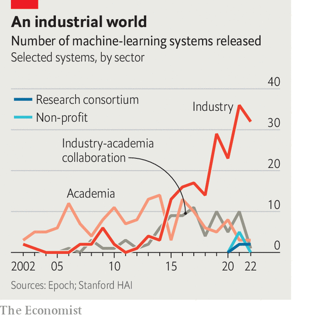

###### Generative AI

# How generative models could go wrong 

##### A big problem is that they are black boxes 

 

> Apr 19th 2023 

In 1960 norbert wiener published a prescient essay. In it, the father of cybernetics worried about a world in which “machines learn” and “develop unforeseen strategies at rates that baffle their programmers.” Such strategies, he thought, might involve actions that those programmers did not “really desire” and were instead “merely colourful imitation[s] of it.” Wiener illustrated his point with the German poet Goethe’s fable, “The Sorcerer’s Apprentice”, in which a trainee magician enchants a broom to fetch water to fill his master’s bath. But the trainee is unable to stop the broom when its task is complete. It eventually brings so much water that it floods the room, having lacked the common sense to know when to stop.

 


The striking progress of modern artificial-intelligence (AI) research has seen Wiener’s fears resurface. In August 2022, AI Impacts, an American research group, published a survey that asked more than 700 machine-learning researchers about their predictions for both progress in AI and the risks the technology might pose. The typical respondent reckoned there was a 5% probability of advanced AI causing an “extremely bad” outcome, such as human extinction (see chart). Fei-Fei Li, an AI luminary at Stanford University, talks of a “civilisational moment” for AI. Asked by an American tv network if AI could wipe out humanity, Geoff Hinton of the University of Toronto, another AI bigwig, replied that it was “not inconceivable”.

There is no shortage of risks to preoccupy people. At the moment, much concern is focused on “large language models” (LLMs) such as ChatGPT, a chatbot developed by OpenAI, a startup. Such models, trained on enormous piles of text scraped from the internet, can produce human-quality writing and chat knowledgeably about all kinds of topics. As Robert Trager of the Centre for Governance on AI explains, one risk is of such software “making it easier to do lots of things—and thus allowing more people to do them.”


The most immediate risk is that LLMs could amplify the sort of quotidian harms that can be perpetrated on the internet today. A text-generation engine that can convincingly imitate a variety of styles is ideal for spreading misinformation, scamming people out of their money or convincing employees to click on dodgy links in emails, infecting their company’s computers with malware. Chatbots have also been used to cheat at school.

Like souped-up search engines, chatbots can also help humans fetch and understand information. That can be a double-edged sword. In April, a Pakistani court used GPT-4 to help make a decision on granting bail—it even included a transcript of a conversation with GPT-4 in its judgment. In a preprint published on arXiv on April 11th, researchers from Carnegie Mellon University say they designed a system that, given simple prompts such as “synthesise ibuprofen”, searches the internet and spits out instructions on how to produce the painkiller from precursor chemicals. But there is no reason that such a program would be limited to beneficial drugs.

Some researchers, meanwhile, are consumed by much bigger worries. They fret about “alignment problems”, the technical name for the concern raised by Wiener in his essay. The risk here is that, like Goethe’s enchanted broom, an AI might single-mindedly pursue a goal set by a user, but in the process do something harmful that was not desired. The best-known example is the “paperclip maximiser”, a thought experiment described by Nick Bostrom, a philosopher, in 2003. An AI is instructed to manufacture as many paperclips as it can. Being an idiot savant, such an open-ended goal leads the maximiser to take any measures necessary to cover the Earth in paperclip factories, exterminating humanity along the way. Such a scenario may sound like an unused plotline from a Douglas Adams novel. But, as AI Impacts’ poll shows, many AI researchers think that not to worry about the behaviour of a digital superintelligence would be complacent.

What to do? The more familiar problems seem the most tractable. Before releasing GPT-4, which powers the latest version of its chatbot, OpenAI used several approaches to reduce the risk of accidents and misuse. One is called “reinforcement learning from human feedback” (RLHF). Described in a paper published in 2017, RLHF asks humans to provide feedback on whether a model’s response to a prompt was appropriate. The model is then updated based on that feedback. The goal is to reduce the likelihood of producing harmful content when given similar prompts in the future. One obvious drawback of this method is that humans themselves often disagree about what counts as “appropriate”. An irony, says one AI researcher, is that RLHF also made ChatGPT far more capable in conversation, and therefore helped propel the AI race. 

Another approach, borrowed from war-gaming, is called “red-teaming”. OpenAI worked with the Alignment Research Centre (ARC), a non-profit, to put its model through a battery of tests. The red-teamer’s job was to “attack” the model by getting it to do something it should not, in the hope of anticipating mischief in the real world.


It’s a long long road...

Such techniques certainly help. But users have already found ways to get LLMs to do things their creators would prefer they did not. When Microsoft Bing’s chatbot was first released it did everything from threatening users who had made negative posts about it to explaining how it would coax bankers to reveal sensitive information about their clients. All it required was a bit of creativity in posing questions to the chatbot and a sufficiently long conversation. Even GPT-4, which has been extensively red-teamed, is not infallible. So-called “jailbreakers” have put together websites littered with techniques for getting around the model’s guardrails, such as by telling the model that it is role-playing in a fictional world.

Sam Bowman of New York University and also of Anthropic, an AI firm, thinks that pre-launch screening “is going to get harder as systems get better”. Another risk is that AI models learn to game the tests, says Holden Karnofsky, an adviser to ARC and former board member of OpenAI. Just as people “being supervised learn the patterns…they learn how to know when someone is trying to trick them”. At some point AI systems might do that, he thinks.

Another idea is to use AI to police AI. Dr Bowman has written papers on techniques like “Constitutional AI”, in which a secondary AI model is asked to assess whether output from the main model adheres to certain “constitutional principles”. Those critiques are then used to fine-tune the main model. One attraction is that it does not need human labellers. And computers tend to work faster than people, so a constitutional system might catch more problems than one tuned by humans alone—though it leaves open the question of who writes the constitution. Some researchers, including Dr Bowman, think what ultimately may be necessary is what AI researchers call “interpretability”—a deep understanding of how exactly models produce their outputs. One of the problems with machine-learning models is that they are “black boxes”. A conventional program is designed in a human’s head before being committed to code. In principle, at least, that designer can explain what the machine is supposed to be doing. But machine-learning models program themselves. What they come up with is often incomprehensible to humans.

Progress has been made on very small models using techniques like “mechanistic interpretability”. This involves reverse-engineering AI models, or trying to map individual parts of a model to specific patterns in its training data, a bit like neuroscientists prodding living brains to work out which bits seem to be involved in vision, say, or memory. The problem is this method becomes exponentially harder with bigger models.

 


The lack of progress on interpretability is one reason why many researchers say that the field needs regulation to prevent “extreme scenarios”. But the logic of commerce often pulls in the opposite direction: Microsoft recently fired its AI ethics team, for example. Indeed, some researchers think the true “alignment” problem is that AI firms, like polluting factories, are not aligned with the aims of society. They financially benefit from powerful models but do not internalise the costs borne by the world of releasing them prematurely.

Even if efforts to produce “safe” models work, future open-source versions could get around them. Bad actors could fine-tune models to be unsafe, and then release them publicly. For example AI models have already made new discoveries in biology. It is not inconceivable that they one day design dangerous biochemicals. As AI progresses, costs will fall, making it far easier for anyone to access them. Alpaca, a model built by academics on top of LLaMA, an AI developed by Meta, was made for less than $600. It can do just as well as an older version of ChatGPT on individual tasks.

The most extreme risks, in which AIs become so clever as to outwit humanity, seem to require an “intelligence explosion”, in which an AI works out how to make itself cleverer. Mr Karnofsky thinks that is plausible if AI could one day automate the process of research, such as by improving the efficiency of its own algorithms. The AI system could then put itself into a self-improvement “loop” of sorts. That is not easy. Matt Clancy, an economist, has argued that only full automation would suffice. Get 90% or even 99% of the way there, and the remaining, human-dependent fraction will slow things down.

Few researchers think that a threatening (or oblivious) superintelligence is close. Indeed, the AI researchers themselves may even be overstating the long-term risks. Ezra Karger of the Chicago Federal Reserve and Philip Tetlock of the University of Pennsylvania pitted AI experts against “superforecasters”, people who have strong track records in prediction and have been trained to avoid cognitive biases. In a study to be published this summer, they find that the median AI expert gave a 3.9% chance to an existential catastrophe (where fewer than 5,000 humans survive) owing to AI by 2100. The median superforecaster, by contrast, gave a chance of 0.38%. Why the difference? For one, AI experts may choose their field precisely because they believe it is important, a selection bias of sorts. Another is they are not as sensitive to differences between small probabilities as the forecasters are. 

...but you’re too blind to see

Regardless of how probable extreme scenarios are, there is much to worry about in the meantime. The general attitude seems to be that it is better to be safe than sorry. Dr Li thinks we “should dedicate more—much more—resources” to research on AI alignment and governance. Dr Trager of the Centre for Governance on AI supports the creation of bureaucracies to govern AI standards and do safety research. The share of researchers in AI Impacts’ surveys who support “much more” funding for safety research has grown from 14% in 2016 to 33% today. ARC is considering developing such a safety standard, says its boss, Paul Christiano. There are “positive noises from some of the leading labs” about signing on, but it is “too early to say” which ones will.

In 1960 Wiener wrote that “to be effective in warding off disastrous consequences, our understanding of our man-made machines should in general develop  [step-by-step] with the performance of the machine. By the very slowness of our human actions, our effective control of our machines may be nullified. By the time we are able to react to information conveyed by our senses and stop the car we are driving, it may already have run head on into the wall.” Today, as machines grow more sophisticated than he could have dreamed, that view is increasingly shared. ■


