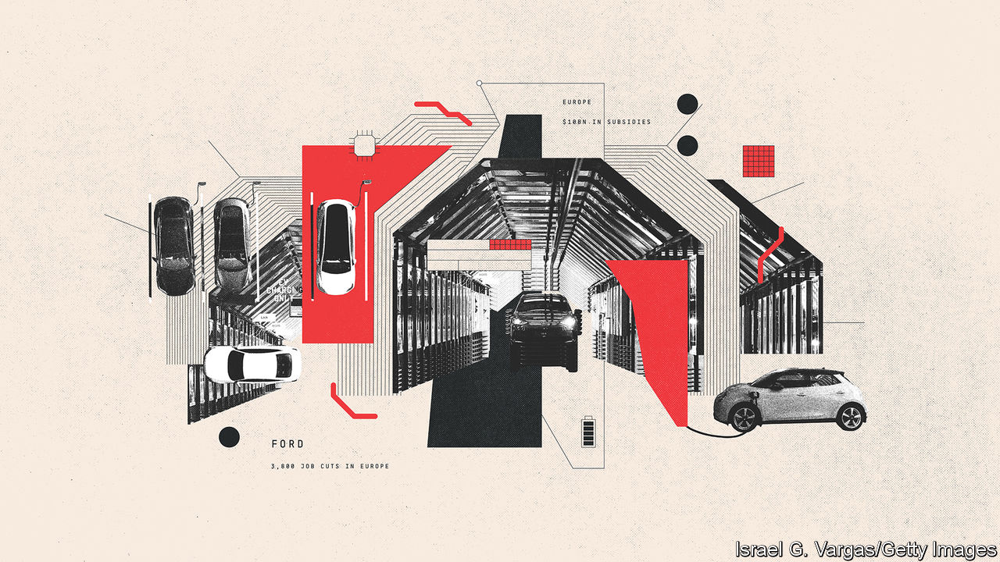

###### Changing lanes

# A changing car industry should result in more choice and better motoring 

##### The future may be hard for some, but for others it could be as bright as a shiny new car 

 

> Apr 14th 2023 

Since the first motorist sparked up a Benz Patent Motorwagen, little has changed. Cars powered by an ICE and carrying four or five passengers have done the same job for 130 years. Several firms that flourished at the outset (including Peugeot and what became Mercedes-Benz) survive. But electrification, tech and autonomous driving may now upend an industry used only to slow change.

The legacy industry must reinvent itself to cope with competition from new carmakers starting from scratch or emerging from China—or both. New technologies demand new ways of doing business as revenues from services are needed to plug the gap of dwindling volumes and EVs that are not as profitable as ice cars. Ashwani Gupta, chief financial officer of Nissan, says the switch is from “one time transaction to lifetime engagement”. Not every firm will manage it. While scale is less of an issue for newcomers, it matters for existing firms that must pay for massive restructuring. Weaker ones, especially small Japanese makers like Subaru or Mazda, may not survive unless they team up with bigger ones.

Can even big companies adjust their cost structures as volumes decline? It may be easier at the upper end of the market, although Tesla as well as China’s Xpeng and Nio are snapping at the heels of Audi, BMW and Mercedes-Benz. America’s big three of Ford, GM and Stellantis’s Chrysler, which make most of their money selling pickups, face new entrants such as Lordstown, Rivian and Tesla’s Cybertruck. Middling European carmakers such as Renault, which rely on the mass market where competition is fiercest, brand loyalty is lowest and profit margins are slimmest, will have the hardest job of all to fend off the Chinese. 

China will be a force because its ev leadership lets it add European sales to those in poorer countries. Whether its car firms can fight through new geopolitical tensions to crack the American market is less clear, but they will keep trying. Tesla may not be making 20m cars a year by 2030 but it will eat away at the market share of incumbents. And some newcomers, seeking to emulate Tesla’s success, will manage to reach scale. Even if many newcomers do not survive, a handful will be making 1m or so cars a year.

The changing industry may let others in. If Foxconn and others operate as manufacturers, scaling up is less of a problem, opening the door to startups. Saudi Arabia’s deep pockets and urge to diversify from oil could make it a force in carmaking. Lucid, backed by the Saudi sovereign-wealth fund, is due to start production of 150,000 cars a year in Jeddah. Ceer, another firm backed by the kingdom, aims to make cars with Foxconn. Building a battery and raw-material industry is also on the Saudi list. And big tech may also have a say. Rumours persist that Apple’s assault on carmaking may extend beyond CarPlay into making vehicles itself. Sony is teaming up with Honda to make EVs. China’s Alibaba, Huawei, Tencent and Xiaomi all have designs on the industry.

But if there is much that is new about the car industry there are still many reminders of the past. Wresting the EV advantage from the Chinese is triggering a new protectionism. Estimates vary over the effect of shifting to less complex EVs that require fewer workers and how many will lose out as the ICE winds down. But there is little disagreement that there will be fewer jobs. “We absolutely have too many people in some places, no doubt about it,” notes Jim Farley, boss of Ford, which announced 3,800 job cuts in Europe in February, citing EVs as the cause. 


The road from rickety contraptions of wood and iron to self-driving supercomputers on wheels has had many twists and turns. The latest upheavals are perhaps the most profound since Carl Benz’s brainwave. The size, reach and impact of the car industry on personal mobility will change. If the eventual outcome of today’s trade tensions and subsidy wars is deglobalisation, the arrival of new entrants may raise costs and reduce efficiency, making cars less affordable and the industry less efficient.

Yet a more optimistic forecast is that startups and new Chinese entrants will force every other carmaker to speed up electrification, to bring forward software that makes journeys better, and to provide more ways to use and pay for trips by car. This could forge a new relationship with the car as a pleasant place to work and play as well as a way to get from A to B. The future may be hard for some, but for others it could be as bright as a shiny new car.■

