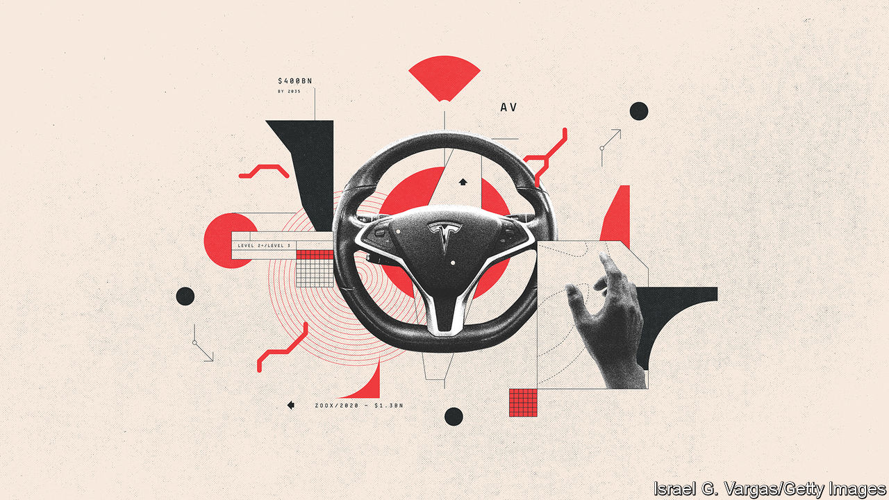

###### Hands off the wheel

# Autonomous vehicles are coming, but slowly 

##### The next challenge for legacy firms is to adapt to autonomy 

 

> Apr 14th 2023 

Fully autonomous electric robotaxis, cheaper and more convenient than a private car, once seemed to threaten the entire industry. Six years ago it was assumed that nobody would buy cars any more, says Amnon Shashua, boss of Mobileye, an autonomous-driving tech firm. At best carmakers would be “white label” suppliers of cheap mass-produced hardware to ride-hailing firms such as Uber or tech giants that had mastered self-driving software. In turn robotaxis would be key for the shift to integrated systems that wove together public transport with private fleets of e-scooters and e-bikes. Such mobility platforms would provide one-click payments for a journey that might use several methods of transport. Smartphone apps would provide integrated, efficient and green urban travel at a fraction of the cost of car ownership.

The promise was backed by data suggesting that young people are no longer so keen to own or even drive cars. Evidence that the screen-obsessed youth of the rich world would rather be glued to a smartphone than slide into a driving seat is supported by the falling proportion obtaining driving licences. The inevitable outcome seemed to be plunging car sales. Yet in fact autonomous vehicles (AVs) and mobility services may be creating new opportunities for firms that can get them right. 

A first myth to dispel is that the young are giving up driving for good. In car-mad America, which has around 890 cars per 1,000 people, only 1% of new cars are bought by people under 24. The share of 16-year-olds with a licence fell between 1983 and 2018, from 46% to 26%, but the decline for older people was less precipitous. In 1983 95% of 35- to 39-year-olds had a licence compared with 91% in 2017. In Britain the proportion of over-21s with licences has hardly budged in 20 years. Just as they are deferring much else, such as settling down or having children, young people are simply getting their driving licences later. The average age of a buyer of a new car in Europe and America is also well over 50. 

A second myth is that Tesla’s Autopilot, its driver-assistance feature, offers the “full self-driving” experience that the company claims. The go-anywhere-anytime, eyes-off-hands-off autonomy—“level 5” in the jargon—is years away from widespread roll-out. A trip in Nissan’s most advanced AV around a test zone in Woolwich in South London shows why. The car attracts attention not for the driving, which is steady and safe, but for the rooftop array of shoebox-sized lidars, laser-based sensors that work in tandem with radars, cameras and high-definition maps. These ensure the car knows where it is to the nearest centimetre and tells it what other road users, pedestrians and static objects to avoid. But they require a boot-full of computers and a “safety driver” in case the vehicle meets an “edge” case that the data cannot respond to. 


Where regulators are more relaxed, robotaxis are more developed. Cruise, a subsidiary of GM, is adding paid driverless rides in Phoenix, Arizona, and Austin, Texas, to the service that it launched for the public in San Francisco in February 2022. Waymo, the self-driving arm of Alphabet, Google’s parent company, operates in Phoenix and San Francisco. Uber’s app with vehicles from Motional, a joint venture between South Korea’s Hyundai and Aptiv, an American supplier, allows the hailing of self-driving rides in Las Vegas. Amazon is running robotaxis between its offices in San Francisco, operated by Zoox, a self-driving startup that it bought for $1.3bn in 2020. In China Baidu, a tech firm, is operating similar services in several cities. Didi, a ride-hailing giant, and WeRide, an av startup that has teamed up with gac, a car firm, are testing out robotaxis in some Chinese cities.

Yet it will be a long time before jumping in a robotaxi is commonplace. Services are “geofenced” to specific areas. Cruise’s 30 cars in San Francisco must for now avoid the busy financial district. Hours of operation may be limited to less congested times and safety drivers or remote monitoring are required. As the cost of the technology falls, robotaxis may spread. UBS, a bank, thinks the market could be worth $2.1trn a year in revenues by 2040, though that would still be only 6% of all kilometres driven. But high costs and distant profits allied to uncertainty over business models mean that most carmakers have less grandiose plans. 

Not autonomous enough

“Profitable, fully autonomous vehicles at scale are a long way off,” is the conclusion of Jim Farley, the boss of Ford. VW and Ford pulled the plug on Argo AI, their robotaxi joint venture, in October 2022. Even Alphabet’s investors are nervous about the costs of Waymo. Carmakers and tech firms are now adopting a more evolutionary approach. This has the benefit of profits arriving sooner by allowing carmakers to follow Tesla’s lead and charge for advanced driver-assistance systems, preloaded in their cars or switched on as subscription services. Tesla has developed its own system using data gathered from its fleet of nearly 3m vehicles. But its Autopilot still requires drivers to stay attentive and keep their hands on the wheel. “Level 2+” and “level 3” autonomy will start by letting drivers let go of the wheel and take their eyes off the road on motorways, although a human must be ready to break off from eating, sending emails or watching a film if need be.

Mr Kallenius, the boss of Mercedes-Benz, says such systems would offer time for work or leisure. Mr Farley adds that “future automated driving tech—hands-free, eyes-off highway driving—has potential to redefine our relationship with our vehicles.” Ford is investing in level 2+/level 3 systems. To master AV, most established carmakers have concluded that they need to team up and share revenues with tech firms. McKinsey reckons that autonomous driving for passenger cars alone could produce sales worth $400bn by 2035. 

As with other software, carmakers want to retain some control. Mobileye, acquired by Intel in 2017 for $15bn and recently floated, switched from a “black box” approach to the open-source system of its competitors, Qualcomm and Nvidia, when it became clear that carmakers were reluctant to risk unknown tech. It says its system will be ready by 2025 and, at roughly $15,000, will cost the same as Tesla’s Autopilot. Mercedes-Benz may be the first to give Tesla competition. Drive Pilot, its level 3 system, has been approved by Nevada for public roads and should be available later this year. McKinsey reckons between four and six out of ten new cars may have autonomous-driving capability by 2035. 

It is the huge tech firms that may do the most to keep American and Chinese carmakers ahead. UBS argues that China has the potential to lead in the mass deployment of self-driving cars. In 2020 the government laid out its strategy for 2025: the large-scale production of level 3 vehicles and the launch of robotaxis in some areas. As in America, China’s AV industry has tech giants, startups and incumbent carmakers all hard at work to serve a large market of tech-obsessed Chinese. Competition is fierce among makers of lidars, radars and cameras, and map firms. Local governments have pitched in by creating test zones and designating thousands of kilometres of roads as suitable for autonomous-car testing. 

The established industry is also rethinking another business that seemed to offer an alternative when merely selling cars lost its appeal. When ride-hailing and other mobility services that came at a fraction of the cost of car ownership were growing and the values of Uber, Lyft and Didi were soaring, carmakers were quick to get in on the act. Yet ride-hailing and car-sharing have not lived up to their early promise. Massive investment before any return (Uber, Lyft and Didi have never made an annual profit), tight margins and the attention of regulators have hobbled ride-hailing. Car firms are trying out new ways to sell mobility. Stellantis’s mobility arm lumps together car rentals, car-sharing, parking and recharging. Toyota’s Kinto unit is developing seamless, joined-up multi-modal transport and payment systems, car-sharing and flexible subscriptions. 

Many firms are copying Tesla by adopting direct sales, as well as new financing packages, to establish a direct relationship with customers in order to collect their data and sell them services more easily. Financing deals are being supplemented with more flexible all-inclusive monthly subscriptions that lower the up-front cost and commitment of using a private car, which may attract younger motorists. Chinese firms are using the subscriptions to attract customers in Europe, such as Lynk&amp;Co, owned by Geely, which calls itself the Netflix of cars.

Autonomous driving should eventually change long car journeys from a chore to a better use of time. For carmakers it will be a way to make money from supplying the systems. More free time in cars should also create opportunities to sell new features such as upgraded infotainment and services such as streaming music and films. The new approach to mobility is one more sign of a switch from ownership to usership.■

