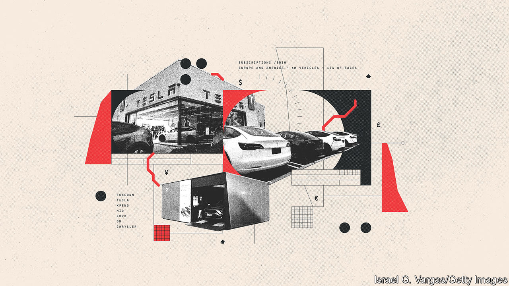

###### Direct drive

# Car firms are trying out new ways to sell mobility 

##### The days when cars were sold at arm’s length through dealerships is ending 

 

> Apr 14th 2023 

Tesla pioneered direct online sales because it wanted to establish a relationship with customers on whose data it relies to develop autonomous driving, and also to keep control of pricing and to reap more profits. Aside from America, where restrictive franchise laws forbid it, many carmakers are now adopting the “agency model” of direct sales. Cutting out haggling with a dealer, widely cited by customers as the worst feature of car buying, is one advantage. Selling directly also allows carmakers to set (higher) fixed prices. Most important, it builds relationships with customers that allow carmakers to pull data from vehicles and so sell them other services.

Car firms are trying out new ways to sell mobility. Buying cars outright with cash is now rare. Financing deals with a monthly payment is supplemented with more flexible all-inclusive monthly payment schemes that lower the cost and commitment of using a private car, which may attract younger customers. Most carmakers now offer subscriptions, or very short-term leases, that resemble car hire by including insurance, maintenance and road tax.

Chinese firms are using the flexibility of subscription to attract customers in Europe. Lynk &amp; Co, owned by Geely and launched in China in 2018, calls itself the Netflix of cars. Its subscriptions, around €550 a month, are available only in Europe, where it launched in 2020, and account for most of its revenues. Nio and BYD have both struck deals with European rental firms to launch subscription services. By 2030 subscriptions in Europe and America may reach 6m vehicles, about 15% of sales, according to Boston Consulting Group, a consultancy.

New financing arrangements could lead to a shift in ownership towards a model where carmakers keep vehicles even as they pass through the second-hand market. As EVs become the dominant means of transport, rules about recycling and reusing battery materials will be tightened. In the EU, for example, from 2027 battery-makers must recover 90% of the nickel and cobalt used, rising to 95% in 2031, and 50% of lithium, rising to 80%. The car will become a mini gold-mine. Christian Dahlheim, boss of VW’s finance arm suggests that, because raw materials will be in heavy demand even after eight years, the battery may be worth more than the rest of the car.

Coming up with financing packages that will allow car firms to keep lifetime ownership of their vehicles would thus make sense, though others admit that it will be tricky to manage. But the industry may gradually change from one in which customers buy a car to drive themselves into one in which they borrow a car that drives them around. ■

