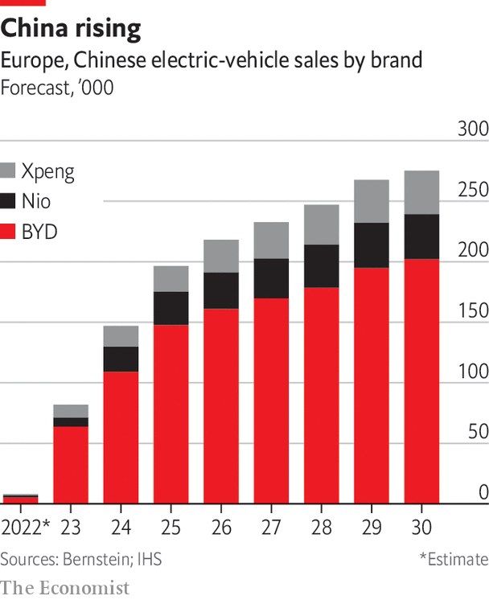

###### The new challenge

# China is leading the challenge to incumbent carmakers 

##### The legacy industry’s greatest assets are not worth as much as in the past 

 

> Apr 14th 2023 

At the start of the 20th century at least 100 American firms were handmaking expensive cars. The economics of mass production led to the concentration of the industry in a few vast firms. Now the process has gone into reverse. In China alone some say there are 300 EV-makers. Batteries and electric motors, which can be bought off the shelf, obviate the need to spend billions developing several ICEs to serve a range of cars with different requirements. One sort of battery can come in a variety of sizes; one sort of motor will suit a variety of vehicles with performance characteristics tweaked by software. So profitability can be reached from smaller volumes.

Creating an artist’s impression of a car and a slick presentation is simple. Even making a handful of cars by hand is not hard. But Factory 56, located at Mercedes-Benz’s mammoth plant in Sindelfingen near the company’s base in Stuttgart, shows that manufacturing at scale is hugely complex. Each high end S-Class is available in several levels of trim and with a variety of options, from exclusive woods and leathers to composite brakes, requiring thousands of parts to be brought to the correct place in the assembly line at just the right moment on robot shuttles. Power tools are controlled wirelessly to tighten the right bolts for torque settings.

The challenge for a newcomer is to replicate this process. It helps that EVs have fewer parts and are easier to assemble than ICE cars. New entrants often make only one or a handful of models, with few options. Even Tesla makes just four, though the cybertruck, a pickup, will soon be available and Mr Musk has promised a cheap Model 2 starting at around $25,000. Simplicity reduces costs, which translates into higher profits. Tesla says the production costs for its Model 2 will be half those of the Model 3, its current smallest vehicle. In an industry where mass-market firms’ operating margins can be in low single figures and premium carmakers such as BMW or Mercedes have generally counted 10% as a triumph, Tesla’s margin is an impressive 15% or so.

Yet carmaking “is still a scale business”, says John McClure of Lincoln International, a bank. Newcomers will not be first in line for batteries and chips in EVs. Drawing on the tech playbook, small firms could find a different, asset-light approach. Fisker, an American EV firm founded in 2016, is using Magna, a contract manufacturer usually employed by carmakers for niche assembly such as early production runs or smaller volume models (it makes Jaguar’s only full-electric model, the iPace). Magna will manufacture the firm’s mid-range Ocean, which costs from $35,000. Fisker will do the rest. 

The practice of teaming up with specialist assemblers may reduce the risks of manufacturing. Fisker will manufacture the Pear, a small cheaper model, with China’s Foxconn, better known for making Apple’s iPhones. Geely, a Chinese carmaker that owns Sweden’s Volvo, and has a 10% stake in Mercedes-Benz, has a deal with Foxconn to make cars for third parties. In 2021 Foxconn also bought a share in Lordstown Motors’ EV factory in Ohio. If any company has greater ambitions even than Tesla, Foxconn’s long-term plan is to manufacture half the world’s EVs. 

Tesla’s rise, its gaggle of followers and the Chinese firms eyeing sales in Europe suggest that old rules about the difficulty of establishing a car brand are breaking down. Because firms old and new are starting from scratch, EV buyers may put less store by established brands. This is especially true in the mass market, where brand loyalty has always been weaker. Premium carmakers tend to do a better job of hanging on to customers. Openness to new brands could give the Chinese firms a leg-up as they try to conquer the world. The growing importance of Chinese motor shows is further evidence of China’s rise. Chinese exports are growing fast: 51% by volume in 2022 to 3.2m vehicles, after expanding by only 2% a year in 2011-20, says Bernstein, a broker. Chinese firms that once exported cheap ICE cars to poorer countries in South Asia and the Americas are now focusing on Europe and EVs.

Brand disloyalty

Both BYD and Great Wall Motor (GWM) with Ora, its budget brand, and upmarket Wey, displayed attractive EVs at October’s Paris Motor Show. Two Chinese EV startups, Nio and Xpeng, are selling cars across Europe and, along with Li Auto, they sold over 120,000 cars apiece in China last year. Along with MG, which is owned by SAIC, and Geely’s Polestar, China accounted for 6.2% of EV sales in western Europe in 2022, says Schmidt Automotive, a data firm. That share seems sure to grow. BYD plans to construct a European EV factory (and not, it has already said, in post-Brexit Britain). Gartner, a consultancy, predicts that by 2026 more than 50% of EVs sold globally will be Chinese.

 


Chinese firms can lean on the vast scale and low costs of serving their home market, their grip on the battery business and their access to generous state funding. But the maturity of China’s market and excess capacity at home combine to make exporting crucial for future growth. Low volumes and the high cost of batteries make it hard for Western legacy firms to switch to making EVs profitably. Bernstein calculates that swapping drive trains increases costs for legacy firms by up to 50%, mostly because of the battery, which in turn makes these vehicles less profitable than their ICE equivalents. Ford says its EV division will lose $3bn in 2023. Carlos Tavares, boss of Stellantis, is blunt: “to fight the Chinese, we will have to have comparable cost structures.” Bernstein notes that Chinese EVs are “on par with global brands on range and efficiency, and yet less expensive”. BYD’s Atto 3 sells for €38,000 in Germany, making it 10-20% cheaper than VW’s similar all-electric ID.4. 

Mr Tavares favours more tariffs on Chinese EVs. But other European firms face a dilemma. Unlike Stellantis, which sells few cars in China, VW, BMW and Mercedes-Benz rely on the country for much of their profits and are big producers there. VW has 33 factories with joint-venture partners and 100,000 Chinese employees. Any move to punish Chinese carmakers in Europe could invite retaliation.

The ability of European firms to cash in on the Chinese market is now waning as the tastes of Chinese car buyers change. European brands once conferred status but their slow response to fast-moving domestic competitors is hitting sales. In 2021 foreign carmakers accounted for less than half of sales for the first time since China became a big market. Once it was all about flashy foreign brands, but innovation is what buyers want now, says Michael Dunne of ZoZoGo, a consultancy that closely watches China. 

Easy access to capital may also be a boost for Chinese firms. But other newcomers have also had little trouble finding the cash that they need. Private equity, tech firms and even old-fashioned carmakers have poured money into any startups that looked as if they might become the next Tesla. Electrifying the pickups that Ford, GM and Chrysler rely on for most of their profits persuaded Amazon, Ford and T. Rowe Price, a big money manager, to invest in Rivian, an American EV pickup firm that was founded in 2009. Its R1T is a match for Ford’s F150 Lightning, the electric version of its bestselling pickup, and will doubtless stand up to electric pickups from GM and Chrysler that are going on sale this year. China’s Xpeng has raised money from domestic investment firms and Alibaba, a Chinese tech giant.

Firms with big plans on paper but few vehicles to sell have also attracted huge valuations at initial public offerings or by going public via special-purpose vehicles. Rivian was valued at nearly $130bn shortly after it floated in 2021. Nio hit a peak of $97bn. But the savage readjustment of Tesla’s valuation and investors’ doubts about tech shares have battered many newcomers that have struggled with carmaking, missing production and sales targets. Rivian and Nio are now valued in the $12bn-15bn range. Shares in Xpeng are at one-seventh of their peak in 2022.

For the newcomers it is a question of how much cash they burn and how long they can keep in the race. Lucid Motors, an EV startup backed by Saudi Arabia’s sovereign-wealth fund, noted at a results presentation in February that it had enough to reach 2024, hardly a ringing endorsement of its long-term prospects. The lavish sums being thrown at new carmakers are drying up even as the established industry still sells ICE cars in large numbers. The newcomers need to scale up; the established industry needs to transform. Neither will find the task easy.■

