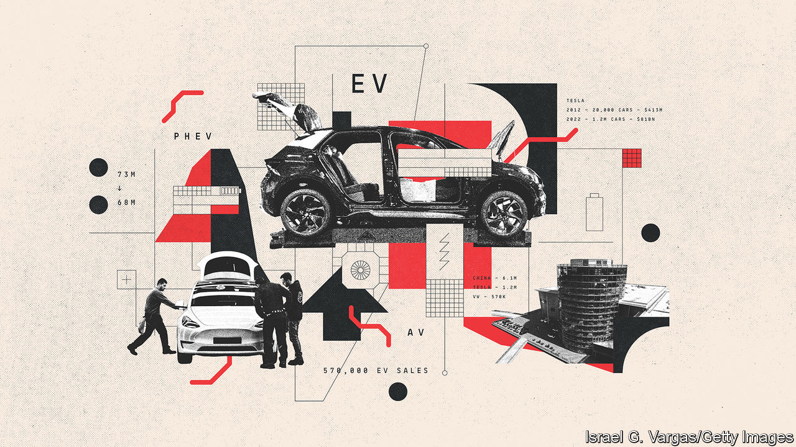
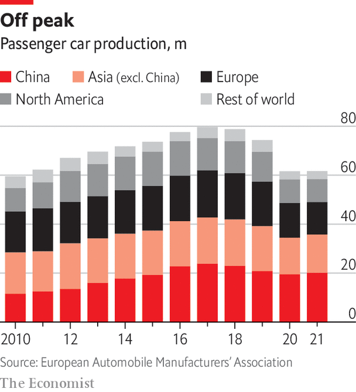

###### The car industry

# Everything about carmaking is changing at once 

##### The industry must reinvent itself to keep pace, says Simon Wright 

 

> Apr 14th 2023 

Going for a spin in the first car was a bother. The Benz Patent Motorwagen, which hit German roads in 1886, needed “stain remover” from a pharmacy for fuel, mechanical parts greased by hand, and oil and water tanks filled. Then you had to spin a large flywheel to start the engine, grasp the tiller that controlled the front wheel, and push forward the lever to engage a drive belt that set the vehicle in motion. Repeat the process every 10-15km when fuel and water ran out. Yet the freedom to travel by powering a carriage with an internal-combustion engine (ICE) soon caught on.

A giant industry with annual revenues of nearly $3trn has grown to provide transport to the masses. Over 1bn cars heave passengers along the world’s roads. There were many pioneers beside . The French provided words like coupé, chauffeur and cabriolet. America developed mass-manufacturing with the Ford Model T in 1908 and then slick marketing in the 1950s.  invented ultra-reliability and just-in-time production. Europe set the mark for luxury, sophisticated engineering and new technologies such as antilock brakes and airbags.

The next phase of the industry’s history will be one in which tech-centric firms and the Chinese come to the fore. Elon Musk’s Tesla has kickstarted electric vehicles (EVs) everywhere. China may be a newcomer but . Until the 1980s the country knocked out only a handful of cars such as the Hongqi limousine that whisked Mao Zedong between military parades and tractor factories. But a 40-year rise to economic superpowerdom has created a car industry to match. China overtook America as the world’s biggest market in 2009. Last year it passed Germany as the world’s second-largest exporter. 

The emergence of Tesla and the Chinese as serious competitors reflects unprecedented upheaval in the industry. The obvious shift is electrification. Although a few carmakers are still trying hydrogen fuel cells, lithium-ion batteries have become the key technology. In 2022 around one new car in ten sold worldwide was a battery-powered electric vehicle (EV). Adding plug-in hybrids (PHEVs), which combine a smaller battery with an ICE, and 13% of total sales, or around 10.5m vehicles, were electrified.

China accounts for 6.1m sales of what it calls new-energy vehicles (EVs and PHEVs). But Tesla is the world’s biggest EV-maker, selling 1.3m cars in 2022. China’s BYD is second for battery-only cars and is way ahead when counting new-energy vehicles. Of the old guard Volkswagen Group (VW) is the boldest electrifier. Yet it is only in third place, with 570,000 EV sales, 7% of its total.

 


Electrification is changing carmaking. The old brands have relied on the complexity and cost of ICEs to keep competitors at bay. Having to spend $1bn to develop an ICE and another $1bn for the presses, paint shop and production lines to scale up a new firm to 150,000-200,000 units a year creates huge barriers to entry. It is little wonder that, from the second world war until Tesla’s arrival, new brands that made the transition to global significance were few and far between. Those that did, such as Toyota and Nissan in Japan and Hyundai-Kia in South Korea, leant on government support and protected home markets.

The relative simplicity of batteries and electric motors knocks down many of these barriers to entry. A host of startups in China (including Li Auto, Nio and Xpeng) and America (such as Fisker, Lordstown, Lucid and Rivian) are now following Tesla’s lead. Electrification has given a leg-up to China’s established carmakers, which were long kept from global markets by the big obstacle of ICE tech. China has cajoled state-owned and private companies to build a domestic EV industry partly so as to sidestep petrol power.

Congestion ahead

The arrival of a clutch of new competitors will make  even more so, not least because car sales may have already passed their peak. China’s eager buyers gave the market its biggest turbo-boost in decades. But the brakes are now on. Car sales fell over the three years starting in 2018, as a saturated market, a worsening economy and the impact of covid-19 all took their toll. Global car production also peaked, at around 73m passenger cars in 2017. Slowing Chinese demand has been compounded by a shortage of the chips that are liberally sprinkled around all modern vehicles. By 2022 global production of cars had fallen to around 62m.

 


Forecasts vary widely, but future growth of car sales is likely to be sluggish at best. Pedro Pacheco of Gartner, a consultancy, reckons that sales will eventually return to 2019 levels but they will never go much higher. In a range of scenarios McKinsey, another consultancy, puts the annual number anywhere between 70m and 95m by 2035, but at the upper end most of the growth will be in emerging markets in Africa, India, Latin America and South-East Asia, where the bulk of demand will be for cheap cars. Europe and America have almost certainly peaked already and China is likely to do so soon. Even optimists see growth in China at barely 2.3% a year over the decade after 2019, compared with nearly 7% during the previous ten years. 

Legacy carmakers face a big challenge since newcomers, especially the Chinese, are likely to have a clear advantage. Ola Kallenius, boss of Mercedes-Benz, does not underestimate the “monumental industrial task” of swapping drive trains and overturning 130 years of ICE history but says that “what’s happening on the software side is bigger”. In the past car brands were defined by the adeptness of the mechanical engineering that went into their handling, their horsepower, the status of their bonnet badges and the satisfying “clunk” of closing the doors of a pricier car. 

In future cars brands will be differentiated mainly by the experience of using them, which is now determined more by their software than their hardware. Software-defined vehicles, which nowadays resemble supercomputers on wheels, will have ever more features and functions such as infotainment, ambient lighting and voice controls, all improved by over-the-air (OTA) updates after a vehicle has left the factory. That will open up new ways for the car producers to cash in.


Many established firms are looking jealously at Tesla, which claims to be a tech company that happens to make cars. From its roots in Silicon Valley, Tesla has gained a decisive lead in software. Yet in China Tesla is but one of several EV-makers. Chinese carmakers, startups and the tech companies they have joined up with are delivering experiences that far exceed what is available elsewhere. BYD, Nio and Xpeng have all beaten Tesla to provide in-car karaoke microphones. Young Chinese who expect and even demand that their vehicles provide a seamless extension of their digital lifestyles are setting a course for the rest of the world.

The race to  is also on. Though the road to fully autonomous cars is littered with obstacles, a more limited “hands-off” autonomy that takes over driving duties initially on motorways and eventually in some urban settings is close to commercial deployment. Carmakers are rethinking their involvement in ride-hailing and car sharing, with the big question over mobility becoming how best to monetise the use rather than the mere ownership of cars, triggering a rethink of car retailing.

A final test comes from new geopolitical tensions, notably between America and China. Rising tariffs, growing restrictions on tech transfers, a reshoring of supply chains and greater subsidies for home-grown manufacturing all threaten to halt or even reverse the process of globalisation. Carmakers will find adjusting to such a change especially challenging.

For legacy firms all this requires big change and re-engineering. They retain many advantages: skills in manufacturing, powerful brands and access to massive amounts of capital in an industry that eats through it. However, startups are not weighed down by the heavy legacy of siloed organisations that have for decades been dedicated to mechanical engineering and are encumbered by a complex portfolio of products that heap on costs. Not all legacy firms will survive the coming transformation.■

